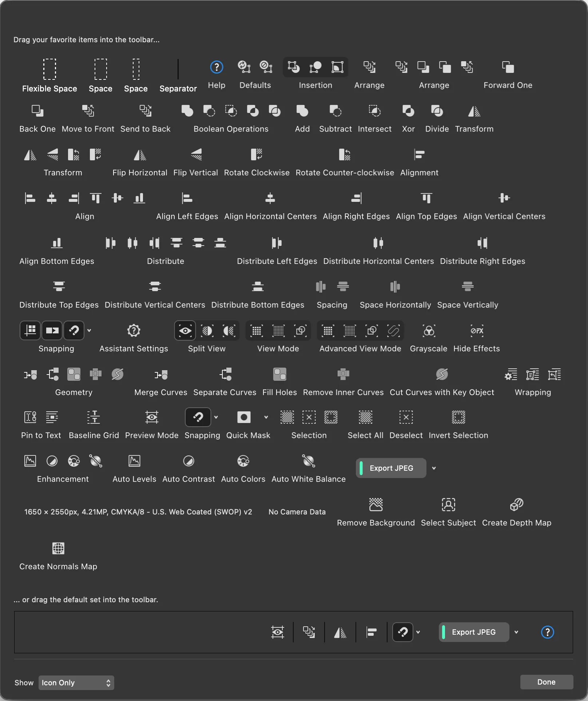

### Toolbar 항목 설명

아래 항목들은 **Affinity Studio(툴바 커스터마이징 화면)**에서 자주 쓰는 기능을 툴바에 넣기 위한 버튼들입니다. (아이콘만 표시되도록 설정되어 있어도, 실제 기능은 아래와 같습니다.)

- **Flexible Space**
  - 의미: 화면/창 크기에 따라 **자동으로 늘어나는 여백**을 넣습니다.
  - 언제 사용: 툴바를 리사이즈할 때 버튼들이 너무 한쪽으로 몰리지 않게 **균형 잡기**.
- **Space** (두 종류로 보일 수 있음)
  - 의미: **고정 폭 여백**(간격)을 넣습니다.
  - 언제 사용: 자주 쓰는 버튼 그룹 사이를 **시각적으로 구분**하고 싶을 때.
- **Separator**
  - 의미: 버튼 사이에 **구분선**을 넣습니다.
  - 언제 사용: 작업 흐름(예: 선택 → 정렬 → 내보내기)별로 툴바를 **그룹화**할 때.
- **Help**
  - 의미: 툴바/기능에 대한 **도움말 또는 안내**로 연결됩니다.
  - 언제 사용: 기능 이름이 헷갈리거나, 스튜디오 사용 중 **빠르게 확인**하고 싶을 때.
- **Defaults**
  - 의미: 기본(추천) 툴바 구성을 불러오거나 초기 상태로 돌리는 기능입니다.
  - 언제 사용: 커스터마이징을 많이 하다가 **원래 상태로 복구**하고 싶을 때.
- **Forward One**
  - 의미: 선택한 오브젝트를 **한 단계 앞으로** 이동(레이어/스택 순서 +1).
  - 언제 사용: 겹쳐진 오브젝트에서 **조금만** 앞으로 올리고 싶을 때.
- **Back One**
  - 의미: 선택한 오브젝트를 **한 단계 뒤로** 이동(스택 순서 -1).
  - 언제 사용: 겹침 순서를 **미세 조정**할 때.
- **Move to Front**
  - 의미: 선택한 오브젝트를 **맨 앞으로** 이동.
  - 언제 사용: 아이콘/텍스트를 항상 위에 두는 등 **최상단 배치**가 필요할 때.
- **Send to Back**
  - 의미: 선택한 오브젝트를 **맨 뒤로** 이동.
  - 언제 사용: 배경 도형/이미지를 **바닥 레이어**로 깔 때.

(여러 도형을 겹쳐서 하나의 결과 도형으로 만드는 연산)

- **Add**
  - 의미: 선택 도형들을 **합집합(Union)**으로 결합.
  - 언제 사용: 여러 조각 도형을 **하나의 큰 도형**으로 만들 때.
- **Subtract**
  - 의미: 위(또는 앞) 도형이 아래 도형을 **빼기(차집합)**.
  - 언제 사용: 구멍, 파임, 컷아웃 같은 **타공 형태**를 만들 때.
- **Intersect**
  - 의미: 겹친 부분만 남기는 **교집합**.
  - 언제 사용: 두 도형이 겹치는 영역만 **정확히 마스크처럼** 남기고 싶을 때.
- **Xor**
  - 의미: 겹친 부분은 제거하고, 나머지 부분만 남기는 **배타적 합(XOR)**.
  - 언제 사용: 겹친 부분을 없애면서 **링/테두리** 같은 형태를 만들 때.
- **Divide**
  - 의미: 겹치는 경계 기준으로 **조각내기**.
  - 언제 사용: 도형을 여러 파트로 나눠서 **각각 따로 편집**해야 할 때.
- **Transform**
  - 의미: 크기/회전/기울기/반전 등 **변형 관련 기능 모음**.
  - 언제 사용: 정밀한 수치 변형이 필요하거나, 변형 패널/도구를 자주 쓸 때.
- **Flip Horizontal**
  - 의미: **가로 방향 반전**.
  - 언제 사용: 좌우 대칭 아이콘, 캐릭터 포즈, 레이아웃 미러링.
- **Flip Vertical**
  - 의미: **세로 방향 반전**.
  - 언제 사용: 상하 대칭, 리플렉션/뒤집기 효과.
- **Rotate Clockwise**
  - 의미: **시계 방향 회전**(보통 90° 단위).
  - 언제 사용: 사진/오브젝트 방향을 빠르게 맞출 때.
- **Rotate Counter-clockwise**
  - 의미: **반시계 방향 회전**(보통 90° 단위).
  - 언제 사용: 위와 동일.
- **Alignment**
  - 의미: 정렬 기능(가로/세로, 기준: 선택 항목/키 오브젝트 등)으로 접근.
  - 언제 사용: 여러 오브젝트를 정렬할 일이 많을 때 **빠른 진입 버튼**으로.
- **Align**
  - 의미: 정렬 기능 묶음(아래의 개별 정렬 버튼들과 같은 계열).
  - 언제 사용: 정렬을 자주 쓰는 편집(포스터, 카드뉴스, UI) 작업.
- **Align Left Edges**
  - 언제 사용: 텍스트 블록/아이콘들을 **왼쪽 기준선**으로 정리.
- **Align Horizontal Centers**
  - 언제 사용: 여러 오브젝트를 **가로 중심**으로 맞춰 균형 잡기.
- **Align Right Edges**
  - 언제 사용: 카드/배너의 오른쪽 끝을 **일괄 정리**.
- **Align Top Edges**
  - 언제 사용: 상단 라인을 맞춰 **그리드 느낌** 만들기.
- **Align Vertical Centers**
  - 언제 사용: 세로 중심을 맞춰 **줄맞춤**.
- **Align Bottom Edges**
  - 언제 사용: 하단을 맞춰 **베이스라인** 정리.
- **Distribute**
  - 의미: 선택 항목 사이의 간격을 **균등 분배**하는 기능 모음.
  - 언제 사용: 아이콘 배열, 카드뉴스 요소 배치에서 **간격을 정확히** 맞출 때.
- **Distribute Left Edges**
  - 언제 사용: 각 오브젝트의 **왼쪽 기준선**을 균등 분배.
- **Distribute Horizontal Centers**
  - 언제 사용: 오브젝트의 **가로 중심점**을 균등 분배.
- **Distribute Right Edges**
  - 언제 사용: 오브젝트의 **오른쪽 기준선**을 균등 분배.
- **Distribute Top Edges**
  - 언제 사용: **상단 기준선**을 균등 분배.
- **Distribute Vertical Centers**
  - 언제 사용: **세로 중심점**을 균등 분배.
- **Distribute Bottom Edges**
  - 언제 사용: **하단 기준선**을 균등 분배.
- **Spacing**
  - 의미: 간격 관련 옵션/명령(분배 기준을 세밀하게 다룰 때 사용).
  - 언제 사용: 간격 설정을 반복 적용하거나 **기준 오브젝트**를 바꿔가며 조정할 때.
- **Space Horizontally**
  - 의미: 선택 항목 사이를 **가로로 동일 간격**으로.
  - 언제 사용: 가로 메뉴, 아이콘 줄, 카드 열 정렬.
- **Space Vertically**
  - 의미: 선택 항목 사이를 **세로로 동일 간격**으로.
  - 언제 사용: 목록형 레이아웃, 세로 스택 구성.
- **Snapping**
  - 의미: 오브젝트가 그리드/가이드/다른 오브젝트에 **달라붙도록(스냅)** 설정.
  - 언제 사용: 픽셀/그리드 기반 디자인에서 **정렬 정확도**를 높일 때.
- **Assistant Settings**
  - 의미: 어시스턴트(자동 보조) 관련 설정.
  - 언제 사용: 스냅, 안내선, 자동 보정 등 **작업 보조 동작을 튜닝**할 때.
- **Split View**
  - 의미: 화면을 분할하여 **두 개 이상의 뷰**를 동시에 보기.
  - 언제 사용: 확대/전체를 동시에 보며 편집, 전후 비교, 디테일 조정.
- **View Mode**
  - 의미: 편집 UI를 단순화해 **보기 중심 모드**로 전환.
  - 언제 사용: 프리뷰처럼 결과를 확인하거나, 화면을 깔끔하게 보고 싶을 때.
- **Advanced View Mode**
  - 의미: 보기 모드의 **확장 옵션**(더 많은 표시/숨김 컨트롤).
  - 언제 사용: 프리뷰 성격은 유지하면서도 특정 정보는 **추가로 확인**해야 할 때.
- **Grayscale**
  - 의미: 화면을 **흑백으로 보기**.
  - 언제 사용: 색상에 의존하지 않는 **명도 대비/가독성 점검**.
- **Hide Effects**
  - 의미: 그림자/블러/광택 등 **효과를 숨기고** 보기.
  - 언제 사용: 성능이 느릴 때, 형태/레이아웃만 빠르게 확인할 때.
- **Geometry**
  - 의미: 곡선 결합/분리, 구멍 처리, 내부 곡선 제거 등 **형태 편집 기능 묶음**.
  - 언제 사용: 로고, 아이콘 제작처럼 벡터 형태를 정교하게 다룰 때.
- **Merge Curves**
  - 의미: 여러 커브(곡선)를 **하나로 합치기**.
  - 언제 사용: 조각난 선을 연결해 **단일 경로**로 만들 때.
- **Separate Curves**
  - 의미: 결합된 커브를 **분리**.
  - 언제 사용: 합쳐진 경로를 다시 파트별로 편집해야 할 때.
- **Fill Holes**
  - 의미: 도형 안의 **구멍(holes)을 채움**.
  - 언제 사용: 불필요한 구멍을 제거해 면을 **완전한 실루엣**으로 만들 때.
- **Remove Inner Curves**
  - 의미: 내부에 있는 커브/경로를 **제거**.
  - 언제 사용: 아이콘에서 내부 선을 없애 단순화, 출력 오류 방지.
- **Cut Curves with Key Object**
  - 의미: 지정한 **키 오브젝트를 칼(커터)처럼 사용**해 커브를 잘라냄.
  - 언제 사용: 특정 기준 도형으로 여러 경로를 **일괄 컷팅**할 때.
- **Wrapping**
  - 의미: 오브젝트 주변으로 텍스트가 흐르는 **텍스트 감싸기(랩)** 설정.
  - 언제 사용: 전단/브로셔/책자 레이아웃에서 이미지 옆으로 글이 흐르게 할 때.
- **Pin to Text**
  - 의미: 오브젝트를 특정 텍스트 위치에 **고정(앵커)**.
  - 언제 사용: 문서 편집 중 텍스트가 늘어나도 아이콘/주석이 **같이 따라오게**.
- **Baseline Grid**
  - 의미: 줄 간격을 맞추는 **베이스라인 그리드**.
  - 언제 사용: 긴 문서/잡지 레이아웃에서 **타이포 정렬감**을 만들 때.
- **Preview Mode**
  - 의미: 편집 요소를 줄이고 **결과물 미리보기**.
  - 언제 사용: 최종 확인, 발표/검수.
- **Quick Mask**
  - 의미: 브러시로 빠르게 칠해서 만드는 **임시 선택/마스크**.
  - 언제 사용: 사진/이미지에서 빠르게 영역을 선택해 보정·편집할 때.
- **Selection**
  - 의미: 선택 관련 명령 묶음.
  - 언제 사용: 선택/해제/반전 등을 자주 쓰는 작업.
- **Select All**
  - 언제 사용: 전체를 한 번에 이동/변형/정렬할 때.
- **Deselect**
  - 언제 사용: 선택을 해제하고 새 선택을 시작할 때.
- **Invert Selection**
  - 언제 사용: 배경만 선택하거나, 선택 영역의 **반대 영역을 편집**할 때.
- **Enhancement**
  - 의미: 자동 보정 관련 기능 모음.
  - 언제 사용: 사진을 빠르게 개선하거나, 보정의 출발점으로.
- **Auto Levels**
  - 언제 사용: 전체 밝기 범위를 자동으로 맞춰 **톤을 정리**할 때.
- **Auto Contrast**
  - 언제 사용: 대비를 자동으로 올려 **선명도**를 확보할 때.
- **Auto Colors**
  - 언제 사용: 색상 균형을 자동으로 맞춰 **색 틀어짐을 보정**할 때.
- **Auto White Balance**
  - 언제 사용: 조명 때문에 생긴 색온도 문제(누렇게/파랗게)를 **자동 교정**할 때.
- **Export JPEG**
  - 의미: 현재 문서/선택 결과를 **JPEG로 내보내기**.
  - 언제 사용: 웹 업로드, 메신저 공유, 프레젠테이션 삽입 등 **빠른 출력**이 필요할 때.
- **Remove Background**
  - 의미: 피사체를 남기고 배경을 **자동 제거**.
  - 언제 사용: 인물/제품컷을 카드뉴스·썸네일에 올릴 때.
- **Select Subject**
  - 의미: 사진에서 **주 피사체를 자동 선택**.
  - 언제 사용: 피사체만 보정하거나 배경과 분리 작업을 시작할 때.
- **Create Depth Map**
  - 의미: 거리(깊이) 정보를 추정해 **Depth Map 생성**.
  - 언제 사용: 심도/블러(가상 아웃포커싱) 같은 효과를 적용하거나, 깊이 기반 마스크가 필요할 때.
- **Create Normals Map**
  - 의미: 표면 방향 정보를 담은 **Normal Map 생성**.
  - 언제 사용: 3D/게임 자산 텍스처 제작, 입체감/조명 효과용 맵이 필요할 때.

---

> 💡 **참고:** 버튼 이름과 아이콘이 버전에 따라 조금씩 다를 수 있어요. 만약 실제 툴바에서 특정 버튼이 안 보이면, 그 기능이 **어떤 스튜디오(Designer/Photo/Publisher)**에서 활성화되는지 확인하면 해결되는 경우가 많습니다.
