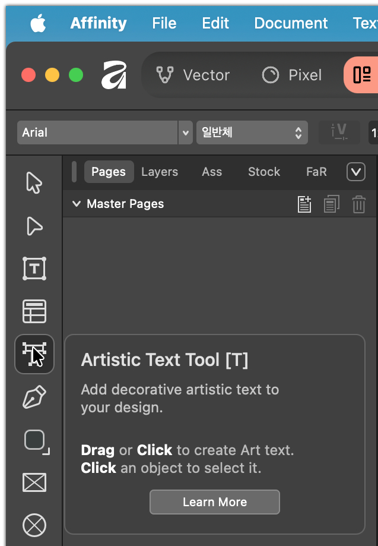
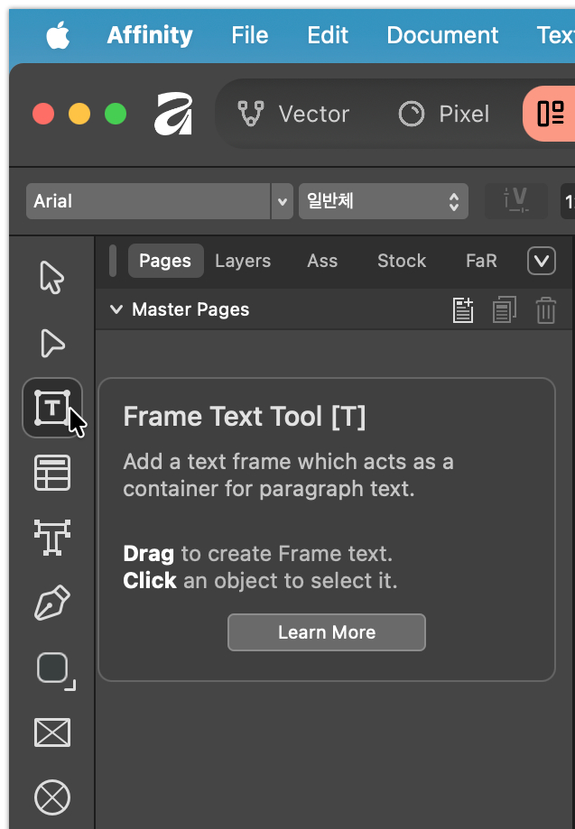
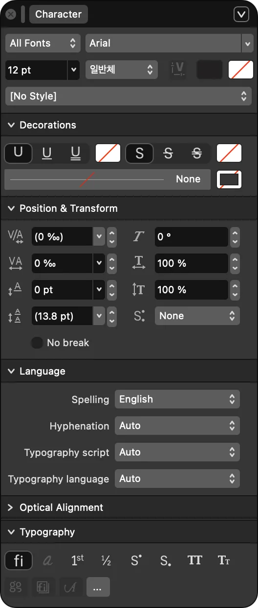
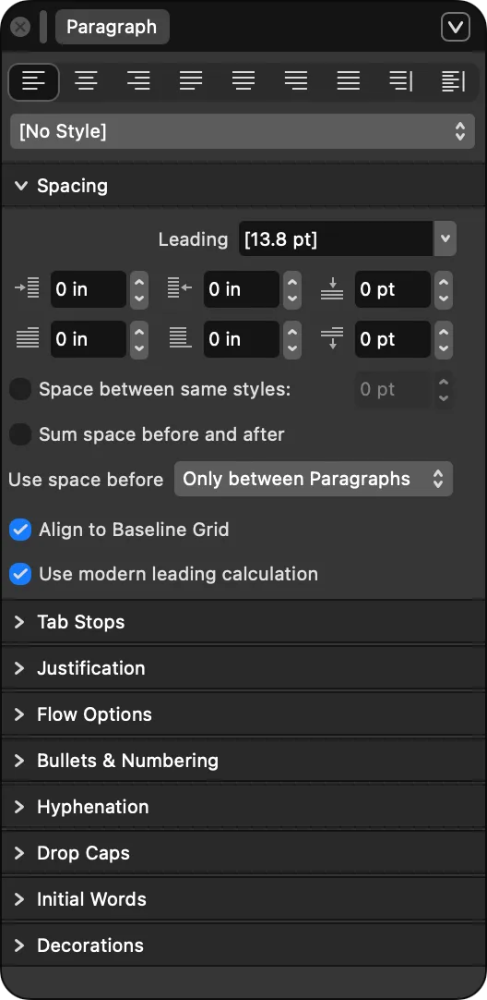
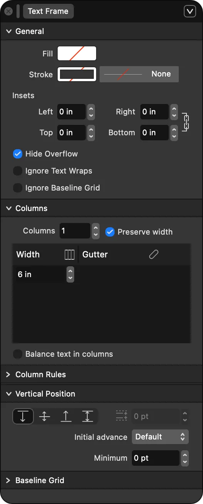
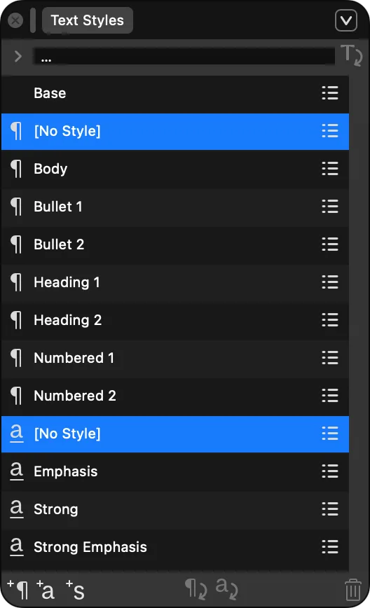

# Affinity by Canva v3: 텍스트 툴 사용 방법

Affinity의 레이아웃 작업에서 텍스트는 크게 두 가지 방식으로 처리됩니다. 각 툴의 성격과 활용법을 이해하면 디자인의 효율성이 극대화됩니다.

## 1. 텍스트 툴의 종류와 용도

### ① 아티스틱 텍스트 툴 (Artistic Text Tool - 'T')

이 툴은 글자 하나하나가 '그래픽 요소'처럼 작동하는 텍스트를 만들 때 사용합니다.

- **용도:** 헤드라인, 로고 디자인, 짧은 문구, 강조 텍스트.
- **사용법:**
  1. 툴바에서 `A` 아이콘(Artistic Text)을 선택합니다.
  2. 캔버스를 클릭하고 드래그하여 글자의 시작 크기를 결정한 뒤 타이핑합니다.
- **주요 특징:** * 텍스트의 모서리 핸들을 잡고 늘리면 폰트 크기가 직접적으로 변합니다.
  - 패스(Path) 위에 글자를 얹거나 도형 안에 배치하기 용이합니다.
  - 디자인적 변형이 자유로워 그래픽 작업에 필수적입니다.

### ② 프레임 텍스트 툴 (Frame Text Tool - 'T' 길게 누르기)

본문이나 정해진 구역 안에 긴 글을 넣을 때 사용하는 '상자형' 텍스트 툴입니다.

- **용도:** 잡지 본문, 브로슈어 설명글, 긴 리스트, 다단 레이아웃.
- **사용법:**
  1. 툴바에서 상자 모양의 `T` 아이콘을 선택합니다.
  2. 캔버스에 텍스트가 들어갈 영역을 드래그하여 상자를 만듭니다.
- **주요 특징:**
  - 상자 크기를 조절해도 글자 크기는 변하지 않고, 글의 흐름(Flow)만 바뀝니다.
  - 텍스트 프레임 연결(Text Flow) 기능을 통해 여러 페이지로 글을 넘길 수 있습니다.
  - 상자 내부 여백(Inset), 다단(Columns) 설정이 가능합니다.

## 2. 텍스트 관련 주요 패널 (Studio Panels)

Affinity의 우측 'Studio' 영역에서 텍스트의 세부 사항을 설정할 수 있습니다.

### ① 문자 패널 (Character Panel)

개별 글자의 스타일을 세밀하게 조정합니다.

- **Font Family & Style:** 서체와 굵기(Bold, Italic 등) 설정.
- **Size:** 폰트 크기.
- **Leading (행간):** 줄 간격. 'Auto' 혹은 고정값 설정 가능.
- **Kerning & Tracking (자간):** 글자 사이의 간격 조정.
- **Positioning:** 위첨자/아래첨자, 대문자 변환(All Caps), 밑줄/취소선.
- **Language:** 맞춤법 검사 및 하이픈 연결 기준 언어 설정.

### ② 단락 패널 (Paragraph Panel)

글 덩어리(단락) 전체의 구조를 관리합니다.

- **Alignment:** 좌측, 우측, 중앙, 양끝 맞춤(Justify).
- **Spacing:** 단락 앞/뒤 간격 설정 (Enter를 쳤을 때 생기는 간격).
기본적으로 문단 아래 여백이 12pt로 설정되어 있습니다.
- **Indents:** 첫 줄 들여쓰기, 왼쪽/오른쪽 전체 들여쓰기.
- **Bullets and Numbering:** 불렛 포인트(글머리기호)나 숫자 목록 자동 생성.
- **Drop Caps:** 단락 첫 글자 크게 키우기.
- **Hyphenation:** 단락 끝 단어 분절(하이픈) 자동화 여부.

### ③ 텍스트 프레임 패널 (Text Frame Panel)

긴 본문이나 다단 레이아웃처럼 “상자(프레임) 안에서 텍스트가 흐르는” 작업을 할 때, 그 프레임의 동작을 제어하는 패널입니다. 즉, 글자 자체(폰트/자간/행간)를 바꾸는 게 아니라 “텍스트가 담기는 그릇”의 규칙을 설정합니다.

- **용도:** 본문 박스, 캡션 박스, 카드형 텍스트, 잡지/브로슈어 다단 구성, 프레임 연결(Text Flow) 기반 문서 편집
- **Insets / Padding(내부 여백)**: 텍스트가 프레임 테두리에 너무 붙지 않도록 안쪽 여백을 줍니다.
- **Columns(단 설정)**: 단 수, 단 간격(Gutter)을 설정해 신문/잡지 같은 다단 본문을 만듭니다.
- **Vertical alignment(수직 정렬)**: 텍스트를 프레임의 위/가운데/아래 기준으로 배치합니다(버전/앱에 따라 옵션명이 다를 수 있음).
- **Overflow(넘침) 관리**: 프레임에 글이 다 안 들어갈 때(오버플로우) 표시/처리 방식이 여기 성격에 포함됩니다. 보통은 프레임을 키우거나, 다음 프레임으로 **연결(Text Flow)** 해서 해결합니다.
- **Auto-fit/Resize류 옵션(있다면)**: 프레임 크기 변화에 따라 텍스트를 어떻게 맞출지(자동 확장/유지 등)를 다루는 옵션이 포함되기도 합니다(버전에 따라 제공 여부가 다름).

### ④ 텍스트 스타일 패널 (Text Styles Panel) - *생산성 핵심*

반복되는 스타일을 저장하여 한 번에 적용합니다.

- **Paragraph Styles:** 제목1, 본문 등 단락 전체 스타일 저장.
- **Character Styles:** 특정 단어에만 적용할 강조 색상이나 폰트 저장.
- **활용법:** '본문' 스타일의 폰트를 바꾸면, 해당 스타일이 적용된 수백 페이지의 글자가 동시에 변경됩니다.

### 3. 실전 활용 팁 (Layout Best Practices)

1. **텍스트 프레임 연결:** 본문 상자 오른쪽 하단의 삼각형 아이콘을 클릭한 뒤 다른 상자를 클릭하면 글이 자동으로 이어집니다.
2. **텍스트흐르기(Text Wrap):** 이미지나 도형을 텍스트 위에 두고 'Text Wrap' 설정을 하면, 글자가 이미지를 피해 자동으로 흐르게 됩니다.
3. **기초 선 그리드(Baseline Grid):** 긴 레이아웃 작업 시 모든 단락의 줄 위치를 맞추고 싶다면, `Baseline Grid`를 활성화하여 글자가 일정한 수평선 위에 놓이게 하세요.
4. **필러 텍스트 (Filler Text):** 디자인 레이아웃을 먼저 잡아야 할 때, 프레임 우클릭 후 `Insert Filler Text`를 선택하면 의미 없는 'Lorem Ipsum' 텍스트가 채워집니다.

---
