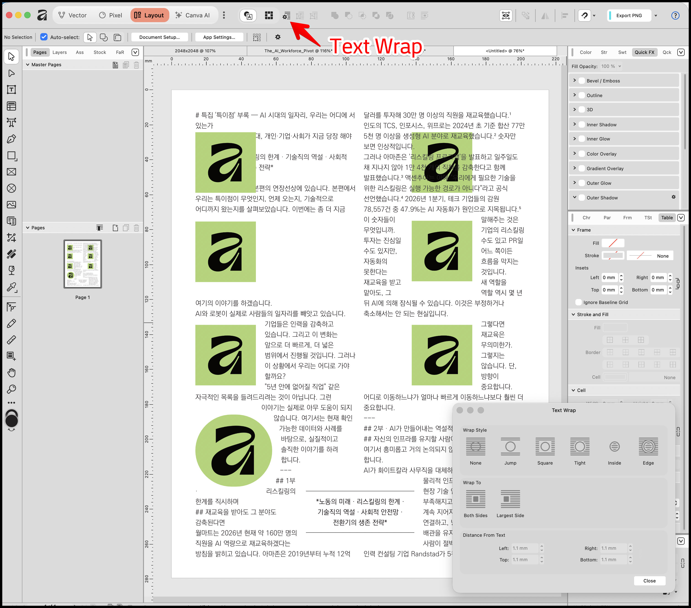
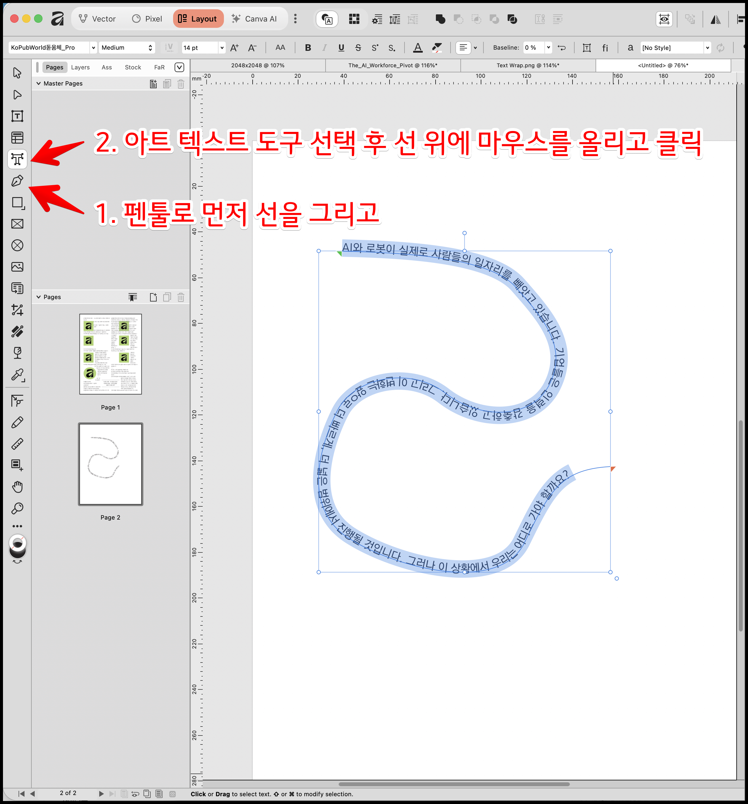

### 1. 텍스트 배치 / 감싸기 (Text Wrap)

이미지나 도형 등 특정 디자인 요소 주변으로 텍스트가 자연스럽게 피해 흐르도록 자동으로 배치해 주는 기능입니다. 수동으로 엔터 키를 쳐가며 줄바꿈을 할 필요 없이 요소의 이동에 맞춰 텍스트가 알아서 재배치됩니다.

- **사용 방법**:
  1. 왼쪽 도구 모음에서 **이동 도구(Move Tool)**를 선택한 뒤, 텍스트가 피해 가길 원하는 이미지나 틀(Picture frame)을 클릭합니다.
  2. 상단 메뉴 바에서 **[Text] > [Text wrap] > [Show wrap settings]**를 클릭하여 텍스트 감싸기 설정 패널을 엽니다.
  3. 패널 안에서 이미지를 바짝 감싸는 **'Tight'**나 네모나게 테두리를 감싸는 **'Square'** 등의 옵션을 선택합니다.
  4. 이미지와 텍스트 사이에 여백을 주고 싶다면, 거리 수치(예: 0.25인치 등)를 직접 입력하여 텍스트가 일정 간격을 두고 떨어지게 만들 수 있습니다.
  5. 설정을 마친 후 이미지를 마우스로 드래그해보면, 실시간으로 텍스트가 이미지를 피해서 동적으로 자동 조정되는 것을 볼 수 있습니다.

### 2. 패스 상의 텍스트 (Text on a Path)

직선이나 곡선을 먼저 그린 뒤, 그 선의 궤적을 따라 글자가 휘어지며 부드럽게 써지도록 만드는 기능입니다.

- **사용 방법**:
  1. 왼쪽 도구 모음에서 **펜 도구(Pen Tool)**를 선택합니다.
  2. 캔버스 위에 점을 찍고 마우스를 클릭·드래그하여 원하는 형태의 선이나 물결 모양의 곡선(패스)을 그립니다 (필요하다면 노드 도구(Node Tool)를 사용해 곡선을 세밀하게 다듬습니다).
  3. 왼쪽 도구 모음에서 **아트 텍스트 도구(Artistic Text Tool)**를 선택합니다.
  4. 앞서 그려둔 곡선 위에 마우스 커서를 올리고 클릭한 뒤, 원하는 텍스트를 입력합니다.
  5. 텍스트가 선을 따라 써지면, 시작점과 끝점에 화살표 모양의 조절 슬라이더가 나타납니다. 이 슬라이더를 좌우로 드래그하여 패스 위에서 텍스트의 위치를 앞뒤로 이동시킬 수 있으며, 슬라이더를 선의 반대쪽 면으로 넘기면 텍스트가 뒤집히게(flip) 만들 수도 있습니다.

### 3. 피닝 (Pinning - 개체 고정)

특정 아이콘이나 그래픽 요소를 본문의 특정 텍스트나 제목의 위치에 "고정(Pin)"시키는 기능입니다.

- **사용 방법**:
  1. 상단 메뉴나 스튜디오 탭에서 **타이포그래피 스튜디오(Typography Studio)**로 전환합니다.
  2. 화면 하단에 보면 **Pinning 패널**이 기본적으로 표시되어 있습니다.
  3. 아이콘이나 특정 그래픽(그룹)을 선택한 후, Pinning 패널을 활용해 본문의 특정 제목이나 단어 위치에 해당 요소를 고정시킵니다.
  4. 개체를 텍스트에 고정해 두면, 앞부분에 문단이 추가되거나 내용이 변경되어 텍스트 전체가 아래로 밀려나더라도 고정된 그래픽이 해당 텍스트와 함께 완벽하게 붙어서 이동합니다.

이러한 도구들을 익혀두시면 긴 문서나 복잡한 레이아웃을 작성할 때 번거로운 반복 수작업을 크게 줄이면서도 전문가 수준의 디자인을 완성하실 수 있습니다.
