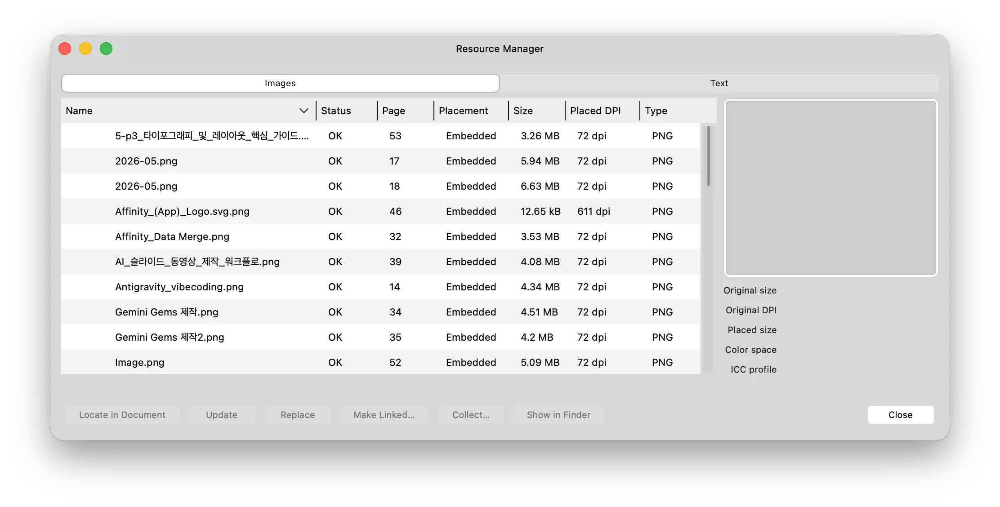

## 이 파트에서 배울 내용

- Resource Manager로 문서에 배치된 이미지 파일을 관리합니다.
- 누락된 이미지를 재연결합니다.
- 기존 레이아웃을 유지한 채 이미지만 교체합니다.
- 인쇄 전 이미지 DPI를 점검합니다.

---

## 1. Resource Manager 열기

**경로**

- `Document → Resource Manager`
- 또는 `Window → Resource Manager`

Resource Manager는 문서에 배치된 모든 이미지를 한 곳에서 관리하는 패널입니다.

---

## 2. Resource Manager에서 확인할 항목

| 항목 | 의미 | 확인 이유 |
| --- | --- | --- |
| 파일명 | 배치된 이미지 파일 이름 | 어떤 이미지인지 식별 |
| 페이지 | 이미지가 사용된 페이지 | 문제 이미지 위치 확인 |
| 상태 | Linked, Embedded, Missing 등 | 링크 끊김 여부 확인 |
| DPI | 문서에 배치된 크기 기준 해상도 | 인쇄 품질 확인 |

### 상태 아이콘

| 상태 | 의미 | 조치 |
| --- | --- | --- |
| ✅ 정상 | 파일이 정상 연결됨 | 조치 필요 없음 |
| ❌ Missing | 파일이 이동되거나 삭제됨 | `Replace`로 새 경로 지정 |
| ⚠️ 경고 | 파일이 수정되었거나 DPI가 부족함 | `Update` 또는 원본 교체 |

---

## 3. 누락된 이미지 재연결

이미지 원본 파일을 이동하거나 삭제하면 Resource Manager에 Missing 표시가 나타납니다.

**해결 단계**

1. `Document → Resource Manager` 열기
2. Missing 표시가 있는 이미지 선택
3. **Replace** 버튼 클릭
4. 파일 탐색창에서 원본 파일의 새 위치 선택
5. `Open`

> 💡 파일을 자주 이동하는 경우 Affinity 파일과 이미지 폴더를 같은 상위 폴더 안에 두세요. 상대 경로가 유지되면 Missing 오류를 줄일 수 있습니다.

---

## 4. 이미지 교체

레이아웃을 유지하면서 이미지 내용만 바꾸고 싶을 때 사용합니다.

### 방법 1 — Resource Manager에서 교체

1. `Document → Resource Manager`
2. 교체할 이미지 선택
3. `Replace`
4. 새 이미지 선택

### 방법 2 — 직접 교체

1. 교체할 이미지 또는 프레임 선택
2. 컨텍스트 도구 모음에서 **Replace Image** 클릭
3. 새 이미지 파일 선택

---

## 5. Linked와 Embedded 관리

이미지를 배치할 때는 두 가지 저장 방식이 있습니다.

| 방식 | 설명 | 장점 | 주의점 |
| --- | --- | --- | --- |
| **Linked** | 이미지 파일을 외부에서 참조 | Affinity 파일 크기가 작음 | 원본 파일을 함께 관리해야 함 |
| **Embedded** | 이미지를 Affinity 파일 내부에 복사 | 파일 하나로 공유 가능 | Affinity 파일 크기가 커짐 |

### 임베드로 전환하기

1. `Document → Resource Manager`
2. 임베드할 이미지 선택
3. `Embed` 버튼 클릭

**교회 주보 권장**

- 작업 중: Linked
- 인쇄소 제출 전: Embedded 또는 Package 사용

---

## 6. DPI 확인 — 인쇄 품질 체크

Resource Manager에서 각 이미지의 배치 DPI(Placed DPI)를 확인할 수 있습니다.

| DPI 범위 | 인쇄 품질 | 조치 |
| --- | --- | --- |
| **300 이상** | ✅ 양호 | 그대로 사용 가능 |
| **150~299** | ⚠️ 주의 | 가능하면 고해상도 원본으로 교체 |
| **150 미만** | ❌ 불량 | 반드시 교체하거나 이미지 크기 축소 |

> 💡 **배치 DPI vs 원본 DPI:** 이미지를 크게 늘리면 배치 DPI가 낮아집니다. 예를 들어 600DPI 이미지를 2배 크기로 늘리면 배치 DPI는 300DPI가 됩니다.

---

## 7. 로고와 QR 코드 관리

### 로고 이미지

- 가능하면 **SVG** 또는 **PNG 투명 배경**을 사용합니다.
- JPEG 로고는 흰 배경이 함께 보일 수 있습니다.
- 인쇄용 로고는 300DPI 이상 또는 벡터 형식이 좋습니다.

### QR 코드

- PNG 투명 배경 또는 SVG 권장
- 지정된 링크의 길이에 따라 QR 코드의 크기가 결정되기 때문에 최대한 길이를 줄이는 것이 디자인에 효율적
- 인쇄 후 반드시 스마트폰으로 스캔 테스트

---

## 용어 정리

| 용어 | 설명 |
| --- | --- |
| **Resource Manager** | 문서의 모든 이미지 파일을 관리하는 패널. DPI 확인, 교체, 링크 수정 가능. |
| **Placed DPI** | 이미지가 문서에 배치된 크기 기준으로 계산한 실제 해상도. |
| **Linked** | 이미지 파일이 외부에 존재하며 문서가 참조하는 방식. |
| **Embedded** | 이미지를 문서 내부에 복사하여 저장하는 방식. |

---

## FAQ

**Q1. 이미지를 배치했는데 화면에서는 선명한데 인쇄하면 흐릿하게 나옵니다.**

A. 원인은 이미지 해상도 부족일 가능성이 큽니다.

1. `Document → Resource Manager`에서 해당 이미지의 Placed DPI 확인
2. 300DPI 미만이면 더 고해상도 원본으로 교체
3. 또는 이미지 표시 크기를 줄여 배치 DPI를 높임

화면에서는 72~96DPI 이미지도 선명해 보일 수 있지만, 인쇄에는 일반적으로 300DPI가 필요합니다.

---

**Q2. Resource Manager에서 Missing 표시가 나타납니다.**

A. 이미지 원본 파일의 경로가 변경된 것입니다.

1. Resource Manager에서 Missing 이미지 선택
2. `Replace` 클릭
3. 원본 파일의 새 위치를 선택

---

**Q3. 로고를 배치했는데 흰색 배경이 함께 나타납니다.**

A. 로고 파일의 배경이 투명하지 않기 때문입니다. 가장 좋은 해결 방법은 로고를 PNG 투명 배경 또는 SVG 형식으로 다시 준비하는 것입니다.

---

## 실수 방지 Tips

### 💡 Tip 1. 인쇄 전 Resource Manager로 DPI를 일괄 점검하자

PDF 내보내기 전에 `Document → Resource Manager`를 열어 모든 이미지의 DPI를 확인하세요. 300DPI 미만 이미지가 있으면 교체하거나 크기를 줄여야 합니다.

### ⚠️ 자주 하는 실수

| 실수 | 결과 | 예방책 |
| --- | --- | --- |
| 저해상도 이미지 사용 | 인쇄 후 흐릿함 | Resource Manager에서 DPI 확인 |
| Linked 이미지 파일 이동 | Missing 오류 발생 | Affinity 파일과 이미지 폴더를 함께 관리 |
| QR 코드 크기 너무 작음 | 스마트폰 인식 불가 | 최소 1" × 1" 이상 배치 후 테스트 |
