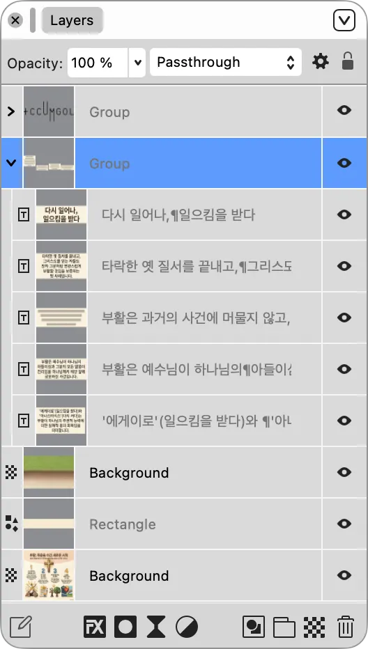

## 이 파트에서 배울 내용

- 도형 도구로 기본 그래픽 요소를 만듭니다.
- Fill과 Stroke로 색상과 선을 설정합니다.
- Layers 패널로 오브젝트 순서, 잠금, 그룹을 관리합니다.
- Align & Distribute로 정확하게 정렬합니다.

---

## 1. 도형 그리기 — Shape Tools

Layout Studio에는 다양한 도형 도구가 있습니다. 도형은 배경 요소, 장식, 섹션 구분, 공지 박스 등에 활용됩니다.

### 1.1 주요 도형 도구

| 도구 | 단축키 | 설명 |
| --- | --- | --- |
| **Rectangle Tool** | `M` | 사각형 그리기. `Shift`+드래그: 정사각형 |
| **Ellipse Tool** | `L` | 타원 그리기. `Shift`+드래그: 정원 |
| **Rounded Rectangle** | — | 모서리가 둥근 사각형 |
| **Triangle Tool** | — | 삼각형 |
| **Polygon Tool** | — | 다각형. 꼭짓점 수 설정 가능 |
| **Star Tool** | — | 별 모양 |
| **Line Tool** | — | 직선 |
| **Pen Tool** | `P` | 자유 벡터 패스 그리기 |

### 1.2 도형 그리기 기본

1. 원하는 도형 도구 선택
2. 문서에서 드래그하여 도형 생성
3. 핸들 드래그 또는 W/H 수치 입력으로 크기 조절
4. Fill/Stroke로 색상과 선 설정

### 1.3 드래그 수식어

| 수식어 | 효과 |
| --- | --- |
| `Shift`  • 드래그 | 정비율 도형 생성 |
| `⌥ Option` / `Alt`  • 드래그 | 중심점에서 바깥으로 확장 |
| `Shift + ⌥ Option` / `Shift + Alt` | 정비율 + 중심점 기준 적용 |

### 1.4 선 그리기

교회 주보의 섹션 구분선은 Line Tool 또는 얇은 Rectangle로 만들 수 있습니다.

**방법 1 — Line Tool**

1. Line Tool 선택
2. `Shift`를 누른 채 가로로 드래그
3. Stroke 패널에서 선 두께 설정

**방법 2 — 얇은 Rectangle (권장)**

1. Rectangle Tool(`M`) 선택
2. 높이 0.5~1pt 정도의 얇은 사각형 생성
3. Fill 색상 설정, Stroke 없음

> 💡 얇은 Rectangle 방식이 인쇄에서 더 안정적입니다.

### 1.5 모서리 둥글게 하기

- 컨텍스트 도구 모음에서 모서리 반경 입력
- 사각형 내부의 빨간 동그라미 핸들 드래그
- 각 모서리를 개별 설정하려면 잠금 아이콘 해제

---

## 2. Fill과 Stroke 설정

### 2.1 Fill 설정

도형이나 이미지 프레임의 내부 색상을 설정합니다.

**방법**

- `View → Studio → Colour`
- 컨텍스트 도구 모음의 채우기 색상 스왓치 클릭
- CMYK 모드에서 직접 색상 입력 가능

> 📌 교회 브랜드 색상은 Swatches 팔레트에 저장해두면 반복 작업이 쉬워집니다.

### 2.2 채우기 유형

| 유형 | 설명 | 사용 예 |
| --- | --- | --- |
| **Solid** | 단일 색상 채우기 | 배경 띠, 구분선 |
| **Linear Gradient** | 방향을 가진 그라데이션 | 배경 장식 |
| **Radial Gradient** | 중심에서 바깥으로 퍼지는 그라데이션 | 원형 장식 요소 |
| **None** | 투명 배경 | 테두리만 있는 도형 |

### 2.3 Stroke 설정

Stroke는 도형의 외곽선입니다.

**경로**

- `View → Studio → Stroke`

| 설정 | 설명 |
| --- | --- |
| **Width** | 선 굵기 |
| **Style** | 실선, 점선, 파선 등 |
| **Caps** | 선 끝 모양 |
| **Join** | 꺾이는 부분 모양 |
| **Align** | 선 위치. Inside, Center, Outside |

> 📌 인쇄용 가는 선은 0.25pt 미만을 피하세요. 구분선은 0.25~0.5pt 이상을 권장합니다.

### 2.4 불투명도와 블렌드 모드

- **Opacity:** Layers 패널 상단에서 조절. 0%는 완전 투명, 100%는 완전 불투명
- **Blend Mode:** Layers 패널 상단 드롭다운에서 설정

| 모드 | 효과 | 사용 예 |
| --- | --- | --- |
| **Normal** | 기본값 | 대부분의 경우 |
| **Multiply** | 색상이 어두워짐 | 배경 사진 위 어두운 오버레이 |
| **Screen** | 색상이 밝아짐 | 어두운 배경 위 밝은 요소 |
| **Overlay** | 대비가 강해짐 | 텍스처 효과 |

---

## 3. Layers 패널 활용

### 3.1 Layers 패널 열기

- `View → Studio → Layers`

### 3.2 Layers 패널 구조

### 3.3 레이어 순서 변경

레이어 패널에서 위에 있는 항목이 화면 앞쪽에 표시됩니다.

| 기능 | Mac | Windows |
| --- | --- | --- |
| 맨 앞으로 | `⌘ Cmd + Shift + ]` | `Ctrl + Shift + ]` |
| 앞으로 한 칸 | `⌘ Cmd + ]` | `Ctrl + ]` |
| 뒤로 한 칸 | `⌘ Cmd + [` | `Ctrl + [` |
| 맨 뒤로 | `⌘ Cmd + Shift + [` | `Ctrl + Shift + [` |

### 3.4 가시성 및 잠금

| 아이콘 | 기능 |
| --- | --- |
| 👁 | 레이어 숨기기/표시 |
| 🔒 | 레이어 잠금/해제 |

> 💡 배경 이미지나 색상 띠처럼 실수로 움직이면 안 되는 요소는 잠금 처리하세요.

### 3.5 그룹화

**그룹화**

1. 묶을 레이어 선택
2. `⌘ Cmd + G` / `Ctrl + G`
3. 또는 `Arrange → Group`

**그룹 해제**

- `⌘ Cmd + Shift + G` / `Ctrl + Shift + G`

**그룹 안으로 진입**

- 그룹 더블클릭

### 3.6 레이어 이름 변경

1. 레이어 이름 더블클릭
2. 새 이름 입력
3. `Enter`

좋은 이름 예시:

- `배경-상단띠-블루`
- `사진-예배당-표지`
- `텍스트-설교제목`
- `QR-홈페이지`

---

## 4. 정렬 및 배분

### 4.1 Alignment 패널 열기

- `View → Studio → Alignment`
- 여러 오브젝트 선택 시 컨텍스트 도구 모음에서도 사용 가능

### 4.2 정렬 기준

- **Selection:** 선택된 오브젝트들의 경계 기준
- **Page:** 페이지 전체 기준
- **Spread:** 마주보는 페이지 전체 기준
- **Key Object:** 특정 오브젝트 기준

### 4.3 정렬 옵션

| 방향 | 기능 |
| --- | --- |
| 수평 | 왼쪽 정렬, 가로 중심 정렬, 오른쪽 정렬 |
| 수직 | 위쪽 정렬, 세로 중심 정렬, 아래쪽 정렬 |

### 4.4 배분 옵션

| 옵션 | 기능 |
| --- | --- |
| 수평 균등 배분 | 오브젝트들의 가로 간격을 동일하게 |
| 수직 균등 배분 | 오브젝트들의 세로 간격을 동일하게 |
| 수평 간격 동일 | 오브젝트 사이의 빈 공간을 동일하게 |
| 수직 간격 동일 | 오브젝트 사이의 빈 공간을 동일하게 |

### 4.5 Snapping

스냅은 오브젝트를 이동할 때 가이드, 그리드, 다른 오브젝트에 자동으로 달라붙게 하는 기능입니다.

- 상단 메뉴 바의 자석 아이콘 클릭
- 단축키: `;`
- 설정: `View → Snapping Options`

---

## 용어 정리

| 용어 | 설명 |
| --- | --- |
| **Fill** | 도형의 내부 색상 또는 그라데이션 설정. |
| **Stroke** | 도형의 외곽선 색상, 두께, 스타일 설정. |
| **Blend Mode** | 레이어가 아래 레이어와 혼합되는 방식. |
| **Opacity** | 레이어의 투명도. |
| **Z-순서** | 레이어의 앞뒤 배치 순서. |
| **Group** | 여러 레이어를 하나로 묶어 함께 이동·편집하는 기능. |
| **Align** | 여러 오브젝트를 특정 기준으로 정렬. |
| **Distribute** | 오브젝트 사이의 간격을 균등하게 조정. |
| **Snapping** | 오브젝트 이동 시 가이드나 다른 오브젝트에 자동으로 맞춰지는 기능. |

---

## FAQ

**Q1. 도형과 텍스트를 그룹으로 묶었는데 그룹 안의 텍스트를 편집할 수 없습니다.**

A. 그룹 안으로 먼저 진입해야 합니다.

1. 그룹 더블클릭
2. 원하는 텍스트 프레임 클릭
3. 텍스트 더블클릭 후 편집
4. `Escape`로 빠져나오기

---

**Q2. 이미지를 정확히 페이지 중앙에 배치하고 싶습니다.**

A. Alignment 패널을 사용합니다.

1. 이미지 선택
2. `View → Studio → Alignment`
3. 정렬 기준을 **Page**로 선택
4. 가로 중심 정렬 + 세로 중심 정렬 클릭

---

## 실수 방지 Tips

### 💡 Tip 1. 교회 브랜드 색상을 Swatches에 저장하자

자주 사용하는 색상은 Swatches 팔레트에 저장하세요. 색상값 입력 실수를 줄이고, 팀원과 색상 기준을 공유하기 쉽습니다.

### 💡 Tip 2. 레이어 이름을 항상 지정하자

레이어가 많아지면 기본 이름만으로는 요소를 찾기 어렵습니다. 배치 직후 의미 있는 이름을 붙이세요.

### 💡 Tip 3. 중요한 배경 요소는 잠금 처리하자

배경 사진, 색상 띠, 마스터 페이지 요소는 실수로 이동하지 않도록 Layers 패널에서 잠그세요.

### 💡 Tip 4. 정렬은 Align 패널, 미세 조정은 수치 입력으로

드래그만으로 정렬하려고 하면 시간이 오래 걸리고 부정확합니다. 대략 위치는 스냅으로 잡고, 정렬은 Alignment 패널, 마지막 미세 조정은 X/Y/W/H 수치 입력으로 처리하세요.

### ⚠️ 자주 하는 실수

| 실수 | 결과 | 예방책 |
| --- | --- | --- |
| 레이어 이름 미지정 | 요소 찾기 어려움 | 배치 직후 이름 지정 |
| 도련까지 배경 확장 안 함 | 인쇄 후 흰 테두리 발생 | 배경 이미지와 색상을 도련 영역까지 확장 |
