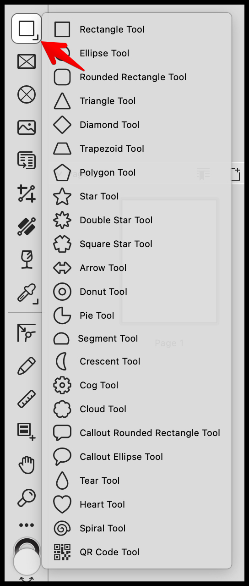
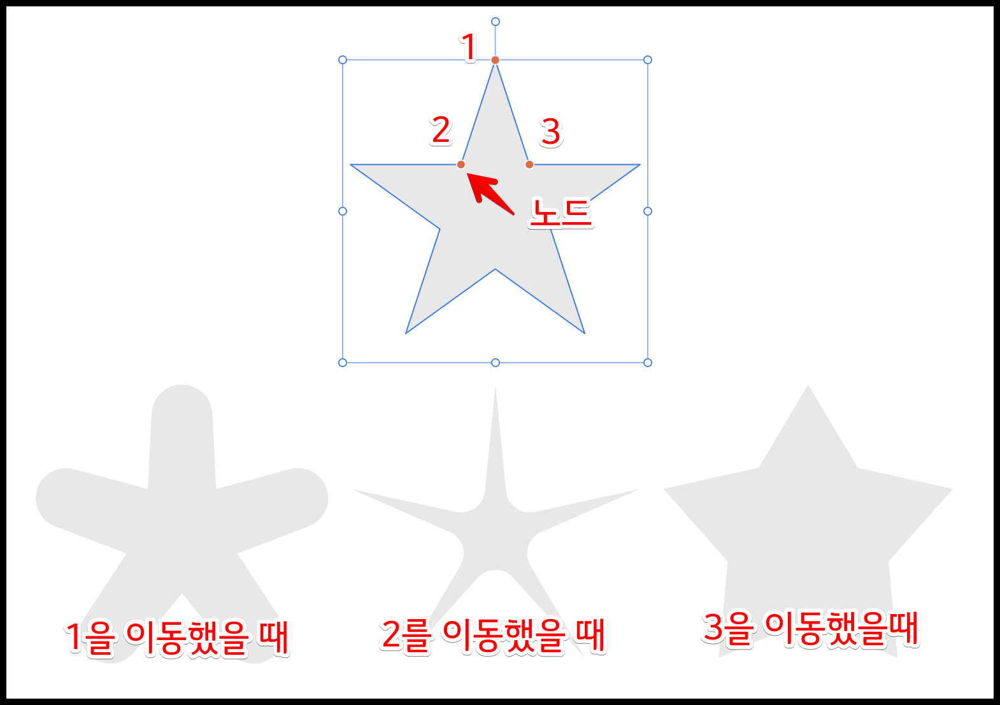
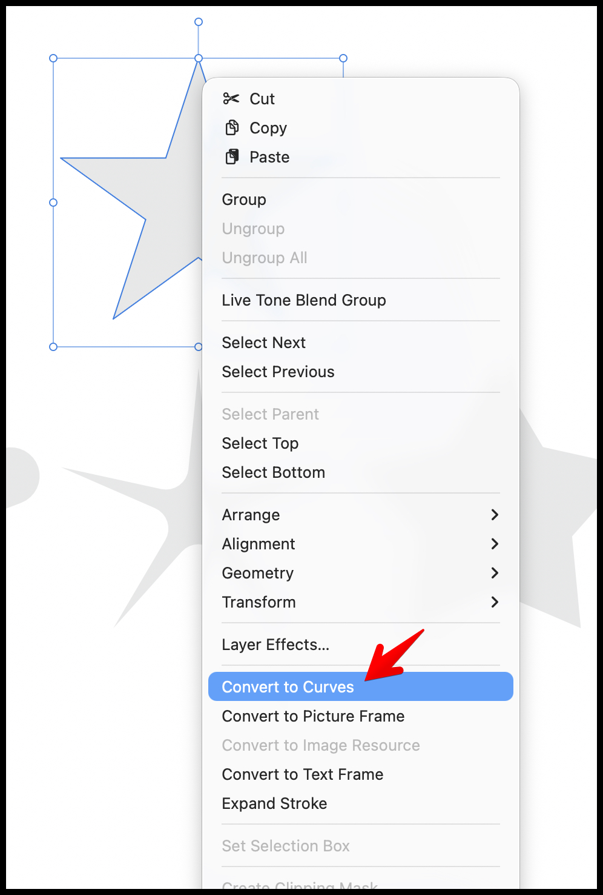
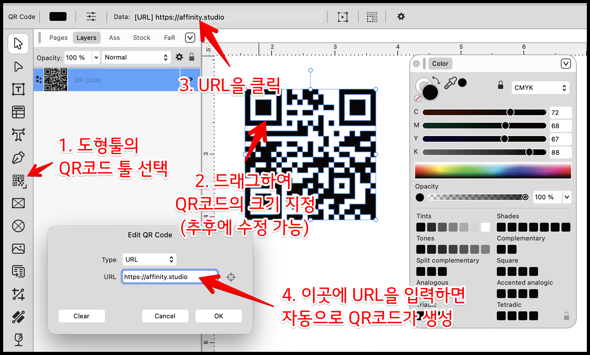

- **도형 툴(Shape Tools)**은 주로 레이아웃 스튜디오(Layout Studio)와 벡터 스튜디오(Vector Studio)에서 사용됩니다. 
- 도형 툴의 오른쪽 아래에 있는 표시는 하위에 다른 도형들이 있다는 의미입니다. 마우스로 길게 클릭하시면 하위 도형들을 보실 수 있습니다. 
- 사각형, 원형, 별, 톱니바퀴, QR 코드 등 다양한 기하학적 형태를 벡터 방식으로 깔끔하게 그릴 수 있는 도구입니다. 
- 참고로 도형 툴의 아이콘은 마지막에 사용했던 도형으로 표시됩니다.

## **1. 도형 툴의 기본 사용 방법**

- **도형 선택 및 숨겨진 툴 찾기:** 툴바에서 사각형이나 다각형 아이콘을 선택합니다. 아이콘 우측 하단에 작은 회색 삼각형이 있는 경우, 길게 누르거나 클릭하면 숨겨진 다양한 도형 툴(별, 하트, 눈물방울, 나선형 등)을 선택할 수 있는 팝업 메뉴가 나타납니다. 원하는 도형을 클릭합니다.
- **그리기:** 캔버스 위에서 마우스를 클릭하고 드래그하여 도형의 크기를 결정하며 생성합니다.
- **비율 유지 (정비율 그리기):** 드래그할 때 **`Shift`**** 키를 누른 상태로 유지**하면 가로세로 비율이 일치하는 완벽한 정사각형이나 정원(원형), 대칭된 별 등을 그릴 수 있습니다.
- **중심 기준 그리기:** `Ctrl(윈도우)/Cmd(맥)` 키와 `Shift` 키를 함께 누른 채 드래그하면, 마우스를 처음 클릭한 지점을 정중앙(중심점)으로 삼아 대칭으로 퍼져나가는 도형을 생성할 수 있습니다.

## **2. 라이브 쉐이프(Live Shapes)와 주황색 노드 활용**

- Affinity의 도형들은 단순히 한 번 그려지고 끝나는 것이 아니라, 생성 후에도 실시간으로 형태적 특성을 변형할 수 있는 **'라이브 쉐이프(Live Shapes)'** 속성을 가집니다.
- 도형을 선택하면 캔버스에 형태를 제어할 수 있는 **주황색 컨트롤 포인트(노드)**가 나타납니다. 이 주황색 점을 마우스로 드래그하면 톱니바퀴의 톱니 깊이, 별의 뾰족한 정도(내경), 눈물방울의 꼬리 구부러짐 등을 캔버스 위에서 즉각적이고 직관적으로 변형할 수 있습니다.

## **3. 곡선으로 변환 (Convert to Curves)**

- 기본 도형의 정해진 틀을 벗어나 개별 앵커 포인트(점)를 직접 자유롭게 편집하고 싶다면, 해당 도형을 우클릭하거나 상단 메뉴를 통해 '**곡선으로 변환(Convert to Curves)**'을 실행해야 합니다.
- 이 과정을 거치면 노드 툴(Node Tool)을 사용해 도형의 형태를 완전히 마음대로 뜯어고칠 수 있지만, 기존 '라이브 쉐이프'가 가지던 고유 옵션(예: 별의 꼭짓점 개수 조절)은 더 이상 사용할 수 없게 되는 일종의 트레이드오프(Trade-off)가 발생합니다.

## **4. QR 코드 만들기**

- **도형 툴에서 QR Code Tool 선택:** 툴바에서 **도형 툴(Shape Tools)** 아이콘을 길게 클릭한 뒤 목록에서 **QR Code Tool**을 선택합니다.
- **QR 코드 생성:** 캔버스에서 **클릭 + 드래그**해서 QR 코드의 크기를 정해 생성합니다.
  - 정비율(정사각형)로 만들려면 드래그 중 **`Shift`**를 누릅니다.
  - 중심 기준으로 만들려면 **`Ctrl(Windows)/Cmd(Mac)`**를 누른 채 드래그합니다.
- **내용(데이터) 입력/변경:** 생성한 QR 코드를 선택한 상태에서 상단 **컨텍스트 툴바(Contextual Toolbar)**(또는 우측 스튜디오의 QR 관련 옵션)에 있는 **데이터 입력 칸**에 URL, 텍스트 등을 입력합니다.
  - 입력값을 바꾸면 QR 코드가 즉시 갱신됩니다.
- **외형 다듬기:** 필요하면 **Colors & Stroke**에서 채우기/획 색상과 두께를 조절하고, **Transform**에서 크기와 위치를 수치로 정렬합니다.
- **편집 팁:** QR 코드는 스캔 인식이 중요하므로, 대비(진한 색 vs 밝은 배경)와 여백(Quiet Zone)을 충분히 두고 변형 효과는 최소화합니다.

## **5. 도형 작업과 관련된 주요 패널 설명**

도형을 그리고 편집할 때 우측 스튜디오나 상단에 위치한 다음의 패널들을 함께 사용하게 됩니다.

1. **컨텍스트 툴바 (Contextual Toolbar):** 
  - 화면 상단에 가로로 위치하며, 현재 선택한 특정 도형에 맞는 세부 설정값을 수치로 직접 입력할 수 있는 곳입니다. 치아(Teeth)의 개수, 내부 반경(Inner Radius) 등을 정확하게 설정할 수 있으며, 일부 도형의 경우 방사형 태양 모양 등 미리 만들어진 **'프리셋(Presets)'**을 원클릭으로 적용할 수도 있습니다.
  - 여러 종류의 컨텍스트 툴바

2. **변형 패널 (Transform Panel):** 
  - 화면 우측 하단에 배치되어 있으며, 도형의 정확한 X/Y 좌표 위치, 너비(W)와 높이(H), 회전(Rotation), 기울기(Shear) 값을 소수점 단위의 정밀한 수치로 제어할 때 사용합니다.

3. **색상 및 획 패널 (Colors & Stroke Panel):** 
  - 도형의 내부를 채우는 색상(Fill)과 외곽선(Stroke)의 색상을 지정합니다. 특히 획(Stroke) 패널에서는 외곽선의 두께(Width), 점선 스타일, 모서리 둥글기 등을 세밀하게 조절하거나 화살표 머리를 추가할 수 있습니다.

4. **레이어 패널 (Layers Panel):** 
  - 캔버스에 도형을 생성할 때마다 레이어 패널에는 해당 도형만의 독립적인 새 레이어가 차곡차곡 쌓입니다. 이를 통해 수많은 도형의 겹침 순서를 위아래로 조정하거나, 묶기(그룹화) 및 잠금 설정 등을 쉽게 관리할 수 있습니다.

