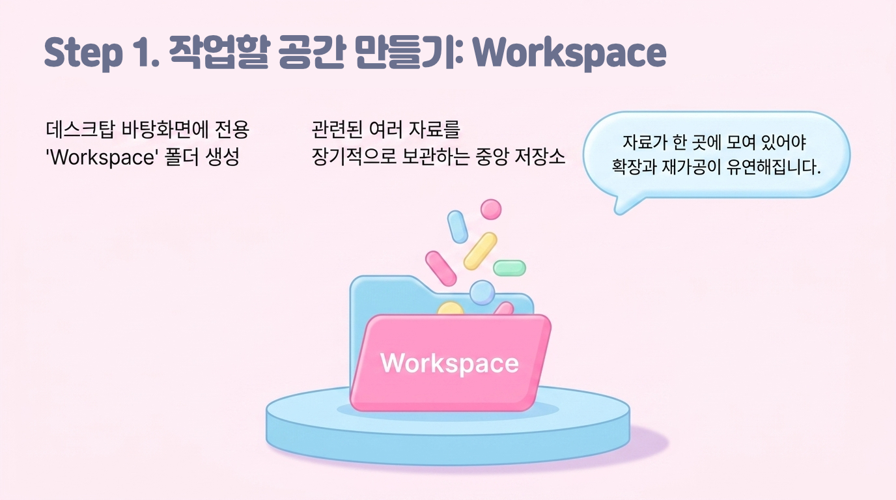
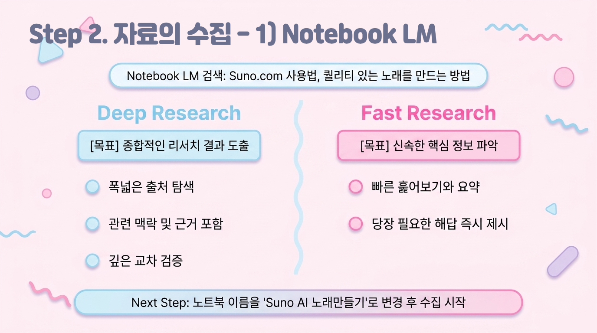
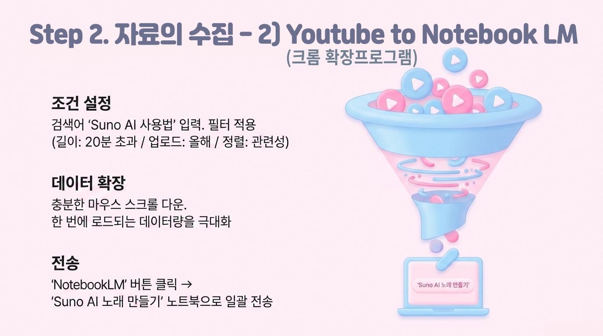
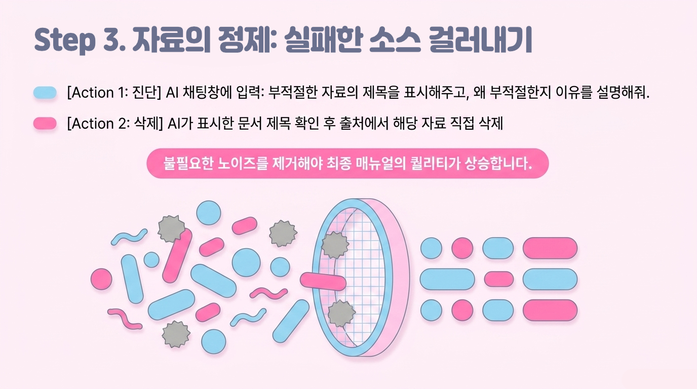
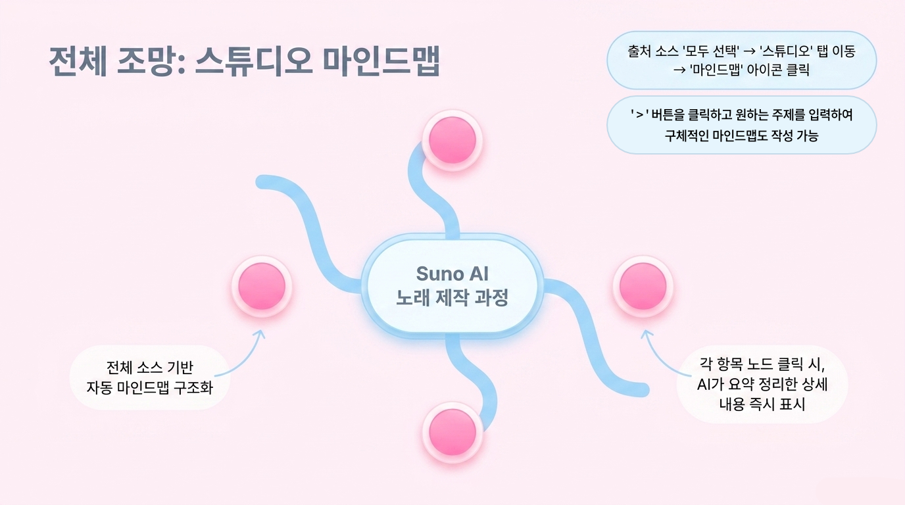
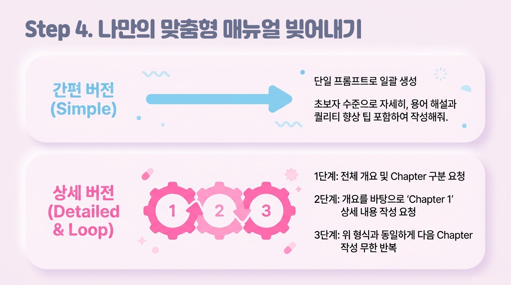
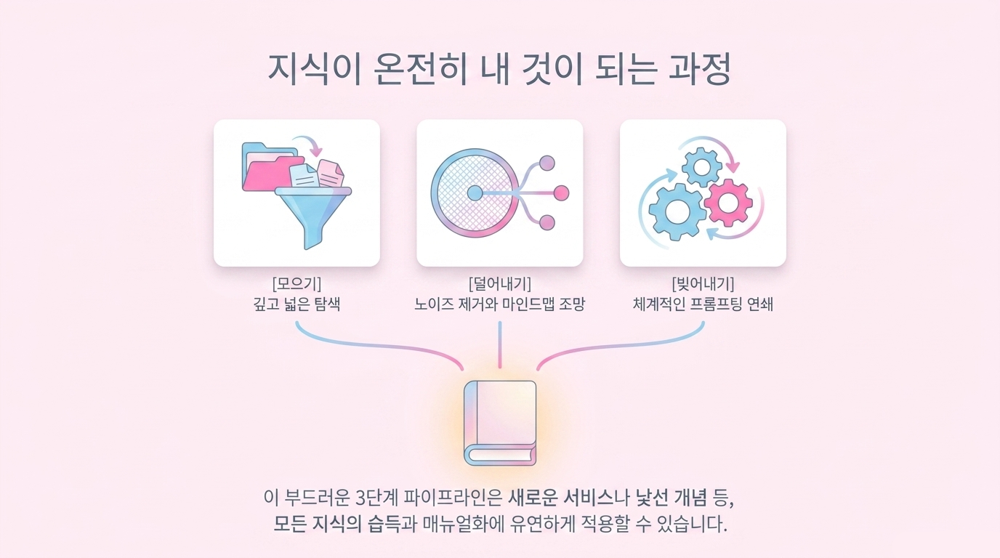

[video](https://youtu.be/y_F1mw_4noE)

아래의 내용은 공부를 해 가는 Workflow를 설명한 것입니다. 굳이 Suno AI가 아니라도 새로운 서비스나 개념을 공부하고, 그것을 매뉴얼로 만드는 과정은 모두 적용해 볼 수 있습니다. ‘Suno AI’에 해당하는 내용에 다른 서비스도 적용해 보세요.

## 작업 공간 준비 - 폴더 생성

- 데스크탑(바탕화면)에 ‘Workspace’ 폴더를 만든다.
- 이 작업공간은 장기적으로 관련된 여러 자료를 보관하기 위한 곳입니다.
- 자료는 한 곳에 모여 있어야 확장과 재가공에 도움이 됩니다.

## 자료의 수집 - Notebook LM, 크롬확장프로그램

1. Notebook LM의 ‘Deep Research’ 기능을 사용하여 자료를 수집

  - 검색 내용: “[Suno.com](http://suno.com/) 사용법, 퀄리티 있는 노래를 만드는 방법”
  - ‘Deep Research’와 ‘Fast Research’의 차이점
    - **Deep Research**: 여러 출처를 폭넓게 탐색해 자료를 **깊이 있게 수집·정리**하고, 관련 맥락/비교/근거까지 포함해 **종합적인 리서치 결과**를 얻는 데 적합.
    - **Fast Research**: 핵심 정보를 **빠르게 훑어 요약**하거나, 당장 필요한 답을 **신속히 파악**하는 데 적합(깊은 교차검증·확장 탐색은 상대적으로 적음).
  - 노트북 이름을 ‘Suno AI 노래만들기’ 등으로 수정
  - Deep Research로 검색한 자료 중 실패한 소스를 모두 삭제
2. Youtube에서 ‘Youtube to NotebookLM’ 크롬 확장을 사용하여 자료를 수집

  - 먼저 크롬 웹스토어에서 ‘Youtube to NotebookLM’을 검색하여 설치
  - 검색 내용: “Suno AI 사용법”
  - 검색 조건(우측 필터 기능)
    - 길이: 20분 초과
    - 업로드 날짜: 올해
    - 우선순위: 관련성
  - 아래로 스크롤을 몇 번 해서 더 많은 양의 검색자료 표시
: Youtube, Facebook, Instagram 등의 서비스들은 한번에 모든 데이터를 띄우지 않고 스크롤을 할 때 한 무더기씩 새로 띄우는 구조입니다. 몇 번 스크롤을 하면 더 많은 자료들이 화면에 표시되고, Youtube to NotebookLM 툴이 가져올 수 있는 소스의 양이 늘어납니다.
  - ‘NotebookLM’ 버튼을 클릭하여 자료를 위에서 만든 ‘Suno로 노래 만들기’ 노트북으로 전송
    - ‘NotebookLM’ 버튼 클릭 → ‘Choose Notebook’ → ‘Suno AI 노래 만들기’ 선택

## 자료의 정제 - Notebook LM

1. Notebook LM의 출처에서 불필요한 자료 삭제

  1. 출처에서 ‘실패한 자료’를 모두 삭제
  2. 채팅에 “Suno AI 서비스를 이용하여 노래를 만드는 방법을 공부하려고 해. 출처에서 부적절한 자료의 제목을 표시해주고, 왜 부적절한지 이유를 설명해줘.”를 입력하여 내용을 확인
  3. 표시된 문서 제목을 바탕으로 출처의 자료를 삭제 - 소스에 불필요한 자료가 있을 때 결과물의 퀄리티에 영향을 미칠 수 있음
  4. 출처의 문서 제목을 클릭하면 그 내용을 볼 수 있음
2. Notebook LM의 ‘스튜디오 - 마인드맵’에서 전체적인 내용을 훑어보기

  1. 출처의 소스 ‘모두 선택’을 클릭
  2. ‘스튜디오 - 마인드맵’의 화살표 아이콘을 클릭하면 원하는 주제로 마인드맵을 만들 수 있음
”Suno를 사용하여 노래를 제작하는 자세한 과정. 모두 한국어로 표시해줘.”
  3. 화살표 아이콘이 아니라 ‘마인드맵’ 버튼을 클릭하면 출처 전체의 내용을 마인드맵으로 구조화해줌
  4. 각 항목을 클릭하면 채팅창에 AI가 정리한 내용을 표시해줌

## Notebook LM에서 기본 매뉴얼 제작

1. 간단 버전: 
  - 채팅에서 “Suno AI를 사용하여 노래를 만드는 과정에 대한 매뉴얼을 만들어줘. AI와 프롬프트의 초보자도 이해할 수 있을 수준으로 자세하게 정리해줘. 용어 해설과 노래의 퀄리티를 향상시킬 수 있는 좋은 팁들도 포함해줘.”
2. 상세 버전
  - 채팅에서 “Suno AI를 사용하여 노래를 만드는 과정에 대한 매뉴얼을 만들려고 해. 먼저, 어떤 내용을 포함해야 하는지 Chapter별로 구분하고, 각 Chapter에서 다룰 내용들을 포함한 전체적인 개요를 정리해줘.”

  - 결과물을 확인하고 채팅에 “위의 개요를 바탕으로 'Chapter 1'의 내용을 AI와 프롬프트 초보자도 이해할 수 있을 수준으로 자세하게 정리해줘. 용어 해설과 제작에 도움이 되는 좋은 팁들도 포함해줘.”

  - 이어서 “위 Chapter 1의 형식으로 Chapter 2를 만들어줘.”, “같은 형식으로 Chapter 3을 만들어줘.”…

