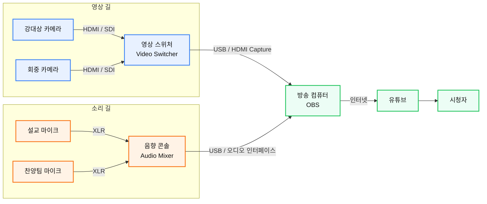
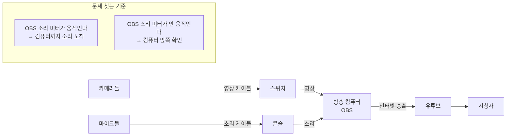

> **교회 라이브 방송 입문** 2편
> 읽는 시간 11분 · 난이도 ★☆☆ · 선행 지식 없음
> 본 내용은 필자도 공부를 하면서 AI의 도움으로 작성하는 컨텐츠입니다.

---

예배 5분 전입니다. 유튜브에 방송은 나가고 있는데, **소리가 안 들립니다.**

이럴 때 대부분 이렇게 합니다.

케이블을 뽑았다가 다시 꽂습니다. 다른 단자에 꽂아 봅니다. 프로그램을 껐다 켭니다. 콘솔 페이더를 위아래로 흔들어 봅니다.

3분이 지났습니다.

여기서 진짜 문제는 소리가 안 나는 게 아닙니다. **고쳤는지 아닌지를 알 수 없다는 것**입니다.

여러 군데를 동시에 건드렸기 때문에, 혹시 소리가 다시 나와도 무엇 때문에 나온 건지 모릅니다. 다음 주에 같은 일이 또 생깁니다.

> 문제를 못 고치는 이유는 지식이 없어서가 아니라, **순서가 없어서**입니다.

오늘 만들 것이 그 순서입니다.

---

## 이 글은 이런 분을 위한 글입니다

- 방송 사고가 났을 때 **무엇부터 봐야 할지** 막막하신 분
- 우리 교회 장비가 어떻게 연결돼 있는지 **정확히 모르시는 분**
- 전임자가 해 놓은 배선을 물려받으신 분

## 결론부터

> 🧭 **끝에서부터 하나씩 확인하지 마세요. 가운데부터 짚으세요.**
>
> 소리가 안 나면 마이크부터 보는 게 아니라, **컴퓨터의 소리 미터**부터 봅니다.

| 컴퓨터 미터가 | 문제는 어디에 |
| --- | --- |
| **움직인다** | 소리는 컴퓨터까지 잘 왔습니다 → **컴퓨터 뒤쪽** (송출 설정, 유튜브) |
| **안 움직인다** | 소리가 아직 도착 못 했습니다 → **컴퓨터 앞쪽** (마이크, 콘솔, 케이블) |

한 번 확인으로 볼 범위가 절반이 됐습니다. 그다음 절반의 가운데를 또 짚습니다. 서너 번만 반복하면 여덟 군데를 다 뒤지지 않고도 **세 번 만에** 범인을 찾습니다.

---

## 원리 — 신호는 물처럼 흐릅니다

집에서 물이 안 나올 때를 생각해 봅시다.

수도꼭지만 계속 돌리지 않습니다. 밸브가 잠겼는지, 우리 집만 그런지 온 동네가 그런지, 계량기는 도는지를 **위에서부터 순서대로** 확인합니다.

방송도 똑같습니다. 소리와 영상은 **정해진 길을 따라 한 방향으로 흐릅니다.** 그 길에서 어느 한 곳이라도 막히면, 그 아래로는 아무것도 가지 않습니다.

이 길을 아는 것이 **신호 흐름**입니다. 영어로는 시그널 플로우라고 합니다.

---

## 길은 네 구간입니다

### 1. 수집

카메라가 빛을 받아 영상 신호를 만들고, 마이크가 공기의 떨림을 받아 음성 신호를 만듭니다. **세상을 신호로 바꾸는** 구간입니다.

### 2. 정리

카메라가 두 대면 어느 화면을 내보낼지 골라야 합니다. 이걸 하는 기계가 **영상 스위처(Video Switcher)**입니다.

마이크가 여덟 개면 각각의 크기를 맞춰 하나로 섞어야 합니다. 이걸 하는 기계가 **음향 콘솔(Audio Console/Mixer)**입니다.

### 3. 송출

정리된 영상과 소리가 드디어 한자리에서 만납니다. 컴퓨터, 정확히는 **인코더**라고 부르는 프로그램에서요. 여기서 신호는 인터넷으로 보낼 수 있게 **압축**됩니다.

### 4. 도달

압축된 신호가 인터넷을 타고 유튜브 서버로 갑니다. 유튜브가 이걸 다시 여러 화질로 만들어 시청자의 TV와 휴대폰으로 뿌립니다.

```javascript
[카메라] ──→ [스위처] ──┐
                        ├─→ [컴퓨터] ──→ [유튜브] ──→ [시청자]
[마이크] ──→ [콘솔] ────┘
   수집        정리          송출          도달
```

---

## 가장 중요한 사실 — 영상과 소리는 따로 흐릅니다

영상과 소리는 **다른 길로 흐릅니다.** 영상은 카메라에서 스위처로, 소리는 마이크에서 콘솔로 갑니다. 이 둘은 서로를 모릅니다.

그러다가 **셋째 구간, 컴퓨터에서 딱 한 번 만납니다.**

이 사실 하나가 실전에서 엄청나게 유용합니다.

> 💡 **화면은 나오는데 소리가 안 난다 → 소리 길만 보면 됩니다.**
>
> 화면이 멀쩡히 나오고 있다면 영상 길은 끝까지 정상입니다. 카메라도, 스위처도, 컴퓨터도, 인터넷도, 유튜브도 다 살아 있습니다.

맨 앞의 실패 장면에서 담당자가 뽑았다 꽂았다 한 케이블은 HDMI였습니다. **영상 케이블이었어요.** 화면은 이미 잘 나오고 있었는데 말입니다.

> 잘 되고 있는 것을 보면, 볼 곳이 절반으로 줄어듭니다.

---

## 증상별 판단표

인쇄해서 부조 벽에 붙여 두시면 좋습니다.

| 증상 | 살아 있는 것 | 볼 곳 |
| --- | --- | --- |
| **화면 O, 소리 X** | 영상 길 전체, 인터넷, 유튜브 | 마이크 → 콘솔 → 컴퓨터 (소리 길만) |
| **소리 O, 화면 X** | 소리 길 전체, 인터넷, 유튜브 | 카메라 → 스위처 → 컴퓨터 (영상 길만) |
| **카메라 1대만 X** | 나머지 전부 | 그 카메라, 그 케이블, 그 입력 단자 |
| **둘 다 X, 방송은 연결됨** | 인터넷, 유튜브 | 컴퓨터의 장면 설정 |
| **방송 자체가 끊김** | — | 인터넷 → 스트림 설정 |
| **부조엔 정상, 유튜브만 이상** | 컴퓨터 앞쪽 전부 | 송출 설정, 인터넷 속도 |

표의 두 번째 칸이 핵심입니다. **살아 있는 것을 먼저 확인하면, 볼 곳이 저절로 좁혀집니다.**

---

## 실제로 해 보기 — 우리 교회 지도 그리기

컴퓨터로 하지 마시고 **손으로 그리세요.** 손으로 그려야 케이블을 실제로 눈으로 따라가게 됩니다.

1. **종이를 세로로 반 접습니다.** 위 칸은 영상, 아래 칸은 소리입니다
2. **맨 왼쪽에 우리가 가진 것을 다 적습니다.** "강대상 카메라", "설교 마이크"처럼 부르는 이름 그대로
3. **맨 오른쪽에 유튜브를 적습니다**
4. **케이블을 실제로 손으로 따라갑니다**
5. **각 선에 단자 모양을 그려 놓습니다.** 이름은 몰라도 됩니다

> 🔍 거의 모든 교회에서 이 과정에 **한 번은 놀랍니다.**
>
> "어? 이게 왜 여기로 가 있지?" 하는 선이 꼭 하나씩 나옵니다. 전임자가 임시로 꽂아 놓고 그대로 굳은 것들입니다. 그것까지 찾는 게 이 실습의 목적입니다.

📷 *신호 흐름도 샘플*





---

## 라벨을 붙이세요

지도를 그렸으면, 실제 케이블에도 이름을 붙입니다.

**반드시 양쪽 끝에 똑같이 붙이세요.** 한쪽만 붙이면 소용이 없습니다.

케이블이 스무 가닥을 넘어가면, 라벨이 있는 교회와 없는 교회의 **사고 대응 시간이 열 배 차이** 납니다.

라벨 테이프가 없으면 종이 반창고에 볼펜으로 써도 충분합니다.

---

## 지도로 연습해 보기

**문제 1. 화면은 나오는데 소리가 안 납니다. 어디부터 볼까요?**

영상 길은 볼 필요 없습니다. **아래 칸(소리 길)만** 봅니다. 그리고 아래 칸의 **가운데**, 컴퓨터의 소리 미터부터 확인합니다.

**문제 2. 카메라 한 대만 화면이 까립니다. 어디부터 볼까요?**

다른 카메라는 잘 나오니까, **스위처부터 뒤쪽은 전부 정상**입니다. 그 카메라와 그 케이블, 스위처의 그 입력 단자. **세 곳만** 보면 됩니다.

---

## 요약 — 이것만 기억하세요

1. 신호는 **한 방향으로** 흐른다. 한 곳이 막히면 그 아래는 전부 멈춘다
2. 길은 네 구간 — **수집 → 정리 → 송출 → 도달**
3. 영상과 소리는 **따로 흐르다가 컴퓨터에서 한 번 만난다**
4. **잘 되고 있는 것**을 먼저 보면 범위가 절반으로 준다
5. 끝에서가 아니라 **가운데부터** 짚는다
6. 예배 중에는 **한 번에 한 곳만** 만진다

---

## 자주 받는 질문

<details>
<summary>미터가 어디 있는지 모르겠습니다.</summary>

방송 프로그램(OBS 등) 화면 아래쪽에 소리 크기를 보여주는 가로 막대가 있습니다. 소리가 들어오면 초록색으로 움직입니다. 이게 미터입니다.

</details>

<details>
<summary>지도를 그리다 보니 용도를 모르는 선이 있습니다.</summary>

흔한 일입니다. **뽑지 마세요.** 일단 "용도 미상"이라고 적어 두고, 예배가 없는 날 하나씩 뽑아 보며 무엇이 사라지는지 확인하세요.

</details>

<details>
<summary>사고가 났을 때 너무 당황해서 아무 생각이 안 납니다.</summary>

정상입니다. 그래서 지도를 **벽에 붙이는** 것입니다. 당황했을 때 기억에 의존하지 않고 종이를 보면 됩니다.

</details>

---

## 오늘 하실 일

- [ ] 레터(A4) 종이 한 장에 **우리 교회 신호 흐름도** 손으로 그리기
- [ ] 케이블 **양쪽 끝에 라벨** 붙이기
- [ ] 그린 지도를 **부조 벽, 고개만 들면 보이는 곳**에 붙이기

서랍에 넣어 두면 없는 것과 같습니다. 사고는 항상 손이 떨릴 때 나는데, 그때 서랍을 열 여유는 없습니다.
