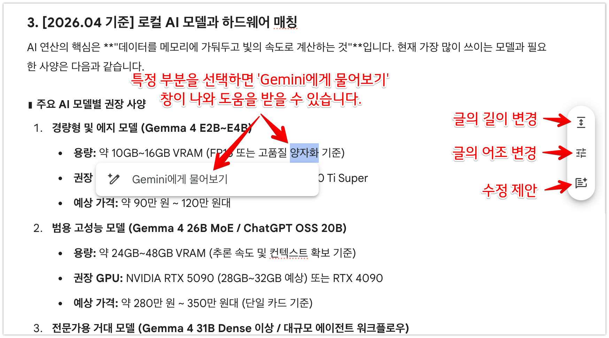

Gemini Canvas의 '실시간 직접 편집'과 '플로팅 툴박스를 이용한 스마트 편집'은 문서 작업 시 전체 내용을 새로 쓸 필요 없이 직관적이고 세밀하게 결과물을 다듬을 수 있는 핵심 기능입니다.

**1. 실시간 직접 편집**

- **즉각적인 타이핑 및 수정:** 
  - AI가 생성한 초안을 바탕으로 사용자가 편집 창(작업 공간)에서 직접 타이핑하여 내용을 수정하거나 추가할 수 있습니다.
  - 일반적으로 AI Chatbot을 사용해 질문한 결과값은 바로 수정을 할 수 없습니다. 수정할 내용을 다시 Chatbot에게 요청하거나, 결과값을 복사하여 텍스트 편집 툴(메모장, Word 등)에 가져가 편집해야 하는데, Canvas는 바로 원하는 부분을 직접 편집할 수 있는 기능을 가지고 있습니다.
- **부분 선택 및 다시 쓰기:** 
  - 마음에 들지 않는 문단이 있다면 전체를 새로 써달라고 할 필요 없이, 특정 부분만 선택한 후 AI에게 "다시 써줘"라고 지시할 수 있어 작업 흐름이 끊기지 않습니다.
  - 용어의 해설을 내용 바로 밑에 추가하도록 요청하거나, 특정 부분만 선택해 더 자세히 설명해달라고 요청할 수도 있습니다.

**2. 플로팅 툴박스를 이용한 스마트 편집**
원하는 글자를 마우스로 드래그(강조 표시)하면 화면에 즉시 **플로팅 메뉴(퀵 에디터 도구)**가 나타나며, 이를 통해 글의 전반적인 품질과 '바이브(Vibe)'를 손쉽게 높일 수 있습니다.

- **길이 변경:** 선택한 텍스트에 구체적인 설명을 더해 내용을 길게 확장하거나, 반대로 핵심만 추려 간결하게 요약할 수 있습니다.
- **어조 변경:** 글의 목적과 대상에 맞게 '전문적인' 격식체로 바꾸거나, '친근한' 캐주얼 문체로 자유롭게 전환할 수 있습니다.
- **읽기 난이도 조절:** 클릭 한 번으로 독자의 수준에 맞춰 글의 읽기 난이도를 최적화하는 기능도 제공합니다.
- **수정 제안 (Suggest Edits):** AI가 사용자가 선택한 문맥을 분석하여 더 세련된 표현을 제안하거나 오탈자를 찾아 교정해 줍니다.

이러한 기능들을 통해 사용자는 기존 챗봇처럼 텍스트를 복사하고 붙여넣는 번거로움 없이, AI와 나란히 앉아 하나의 문서를 **정교하고 완성도 있게 공동 창작**할 수 있습니다.
