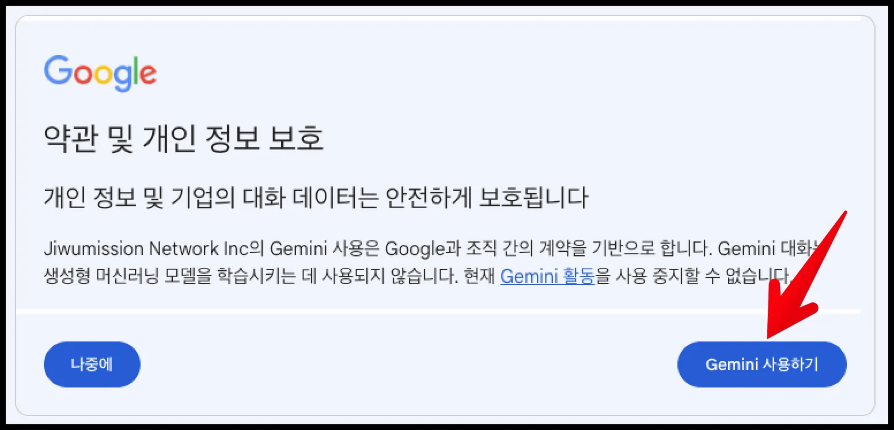
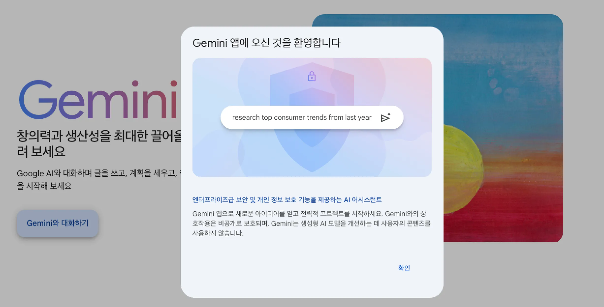
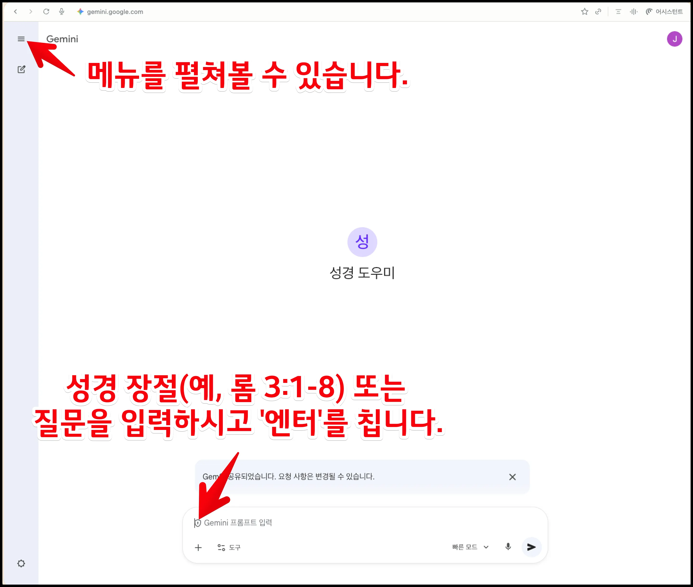
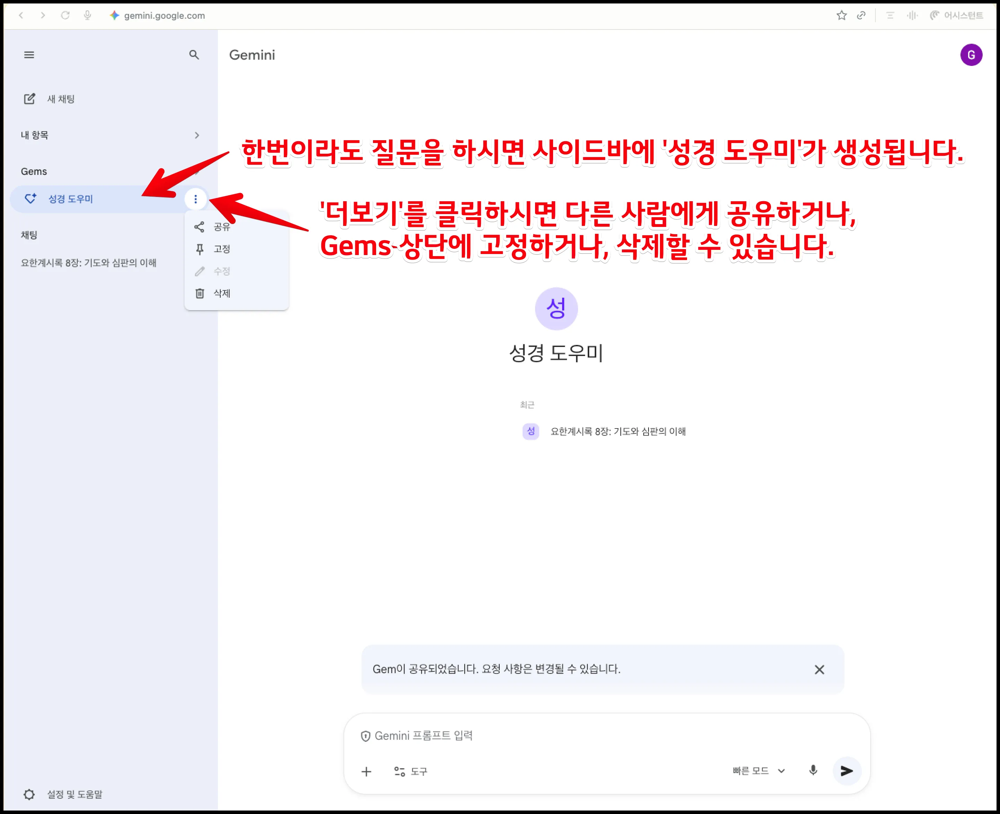

**동영상 개요**



## 새해 성경 읽기, 정말 의미 있게 하고 계신가요?

매년 1월이 되면 많은 그리스도인들이 "올해는 성경을 꼭 완독하겠다"는 다짐을 합니다. 1독, 2독, 3독... 숫자가 늘어날수록 더 영적으로 성장한 것처럼 느껴지기도 합니다. 하지만 과연 그럴까요?

성경을 단순히 처음부터 끝까지 읽는 것만으로는 하나님의 마음을 온전히 이해하기 어렵습니다. 창세기부터 요한계시록까지 66권의 책은 각기 다른 시대적 배경, 문화적 맥락, 저자의 의도를 담고 있습니다. 이러한 배경과 맥락을 놓친 채 글자만 읽어 내려간다면, 우리는 하나님의 말씀이 담고 있는 깊은 의미를 놓치게 됩니다.

예를 들어, 구약의 율법서를 읽을 때 고대 근동 문화를 이해하지 못하면 그저 낡은 규칙의 나열로 보일 수 있습니다. 예언서를 읽을 때 역사적 배경을 모르면 그 절박한 메시지가 와닿지 않습니다. 신약의 서신서를 읽을 때 초대교회의 상황을 이해하지 못하면 오늘날 우리 삶에 어떻게 적용해야 할지 막막합니다.

이제는 성경 읽기의 방식을 바꿔야 할 때입니다. 단순히 많이 읽는 것이 아니라, **깊이 있게, 맥락 안에서, 하나님의 마음을 헤아리며** 읽어야 합니다.

이를 위해 'AI와 함께 하는 성경읽기 도우미'를 소개합니다. Google Gems를 활용한 이 도구는 여러분의 성경 읽기를 단순한 완독을 넘어 **깊은 이해와 적용**의 여정으로 안내합니다.

## 샘플 예시

> **Question 1**
>
> ‘미가 3장’

> **Answer:**
>
> ## 1단계: 역사적/문화적 배경 (Setting the Stage)
> 
> 미가 선지자는 기원전 8세기, 남유다의 요담, 아하스, 히스기야 왕 시대에 활동했습니다. 당시 남유다는 겉으로는 종교적 형식을 갖추었으나, 속으로는 **'부익부 빈익빈'**이 극에 달한 불공평한 사회였습니다.
> 
> 비유를 들자면, **'대기업 회장들과 정치인, 그리고 종교 지도자들이 짜고 치는 고스톱'** 판과 같습니다. 힘 있는 자들은 가난한 이들의 땅을 빼앗고, 종교 지도자들은 돈을 주면 축복을 빌어주고 돈을 안 주면 저주를 퍼부었습니다. 미가 3장은 바로 이러한 사회 지도층의 추악한 민낯을 향해 하나님의 심판을 선포하는 본문입니다.
> 
> ---
> 
> ## 2단계: 핵심 원어 해설 (Original Language Insights)
> 
> 3장 1절과 9절에서 반복되는 **'정의(Mishpat, מִשְׁפָּט)'**라는 단어가 핵심입니다.
> 
> - **원어적 의미:** 히브리어 '미쉬파트'는 단순한 재판의 판결을 넘어, 고아와 과부 같은 사회적 약자를 보호하고 그들의 권리를 되찾아주는 '사회적 공의'를 뜻합니다.
> - **풍성한 뉘앙스:** 당시 지도자들은 법(Law)을 알았지만, 미쉬파트(Justice)는 버렸습니다. 그들은 법망을 교묘히 피해 가며 가난한 자들을 수탈했습니다. 성경은 그들이 율법의 글자(Letter)는 지켰을지 몰라도, 그 정신인 '미쉬파트'를 저버린 것은 사람의 가죽을 벗기고 뼈를 꺾는 것과 다름없는 '식인 행위'라고 고발합니다.
> 
> ---
> 
> ## 3단계: 핵심 아이디어 (Big Ideas)
> 
> 1. **지도층의 부패와 공동체의 멸망:** 정치적 리더(치리자), 종교적 리더(선지자, 제사장)가 사리사욕을 위해 직분을 이용할 때, 그 공동체는 영적 소경이 되며 결국 심판에 이르게 된다는 원리입니다.
> 2. **참된 영적 권위의 출처:** 미가는 자신의 권위가 돈이나 지위가 아니라, 오직 "여호와의 영으로 말미암아 능력과 정의와 용기로 충만해진 것(8절)"임을 강조합니다. 즉, 하나님의 말씀은 때로 듣기 괴로운 심판의 소리일지라도 타협 없이 선포되어야 한다는 것입니다.
> 
> ---
> 
> ## 4단계: 성경 연결하기 (Cross-References)
> 
> - **아모스 5:24** - "오직 정의를 물 같이, 공의를 마르지 않는 강 같이 흐르게 할지로다" (동시대 선지자의 공의에 대한 외침)
> - **디모데전서 6:10** - "돈을 사랑함이 일만 악의 뿌리가 되나니 이것을 탐내는 자들은 미혹을 받아 믿음에서 떠나 많은 근심으로써 자기를 찔렀도다" (돈에 눈먼 지도자들에 대한 경고)
> 
> ---
> 
> ## 5단계: 생각해보기 (Thinking Tools)
> 
> 1. 당신은 혹시 하나님을 '복채'를 주면 복을 주시고, 정성이 부족하면 벌을 주시는 '기복 신앙의 대상'으로 오해하고 있지는 않습니까? (5절의 거짓 선지자들처럼)
> 2. 공동체 안에서 당신이 가진 작은 권력이나 영향력을 사용하여 은근히 자신의 이익을 챙기면서, 겉으로는 "여호와께서 우리 중에 계시지 아니하냐(11절)"라며 종교적 안도감에 숨어 있지는 않습니까?
> 3. 당신이 듣고 싶어 하는 '평강'의 메시지가 실제로는 당신의 죄를 덮어버리는 독약이 될 수도 있다는 사실을 인지하고 있습니까?
> 
> ---
> 
> ## 6단계: 근거 및 출처 (Sources)
> 
> - **IVP 성경주석:** 미가서 3장 (당시 사회 경제적 상황 및 지도층 부패 분석)
> - **ESV Study Bible:** Micah 3 Commentary (정치적, 종교적 타락의 대조)
> - **Theological Wordbook of the Old Testament (TWOT):** 'Mishpat'의 신학적 용례 연구
> - **김회권, '소예언서 주석':** 한국적 상황에서의 공의와 심판 해석 참고
> 
> ---
> 
> 이 중 어느 단계에 대해 더 구체적인 설명이 필요한가요?

> **Question 2**
>
> ‘성경이 말하는 '정의'는 뭐야?’

> **Answer:**
>
> ## 1단계: 역사적/문화적 배경 (Setting the Stage)
> 
> 고대 근동 사회에서 '왕'의 가장 중요한 임무는 영토 확장이나 경제 발전이 아니라, 사회적 약자를 보호하는 것이었습니다. 당시 사람들은 세상을 **'정글'**처럼 느꼈습니다. 힘 있는 자가 약한 자를 잡아먹는 것이 당연시되는 시대였죠.
> 
> 비유를 들자면, 성경의 정의는 **'심판 없는 축구 경기장'**에 하나님이 심판으로 등장하시는 것과 같습니다. 강한 팀이 규칙을 어기며 약한 팀을 짓밟을 때, 하나님은 경기를 멈추고 약한 자의 권리를 회복시키며 경기장을 평화롭게 만드십니다. 즉, 성경적 정의는 단순히 '법대로 하는 것'을 넘어, 깨어진 관계를 바로잡는 **'회복의 에너지'**입니다.
> 
> ---
> 
> ## 2단계: 핵심 원어 해설 (Original Language Insights)
> 
> 구약 성경에서 정의를 말할 때 두 단어가 쌍둥이처럼 붙어 다닙니다. 바로 **미쉬파트(Mishpat)**와 **쯔다카(Tsedaqah)**입니다.
> 
> - **미쉬파트 (Mishpat, מִשְׁפָּט):** 주로 '공의' 혹은 '정의'로 번역됩니다. 재판과 관련된 용어로, 특히 고아, 과부, 나그네처럼 스스로를 변호할 수 없는 사람들에게 그들의 마땅한 권리를 찾아주는 **'실천적 행동'**을 의미합니다.
> - **쯔다카 (Tsedaqah, צְדָקָה):** 주로 '공의' 혹은 '의로움'으로 번역됩니다. 이는 추상적인 윤리가 아니라 **'관계에 충실함'**을 뜻합니다. 하나님과의 관계, 이웃과의 관계에서 마땅히 해야 할 도리를 다하는 상태를 말합니다.
> - **뉘앙스의 차이:** 한글 개역개정은 이 둘을 섞어서 번역하기도 하지만, 성경이 말하는 정의는 **'올바른 관계(쯔다카)'**에서 출발하여 **'약자를 보호하는 행동(미쉬파트)'**으로 완성됩니다.
> 
> ---
> 
> ## 3단계: 핵심 아이디어 (Big Ideas)
> 
> 1. **배분적 정의를 넘어선 구속적 정의:** 세상의 정의는 '받은 만큼 돌려주는 것'이지만, 성경의 정의는 '필요한 만큼 채워주는 것'에 가깝습니다. 하나님은 죄인인 우리를 법대로 처벌하시는 대신, 아들을 통해 우리를 '의롭다' 하심으로 관계를 회복시키셨습니다.
> 2. **공동체적 책임:** 성경에서 정의가 부재하다는 것은 단순히 개인의 도덕성이 나쁜 것이 아니라, 사회 구조가 약자를 착취하도록 방치되는 상태를 말합니다. 따라서 정의는 개인의 경건을 넘어 사회 구조적 책임까지 포괄합니다.
> 
> ---
> 
> ## 4단계: 성경 연결하기 (Cross-References)
> 
> - **시편 33:5** - "그는 공의와 정의를 사랑하심이여 세상에는 여호와의 인자하심이 충만하도다" (쯔다카와 미쉬파트가 함께 등장하는 대표적 구절)
> - **마태복음 23:23** - "...율법의 더 중한 바 정의와 긍휼과 믿음은 버렸도다 그러나 이것도 행하고 저것도 버리지 말아야 할지니라" (예수님이 강조하신 정의의 우선순위)
> 
> ---
> 
> ## 5단계: 생각해보기 (Thinking Tools)
> 
> 1. 당신은 '정의'를 나에게 잘못한 사람을 벌주는 수단으로만 생각합니까, 아니면 내가 가진 것을 나누어 약자를 세워주는 책임으로 생각합니까?
> 2. 성경은 '제사(예배)'보다 '정의'가 우선한다고 반복해서 말합니다(잠 21:3). 당신의 주일 예배와 월요일부터의 삶 속 '정의'는 연결되어 있습니까?
> 3. 만약 하나님이 우리에게 '공평한 정의'만 적용하셨다면, 과연 우리 중 살아남을 자가 있을까요? 하나님의 정의 안에 담긴 '자비(Mercy)'의 요소를 인식하고 있습니까?
> 
> ---
> 
> ## 6단계: 근거 및 출처 (Sources)
> 
> - **니콜라스 월터스토프, 『정의와 평화가 입 맞출 때까지』:** 성경적 정의의 개념 정립.
> - **팀 켈러, 『관대함의 정의』:** 미쉬파트와 쯔다카의 현대적 적용 및 신학적 분석.
> - **IVP 성경 배경 주석:** 고대 근동의 법 체계와 성경적 공의의 독특성 비교.
> - **구약 신학 사전 (NIDOTTE):** 'Mishpat' 및 'Tsedaqah' 어근 및 용례 연구.
> 
> ---
> 
> 이 중 어느 단계에 대해 더 구체적인 설명이 필요한가요?

> 
>
> ## Google Gems 링크 
> 
> - 아래 북마크를 클릭하세요.
> - Gemini 기반으로 무료 사용이 가능합니다.
> 
> [‘성경 도우미’ Gems 링크 → 클릭하세요.](https://gemini.google.com/gem/1r43a1pYZd8NQkFvRcUfC-fgetMeivmjK?usp=sharing)
> 
> [https://gemini.google.com/gem/1r43a1pYZd8NQkFvRcUfC-fgetMeivmjK?usp=sharing](https://gemini.google.com/gem/1r43a1pYZd8NQkFvRcUfC-fgetMeivmjK?usp=sharing)
> 
> 셀폰에서는 위 링크를 복사, 붙여넣기 하여 사용하실 수 있습니다. 

## 사용 방법

1. 위 링크를 클릭하시면 ‘성경 도우미’ Gems에 바로 들어가 사용하실 수 있습니다. 만약 한번도 Google Gemini를 사용하지 않으셨던 분은 아래와 같은 창이 나옵니다. ‘Gemini 사용하기’를 클릭하세요.

2. 처음 사용하시는 분에게는 환영 메시지가 뜹니다. ‘확인’을 클릭합니다.

3. ‘성경 도우미’ 실행창의 모습입니다. 일반 Gemini 또는 ChatGPT처럼 아래 ‘프롬프트 입력’창에 질문을 하시면 됩니다. 질문은 다음의 여러가지 방법을 포함해서 사용하시면 됩니다.
  1. ‘롬 3:1-8’과 같이 단순히 성경 장절을 입력합니다. 
  2. 롬 3:4의 뜻을 쉽게 설명해줘.
  3. 성경 본문의 이 표현의 배경을 설명해줘.
  4. 성경이 말하는 ‘의’의 의미를 설명해줘. 

4. 한 번이라도 질문을 하면 Gemini의 ‘사이드바’에 ‘성경 도우미’ Gems가 표시됩니다. 다음부터는 이 메뉴를 클릭하셔서 사용하실 수 있습니다.

5. 구글은 Gems를 만든 사람의 **'노하우(프롬프트)'를 보호**하기 위해, 공유받은 사람이 그 내부 지침을 함부로 보거나 복사하지 못하게 막아두었습니다.
  - **공유 (Share):** 이 Gems 링크를 다른 사람에게 또 전달할 때 씁니다.
  - **고정 (Pin):** 내 Gemini 왼쪽 메뉴 상단에 이 Gems를 붙여두고 언제든 바로 꺼내 쓰기 위해 사용합니다. (사실상 '저장' 기능입니다.)
  - **삭제 (Delete):** 내 리스트에서 이 Gems를 삭제합니다.
6. ‘성경 도우미’ Gems는 제작자가 더 유용한 기능으로 업데이트하면 실시간으로 반영되어 모두 사용하실 수 있습니다.
7. 만약 ‘성경 도우미’ Gems를 개인적으로 더 업그레이드시켜서 사용하기를 원하시는 분은 아래 카카오톡 또는 이메일로 Gems ‘지침’을 요청해 주시면 공유해 드리도록 하겠습니다.

## Google Gemini의 'Gems' 서비스란?

**Gems**는 Google Gemini에서 제공하는 **맞춤형 AI 어시스턴트 생성 도구**입니다. 사용자가 특정 목적에 맞게 AI의 역할, 톤, 전문성을 미리 설정해두고, 필요할 때마다 해당 설정으로 대화를 시작할 수 있는 기능입니다.

### 주요 특징

1. **맞춤형 AI 캐릭터 생성**
  - 사용자가 직접 AI의 역할을 정의할 수 있습니다 (예: 성경 교사, 코딩 튜터, 글쓰기 코치 등)
  - 말투, 전문성 수준, 응답 스타일을 커스터마이징 가능합니다
2. **재사용 가능한 프롬프트 템플릿**
  - 한 번 만들어두면 계속해서 같은 설정으로 대화를 시작할 수 있습니다
  - 매번 긴 프롬프트를 입력할 필요 없이 바로 본론으로 들어갈 수 있습니다
3. **공유 기능**
  - 만든 Gems를 다른 사람과 공유할 수 있습니다
  - 공유받은 사람은 링크 클릭만으로 바로 사용 가능합니다
  - **중요:** 제작자의 프롬프트(지침)는 보호되어 복사나 열람이 불가능합니다
4. **실시간 업데이트**
  - 제작자가 Gems를 업데이트하면 공유받은 모든 사용자에게 자동으로 반영됩니다
  - 별도의 재공유나 재설치 없이 최신 버전을 사용할 수 있습니다

### 사용 방법

1. **Gems 만들기**
  - Gemini 왼쪽 사이드바에서 'Gem Manager' 클릭
  - '새 Gem 만들기' 선택
  - Gem의 이름, 설명, 지침(프롬프트)을 작성
  - 저장 후 바로 사용 가능
2. **Gems 사용하기**
  - 왼쪽 사이드바에서 원하는 Gem 선택
  - 일반 Gemini처럼 대화 입력창에 질문 입력
  - 설정된 역할과 톤으로 응답을 받습니다
3. **Gems 관리하기**
  - **Pin (고정):** 자주 쓰는 Gem을 상단에 고정
  - **Share (공유):** 링크로 다른 사람과 공유
  - **Edit (수정):** 지침이나 설정 변경
  - **Delete (삭제):** 더 이상 필요 없는 Gem 제거

### 활용 예시

- **성경 연구 도우미:** 히브리어/헬라어 배경, 문맥 설명, 신학적 해석을 제공하는 전문 AI
- **코딩 튜터:** 특정 언어에 특화되어 친절하게 설명하고 예제 코드를 제공하는 AI
- **글쓰기 코치:** 문체 개선, 논리 구조 검토, 맞춤법 교정을 도와주는 AI
- **외국어 회화 파트너:** 특정 언어로만 대화하며 발음과 문법을 교정해주는 AI
- **브레인스토밍 파트너:** 창의적 아이디어 발상과 확장을 돕는 AI

### ChatGPT의 GPTs와의 차이점

| **항목** | **Google Gems** | **ChatGPT GPTs** |
| --- | --- | --- |
| 접근성 | Gemini 무료 사용자도 이용 가능 | ChatGPT Plus 유료 구독 필요 |
| 프롬프트 보호 | 공유 시 프롬프트 자동 보호 | 프롬프트 추출 가능성 있음 |
| 업데이트 | 제작자 수정 시 자동 반영 | 버전별로 재공유 필요 |
| 복잡도 | 상대적으로 단순하고 직관적 | 더 복잡한 설정 가능 (Actions, Knowledge 등) |

### 제한 사항

- 공유받은 Gems의 내부 프롬프트는 볼 수 없습니다
- 현재는 텍스트 기반 지침만 설정 가능합니다 (파일 업로드나 외부 API 연동은 제한적)
- Gemini의 일반적인 제약사항이 그대로 적용됩니다

### 유용한 팁

1. **구체적인 지침 작성:** "친절하게"보다는 "초보자도 이해할 수 있도록 예시를 들어 단계별로 설명해줘"처럼 구체적으로 작성
2. **역할 명확히 정의:** "당신은 10년 경력의 성경 히브리어 교수입니다"처럼 명확한 페르소나 부여
3. **출력 형식 지정:** "항상 1. 배경설명 2. 원어분석 3. 적용점 순서로 답변해줘" 등 구조화
4. **금지사항 명시:** "추측하지 말고 확실한 정보만 제공해줘" 등 제약 조건 설정
