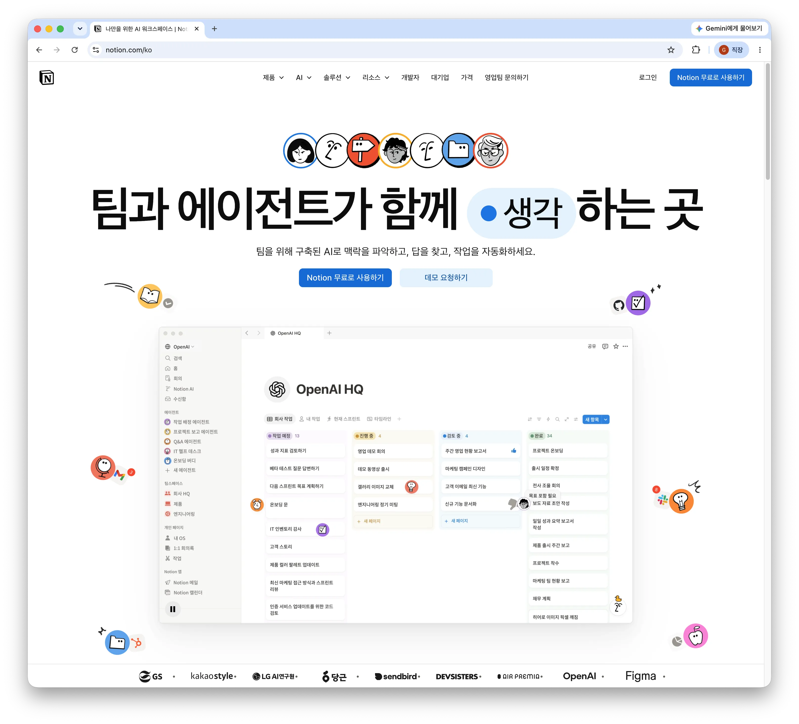
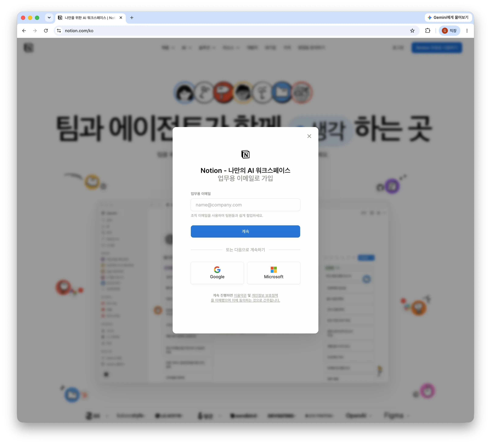
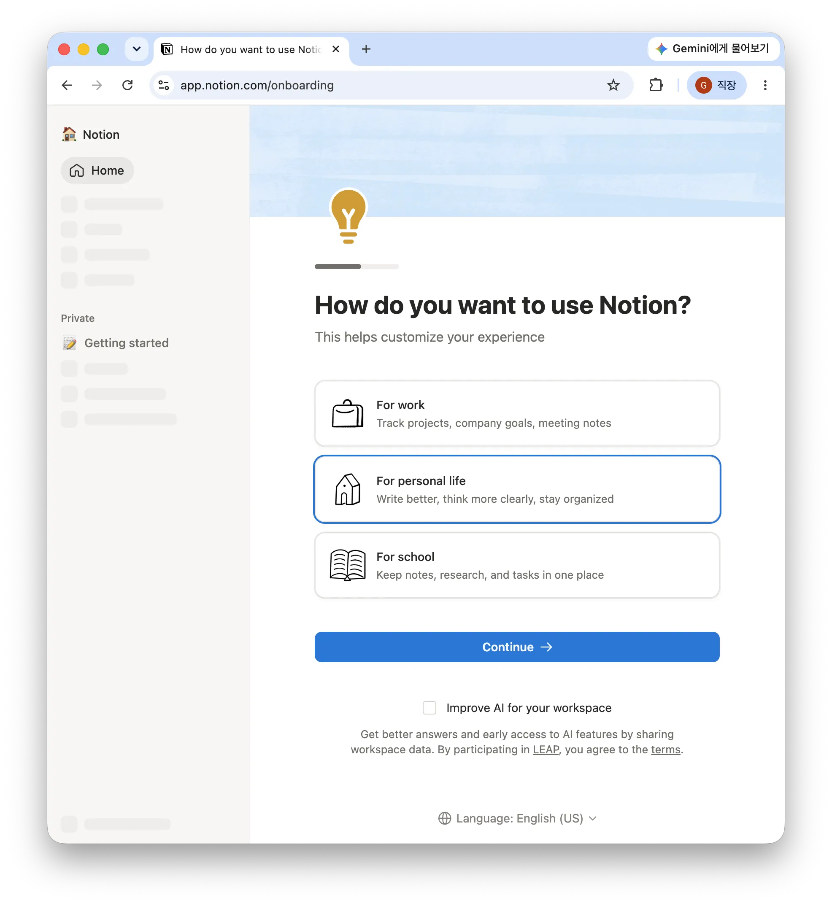
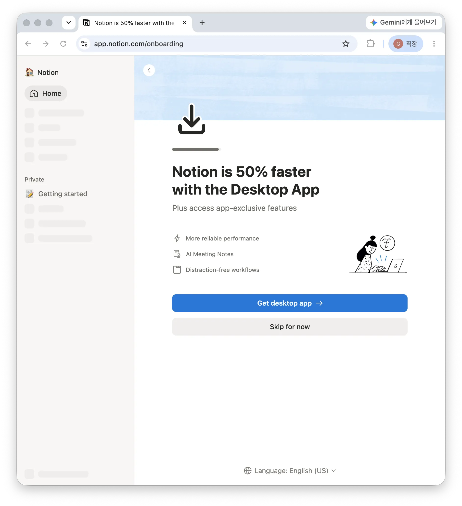
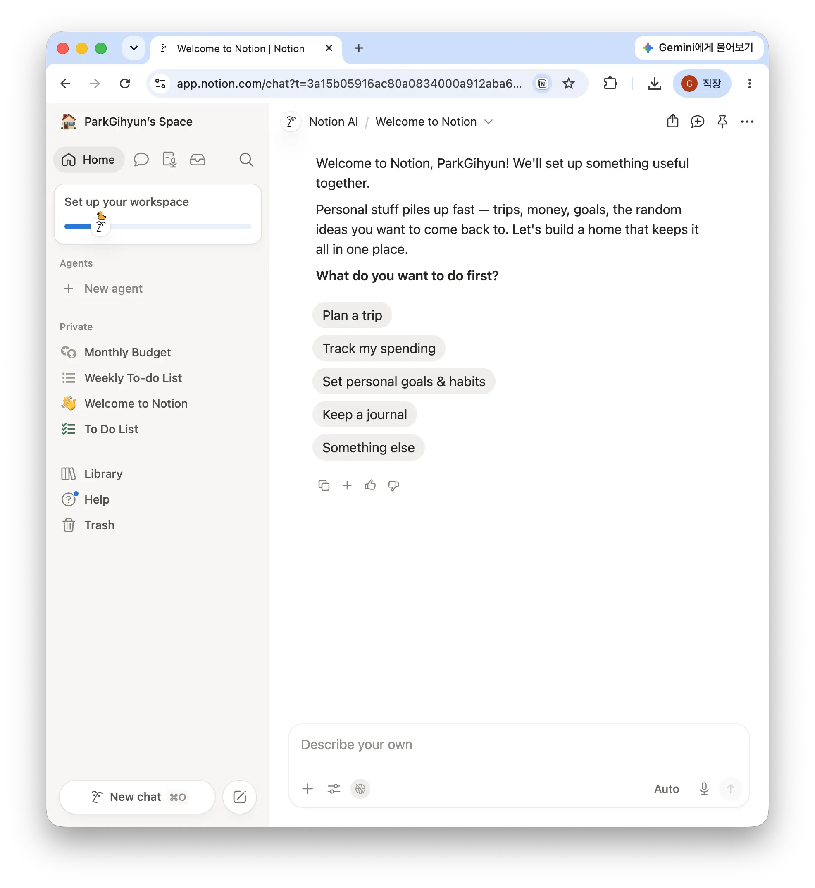
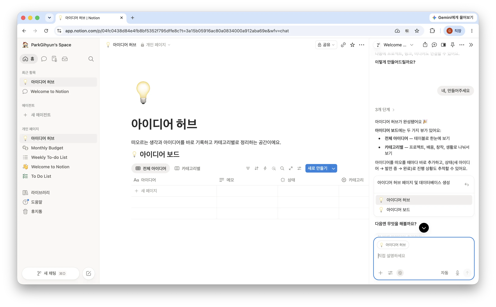
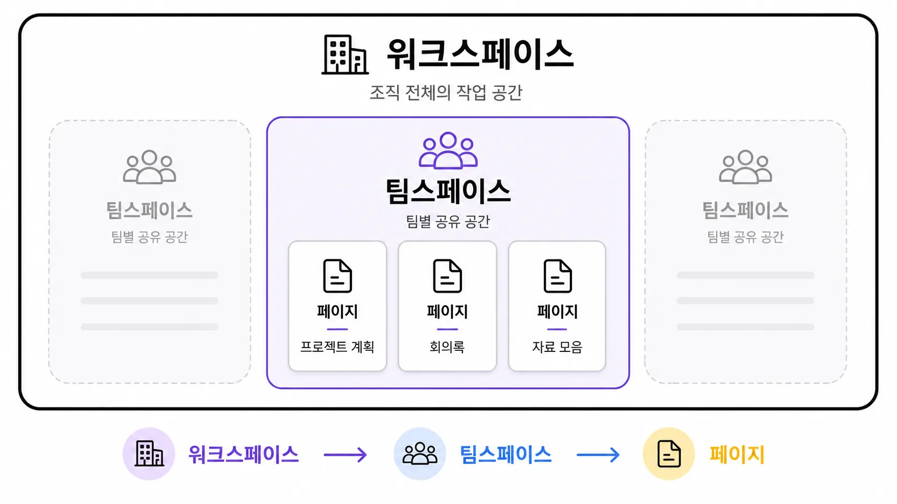

> 🎯 **학습 목표:** Notion이 무엇인지 이해하고, 계정을 만들어 화면을 자유롭게 둘러볼 수 있다.

## 1-1. Notion이란?

Notion은 **문서, 메모, 할 일 목록, 데이터베이스, 협업**을 한곳에서 해결하는 올인원(all-in-one) 작업 공간입니다. 원래 메모장, 엑셀, 사내 위키, 일정 관리 도구로 나눠 하던 일을 Notion 한 곳에서 처리할 수 있습니다.

실무에서는 보통 이렇게 쓰기 시작합니다: 회의록 정리 → 프로젝트·할 일 관리 → 팀 지식 문서(위키) → 데이터 관리.

## 1-2. 계정 만들기와 요금제

1. [notion.com](http://notion.com/)에서 이메일 또는 Google/Apple 계정으로 가입합니다.

2. 개인용은 **무료 플랜**으로도 충분히 쓸 수 있습니다. 팀과 함께 쓰거나 고급 기능(무제한 파일 업로드, 권한 관리 등)이 필요하면 유료 플랜을 고려합니다. 새 계정을 생성할 때는 ‘Google로 로그인’이 편리합니다.

3. 용도를 설정하고, 데스크탑 앱을 설치합니다. 노션은 웹브라우저, 데스크탑 앱 모두 사용 가능합니다. 데스크탑 앱을 사용하면 더 많은 작업을 할 수 있습니다.
> 
>
> 
> 
> 
4. Notion AI가 첫 사용을 지원합니다. 원하는 작업을 선택하거나, 별도의 요청을 하면 그에 따라 첫 작업 공간을 마련해줍니다. 단, Notion AI는 기본 용량을 사용한 후에는 유료 결제를 해야 사용할 수 있는 기능입니다.

## 1-3. 화면 구성 살펴보기

Notion 화면은 크게 세 영역으로 나뉩니다.

- **사이드바(왼쪽):** 워크스페이스, 팀스페이스, 페이지 목록, 검색, 설정이 모여 있는 곳
- **상단바:** 현재 페이지 경로, 공유·댓글·즐겨찾기 버튼
- **본문 영역(가운데):** 실제로 내용을 작성하는 공간
- **Notion AI(오른쪽):** 페이지 내용에 대해 질문하거나, 글을 요약·정리하고, 초안을 작성하도록 요청할 수 있는 AI 도우미 영역(유료기능)

## 1-4. 워크스페이스 · 팀스페이스 · 페이지의 관계

가장 큰 단위가 **워크스페이스**(회사/개인 전체 공간), 그 안에 주제별 **팀스페이스**가 있고, 팀스페이스 안에 실제 문서인 **페이지**가 담깁니다. 서랍장(워크스페이스) 안에 칸(팀스페이스), 칸 안에 서류(페이지)가 있다고 생각하면 쉽습니다.

## 1-5. 앱 · 웹 · 모바일

같은 계정으로 데스크톱 앱, 웹 브라우저, 모바일 앱에서 모두 접속할 수 있고 내용은 실시간으로 동기화됩니다. 집중해서 작업할 때는 데스크톱 앱, 잠깐 확인·메모할 때는 모바일 앱이 편합니다.

---

## 📖 용어정리

| 용어 | 뜻 |
| --- | --- |
| 워크스페이스 | 하나의 계정이 소속된 가장 큰 작업 공간. 회사 또는 개인 단위 |
| 팀스페이스 | 워크스페이스 안에서 주제·팀별로 나눈 공간 |
| 사이드바 | 화면 왼쪽의 페이지 목록·검색·설정 영역 |
| 페이지 | 내용을 작성하는 문서 단위. Notion의 기본 뼈대 |

## ❓ FAQ

**Q. 무료로 어디까지 쓸 수 있나요?**

A. 개인 사용은 페이지·블록 수 제한 없이 무료로 충분히 쓸 수 있습니다. 파일 업로드 용량, 팀 협업 권한 등에서 유료와 차이가 납니다.

**Q. 회사 계정과 개인 계정을 나눠야 하나요?**

A. 권장합니다. 하나의 이메일로도 여러 워크스페이스를 오갈 수 있으니, 업무용 워크스페이스와 개인용을 분리하면 자료가 섞이지 않습니다.

**Q. 앱과 웹 중 뭘 써야 하나요?**

A. 기능은 동일합니다. 알림·단축키·집중 작업에는 데스크톱 앱을 추천합니다.

## 💡 Tips

- `Ctrl/Cmd + P`로 어디서든 빠르게 페이지를 검색해 이동할 수 있습니다.
- 설정에서 **다크 모드**를 켜면 눈이 편합니다.
- 자주 쓰는 페이지는 **즐겨찾기**(별표)에 추가해 사이드바 상단에 고정하세요.
