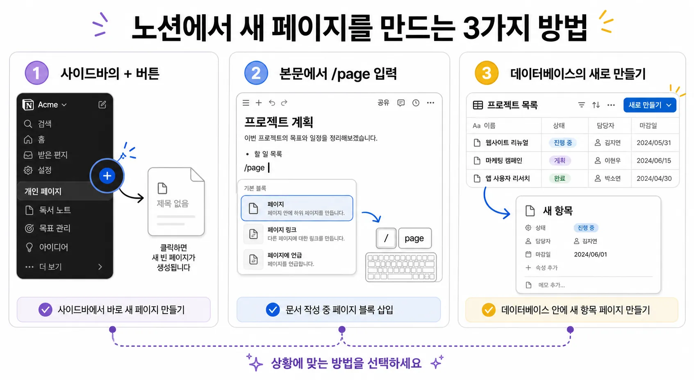
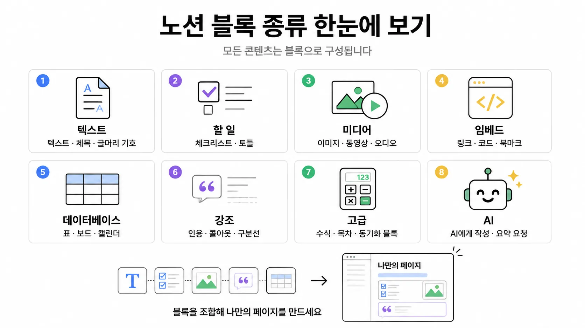
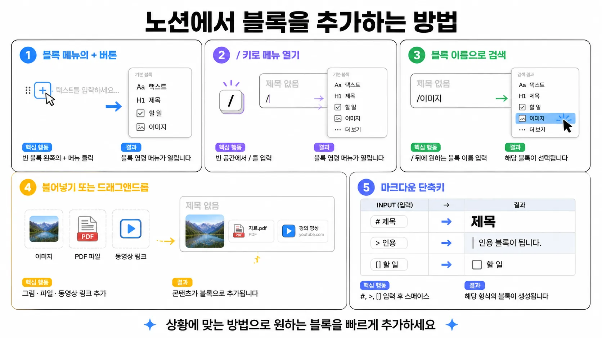

> 🎯 **학습 목표:** Notion에서 페이지가 어떤 의미인지 이해하고, 새 페이지를 만든 뒤 꾸미고 블록으로 내용을 구성할 수 있다.

## 2-1. 페이지란?

Notion에서 **페이지(page)**는 내용을 담는 가장 기본적인 문서 단위입니다. Chapter 1에서 살펴본 워크스페이스와 팀스페이스가 자료를 담는 큰 공간이라면, 페이지는 실제 글을 쓰고 정보를 정리하는 한 장의 문서입니다.

페이지 안에는 텍스트, 제목, 체크리스트, 이미지, 표 같은 여러 요소를 넣을 수 있습니다. 또한 페이지 안에 또 다른 페이지를 넣어 계층 구조를 만들 수도 있습니다.

쉽게 말해 Notion의 구조는 이렇게 이해하면 됩니다.

- **워크스페이스:** 전체 작업 공간
- **팀스페이스:** 주제나 팀별 공간
- **페이지:** 실제 내용을 작성하는 문서
- **블록:** 페이지 안에 들어가는 각각의 요소

## 2-2. 페이지를 만들 수 있는 방법

Notion에서는 여러 위치에서 새 페이지를 만들 수 있습니다. 처음에는 아래 세 가지 방법만 익혀도 충분합니다.

1. **사이드바에서 만들기**
  사이드바의 팀스페이스나 기존 페이지에 마우스를 가져가면 우측에 `+` 버튼이 나타납니다. 버튼을 눌러 새 페이지를 만듭니다. 가장 기본적인 방법입니다.
2. **본문 안에서 하위 페이지 만들기**
  페이지 안에서 `/page` 또는  `/페이지` 를 입력하거나, 블록 메뉴에서 **페이지**를 선택하면 현재 페이지 안에 하위 페이지를 만들 수 있습니다.
3. **데이터베이스 안에서 만들기**
  표, 보드, 캘린더 같은 데이터베이스에서 `새로 만들기`를 누르면 각 항목이 하나의 페이지로 만들어집니다. 데이터베이스는 뒤 챕터에서 더 자세히 다룹니다.

## 2-3. 페이지와 하위 페이지

페이지 안에는 또 다른 페이지를 넣을 수 있습니다. 이것을 **하위 페이지**라고 합니다.

예를 들어 `팀 홈` 페이지 안에 `회의록`, `프로젝트`, `자료실` 페이지를 만들 수 있습니다. 그러면 사이드바에서도 같은 계층 구조가 트리 형태로 나타납니다.

하위 페이지를 사용하면 관련 문서를 한곳에 모아둘 수 있어 자료를 찾기 쉽습니다. 처음에는 큰 주제 페이지를 만들고, 그 안에 세부 페이지를 하나씩 넣는 방식으로 정리하면 좋습니다.

## 2-4. 페이지의 역할

Notion의 페이지는 단순히 글을 적는 공간을 넘어, 자료를 담고 정리하는 기본 단위입니다. 페이지의 역할을 세 가지로 이해하면 이후 블록과 데이터베이스를 배울 때 훨씬 자연스럽습니다.

- **하나의 문서:** 페이지는 회의록, 수업 노트, 프로젝트 계획서, 매뉴얼처럼 하나의 독립된 문서로 사용할 수 있습니다. 제목을 붙이고 내용을 작성하면 그 자체로 완성된 문서가 됩니다.
- **자료를 담는 컨테이너:** 페이지 안에는 글뿐 아니라 그림, 동영상, 파일, 링크, 표, 체크리스트 등을 함께 넣을 수 있습니다. 그래서 페이지는 여러 종류의 자료를 한곳에 모아두는 컨테이너 역할을 합니다.
- **폴더처럼 정리하는 공간:** 페이지 안에 하위 페이지를 만들면 폴더 안에 파일을 넣듯이 관련 문서를 묶을 수 있습니다. 예를 들어 `프로젝트` 페이지 안에 `회의록`, `자료`, `할 일` 페이지를 넣어 구조적으로 정리할 수 있습니다.

## 2-5. 페이지 꾸미기

페이지를 만들었다면 먼저 제목을 정하고, 아이콘과 커버를 추가해 구분하기 쉽게 꾸밀 수 있습니다.

- **제목:** 페이지의 이름입니다. 사이드바와 검색 결과에도 표시됩니다.
- **아이콘:** 페이지 앞에 붙는 작은 그림입니다. 이모지나 아이콘을 사용할 수 있습니다.
- **커버:** 페이지 상단에 들어가는 넓은 배경 이미지입니다.

페이지 맨 위에 마우스를 올리면 **아이콘 추가 / 커버 추가** 버튼이 나타납니다. 아이콘과 커버를 넣으면 페이지의 성격을 한눈에 파악하기 쉽고, 여러 페이지 사이에서 원하는 문서를 더 빨리 찾을 수 있습니다.





## 2-6. 블록이란?

페이지의 겉모양을 만들었다면 이제 페이지 안에 내용을 채울 차례입니다. Notion에서 페이지 안에 들어가는 모든 요소는 **블록(block)**입니다.

한 줄의 텍스트, 제목, 이미지, 표, 체크박스, 구분선까지 모두 블록입니다. 블록은 레고 블록처럼 자유롭게 쌓고, 옮기고, 바꿀 수 있습니다.

Notion을 잘 다룬다는 것은 결국 페이지 안의 블록을 원하는 구조로 배치하고 정리할 수 있다는 뜻입니다.

## 2-7. 블록 추가·이동·삭제

블록은 페이지 안에서 계속 추가하고, 순서를 바꾸고, 필요 없는 것은 삭제하면서 문서를 완성합니다.

- **추가:** 빈 줄에서 `/`를 누르면 블록 메뉴가 나타납니다. 원하는 블록을 검색해 선택합니다.
- **이동:** 블록 왼쪽의 ∷ 핸들을 잡고 드래그하면 위치를 바꿀 수 있습니다.
- **삭제:** 블록을 선택한 뒤 `Delete`를 누르거나, ∷ 핸들 메뉴에서 삭제합니다.

처음에는 `/` 명령어와 ∷ 핸들만 익혀도 대부분의 기본 편집을 할 수 있습니다.

## 2-8. 기본 블록 유형 훑어보기

Notion에는 많은 블록이 있지만, 처음부터 모두 외울 필요는 없습니다. 자주 쓰는 기본 블록부터 익히면 됩니다.

- **텍스트:** 일반 문장을 작성하는 기본 블록
- **제목:** 문서의 큰 흐름을 나누는 블록
- **글머리/번호 목록:** 항목을 정리하는 블록
- **할 일:** 체크박스로 진행 여부를 표시하는 블록
- **인용:** 중요한 문장이나 강조 내용을 보여주는 블록
- **구분선:** 내용 구역을 나누는 블록
- **이미지/파일:** 시각 자료나 첨부 파일을 넣는 블록

지금은 “페이지는 그릇이고, 블록은 그 안에 담는 재료”라고 이해하면 충분합니다. 이후 챕터에서 필요한 블록을 하나씩 더 자세히 다룹니다.

---

## 📖 용어정리

| 용어 | 뜻 |
| --- | --- |
| 페이지 | Notion에서 내용을 작성하고 정리하는 문서 단위 |
| 하위 페이지 | 페이지 안에 중첩된 또 다른 페이지 |
| 블록 | Notion의 최소 작업 단위. 텍스트·이미지·표 등 페이지 안의 모든 요소 |
| 슬래시 명령어(/) | `/` 입력으로 블록 종류를 불러오는 메뉴 |
| 커버 | 페이지 상단의 배경 이미지 |

## ❓ FAQ

**Q. 페이지와 블록의 차이가 뭔가요?**

A. 페이지는 내용을 담는 문서이고, 블록은 그 문서 안에 들어가는 각각의 요소입니다. 텍스트 한 줄도 블록이고, 이미지나 체크리스트도 블록입니다.

**Q. 페이지를 실수로 지웠어요.**

A. 사이드바 하단의 **휴지통**에서 복구할 수 있습니다. 삭제 직후라면 `Ctrl/Cmd + Z`로도 되돌릴 수 있습니다.

**Q. 블록이 안 옮겨져요.**

A. 블록 왼쪽의 ∷ 핸들 부분을 정확히 잡아야 합니다. 텍스트 부분을 잡으면 드래그가 아니라 범위 선택이 됩니다.

**Q. 처음에는 어떤 블록부터 익히면 좋나요?**

A. 텍스트, 제목, 글머리 목록, 할 일, 이미지 정도면 충분합니다. 문서를 만들면서 필요한 블록을 하나씩 추가로 익히면 됩니다.

## 💡 Tips

- 새 문서를 만들 때는 먼저 **페이지 제목 → 아이콘/커버 → 큰 제목 → 세부 블록** 순서로 작업하면 덜 헷갈립니다.
- `/`만 외우면 거의 모든 블록을 불러올 수 있습니다. 가장 중요한 기본 단축키입니다.
- 여러 블록을 드래그로 범위 선택한 뒤 한 번에 이동·삭제·복사할 수 있습니다.
- 블록을 오른쪽으로 끌어 놓으면 **열(Column)**이 되어 좌우 배치가 됩니다.
