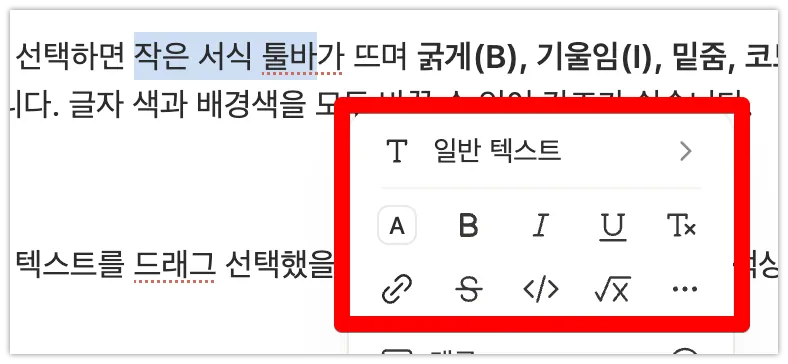

> 🎯 **학습 목표:** 읽기 좋은 문서를 만들 수 있도록 서식과 정리 도구를 활용할 수 있다.

## 3-1. 텍스트 서식

텍스트를 드래그해 선택하면 작은 서식 툴바가 뜨며 **굵게(B), 기울임(I), 밑줌, 코드, 색상** 등을 적용할 수 있습니다. 글자 색과 배경색을 모두 바꿀 수 있어 강조가 쉽습니다.

## 3-2. 제목과 구분선으로 구조 만들기

긴 문서는 **제목(Heading 1·2·3, **`#`**)**으로 단락을 나누면 훨씬 읽기 좋아집니다. 섹션 사이에 **구분선**(`/구분선` 또는 `---`)을 넣으면 내용이 또렸하게 나뉩니다.

## 3-3. 목록 만들기

글머리 목록(`-`), 번호 목록(`1.`), 그리고 체크박스(할 일)(`[]`) 세 가지가 가장 자주 쓰입니다. 체크박스는 클릭하면 완료 표시가 되어 간단한 할 일 관리에 유용합니다.

> 
>
> 1. 번호 목록
>   1. 번호 목록(하위)
>     - 글머리 목록
> 
>     - [ ] 체크박스(할 일) - 네모를 클릭하면 체크 생성 또는 해제 가능

## 3-4. 토글·콜아웃·인용

- **토글**(`>`)**:** 클릭하면 내용이 접혀서 긴 문서를 깔끔하게 정리합니다. FAQ처럼 펼치고 접는 내용에 좋습니다.
> 
>
>   **토글**
> 
>   내부에 내용이 있습니다. 삼각형 아이콘을 눌러 감추거나 보이게 할 수 있습니다.
- **콜아웃:** 아이콘 + 배경색 박스로 주의·팁을 눈에 띄게 강조합니다.
> 
>
> > 🪴 콜아웃은 여러 아이콘과 배경색을 사용할 수 있습니다. 
- **인용**(`"`)**:** 세로줄과 함께 문구를 강조하는 데 쓰입니다.
> 
>
>   “우리가 반복적으로 하는 일이 우리를 만든다. 그러므로 탁월함은 행동이 아니라 습관이다.”
> 
>   — 아리스토텔레스

## 3-5. 열 나누기와 삽입

블록을 오른쪽으로 끌면 화면이 좌우 **열(Column)**로 나뉘어져 공간을 알차게 씁니다. 또한 `/`로 이미지, 파일, 웹 링크, 북마크(기존 페이지 바로가기) 등을 삽입할 수 있습니다.

---

## 📖 용어정리

| 용어 | 뜻 |
| --- | --- |
| 토글(Toggle) | 클릭으로 내용을 펼치고 접는 블록 |
| 콜아웃(Callout) | 아이콘과 배경색으로 강조하는 안내 박스 |
| 체크박스 | 클릭해 완료 표시하는 할 일 목록 블록 |
| 열(Column) | 화면을 좌우로 나누는 레이아웃 |

## ❓ FAQ

**Q. 마크다운 문법을 몰라도 되나요?**

A. 네, 메뉴로 모두 선택할 수 있습니다. 다만 `#`(제목), `-`(목록), `[]`(체크박스) 같은 단축을 알면 더 빠릅니다.

**Q. 표와 데이터베이스는 뭐가 다른가요?**

A. 여기서의 '표'은 단순히 칸을 나눈 정적인 표입니다. 각 행을 페이지처럼 열거나 필터·정렬하려면 5장의 데이터베이스를 써야 합니다.

**Q. 복사해서 붙여넣으면 서식이 깨져요.**

A. 외부 문서를 붙여넣을 때는 `Ctrl/Cmd + Shift + V`(서식 없이 붙여넣기)를 쓰면 깨짐을 줄일 수 있습니다.

## 💡 Tips

- 줄 시작에서 `# `, `## `, `- `, `[] `를 치면 각각 제목·목록·체크박스로 바로 바뀝니다.
- 긴 안내문은 토글로 접어 페이지를 깔끔하게 유지하세요.
- 중요한 주의사항은 빨간·노란 배경 콜아웃으로 만들면 놓치지 않습니다.
