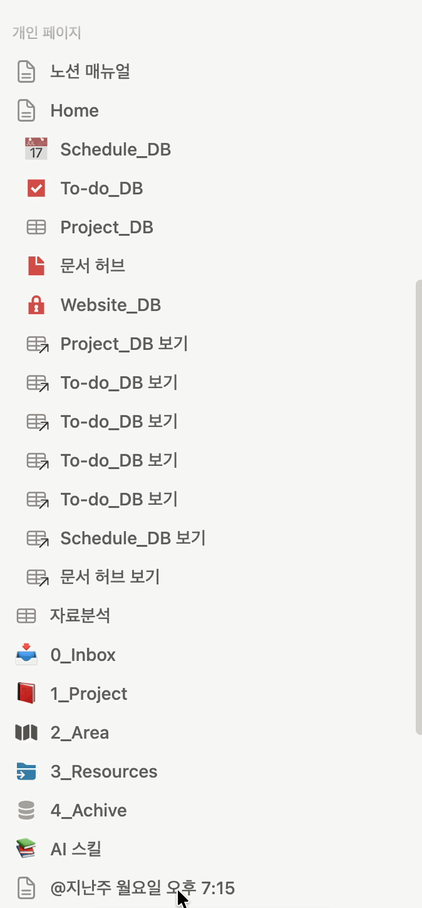
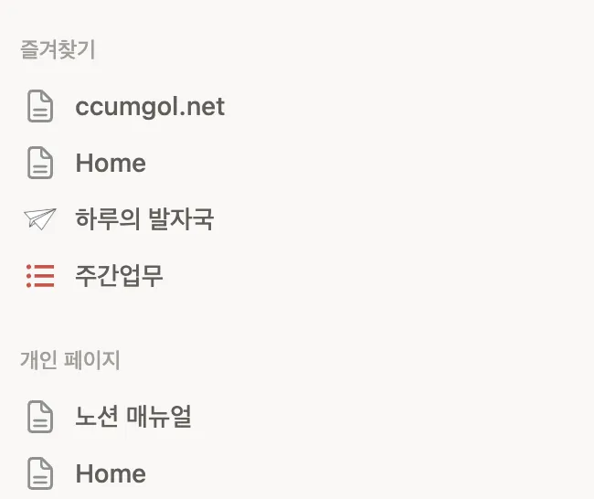
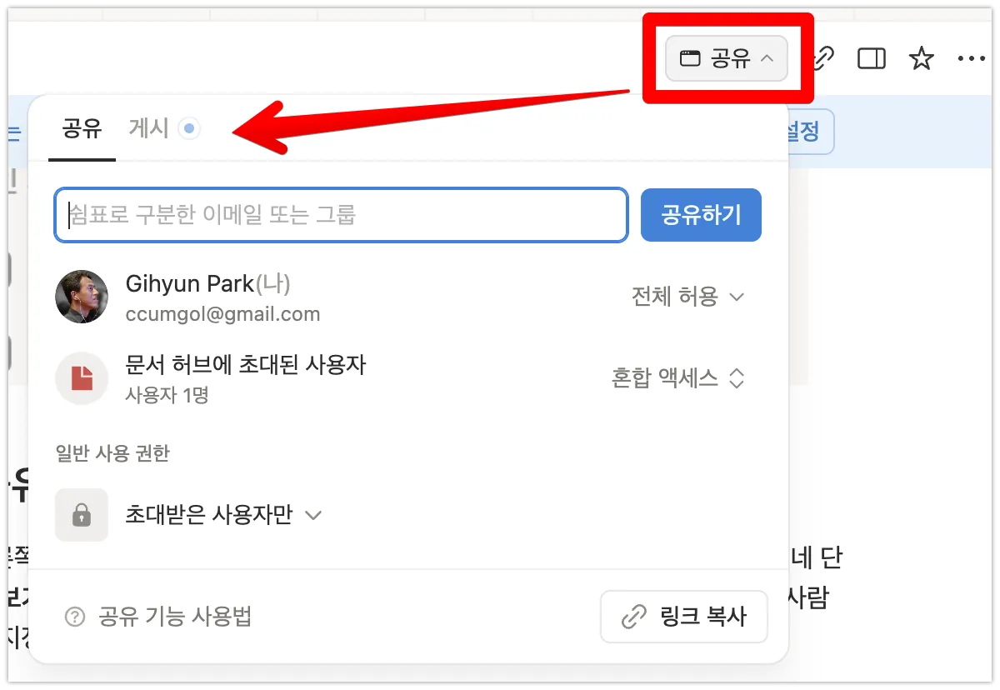
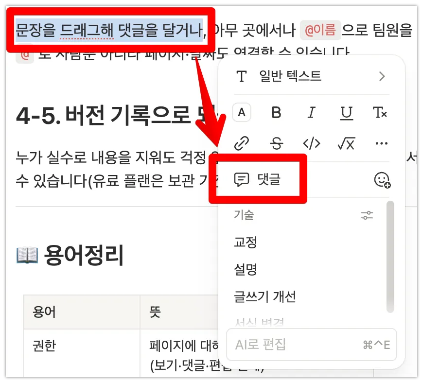

> 🎯 **학습 목표:** 페이지를 체계적으로 정리하고, 다른 사람과 함께 작업할 수 있다.

## 4-1. 사이드바로 페이지 구조 잡기

페이지가 많아지면 정리가 생명입니다. 사이드바에서 페이지를 드래그해 다른 페이지 안으로 넣으면 하위 페이지가 되고, 이렇게 주제별 계층을 만들 수 있습니다. 보통 '팀 홈' 같은 상위 페이지 하나를 두고 그 아래에 주제별로 정리합니다.

> 
>
> 

## 4-2. 페이지 이동·복제·즐겨찾기

페이지 ∷ 메뉴에서 복제, 이동, 이름 변경, 삭제를 할 수 있습니다. 자주 보는 페이지는 **즐겨찾기**(별표)로 사이드바 상단에 고정해 두면 빠르게 접근할 수 있습니다.

> 
>
> 

## 4-3. 공유와 권한

페이지 오른쪽 위 **공유** 버튼으로 다른 사람을 초대하고 권한을 지정합니다. 권한은 보통 네 단계입니다: **보기 가능 / 댓글 가능 / 편집 가능 / 전체 허용**. 링크 공유를 켜면 링크를 가진 사람은 누구나 지정된 권한으로 접근할 수 있습니다.

> 
>
> 

## 4-4. 댓글·멘션으로 소통하기

문장을 드래그해 댓글을 달거나, 아무 곳에서나 `@이름`으로 팀원을 **멘션**하면 알림이 갑니다. `@` 로 사람뿐 아니라 페이지·날짜도 연결할 수 있습니다.

> 
>
> 

## 4-5. 버전 기록으로 되돌리기

누가 실수로 내용을 지워도 걱정 없습니다. ∷ 메뉴의 **버전 기록**에서 과거 시점으로 되돌릴 수 있습니다(유료 플랜은 보관 기간이 더 깁니다).

---

## 📖 용어정리

| 용어 | 뜻 |
| --- | --- |
| 권한 | 페이지에 대해 상대방이 할 수 있는 일(보기·댓글·편집·전체) |
| 멘션(@) | `@`로 사람·페이지·날짜를 호출·연결하는 기능 |
| 게스트 | 워크스페이스 멤버는 아니지만 특정 페이지에 초대된 외부 사용자 |
| 버전 기록 | 페이지의 변경 이력을 되돌릴 수 있는 기능 |

## ❓ FAQ

**Q. 공유 링크를 아무나 볼 수 있나요?**

A. '웹에서 공유'를 켜면 링크를 가진 누구나 볼 수 있습니다. 내부 자료라면 이 설정을 꼭 확인하세요.

**Q. 실수한 편집을 되돌릴 수 있나요?**

A. 네, 바로라면 `Ctrl/Cmd + Z`, 오래전이라면 버전 기록을 사용하세요.

**Q. 특정 사람만 편집하게 하려면?**

A. 공유 패널에서 사람별로 권한을 다르게 지정할 수 있습니다. 나머지는 '보기 가능'으로 두면 됩니다.

## 💡 Tips

- 팀 온보딩용 '홈 페이지'를 하나 만들어 그 안에 모든 주요 페이지를 정리하세요.
- 권한은 '최소한으로' 주는 게 원칙입니다. 필요 없는 전체 허용은 피하세요.
- 담당자가 있는 업무는 댓글에 `@이름`을 넣어 바로 알림이 가게 하세요.
