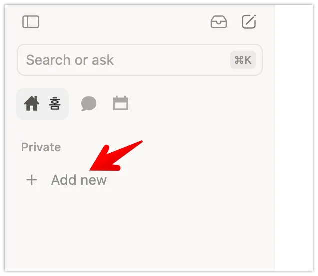
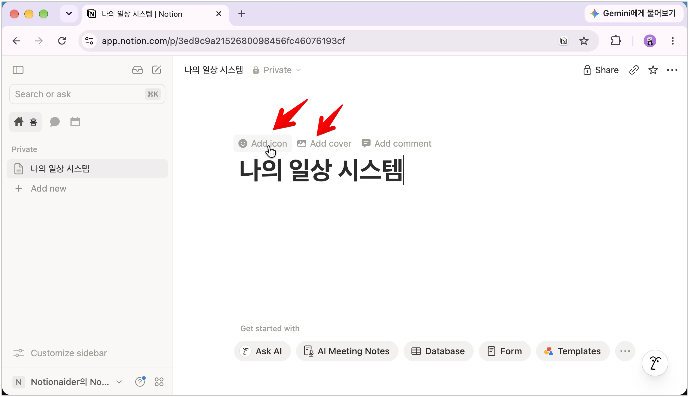
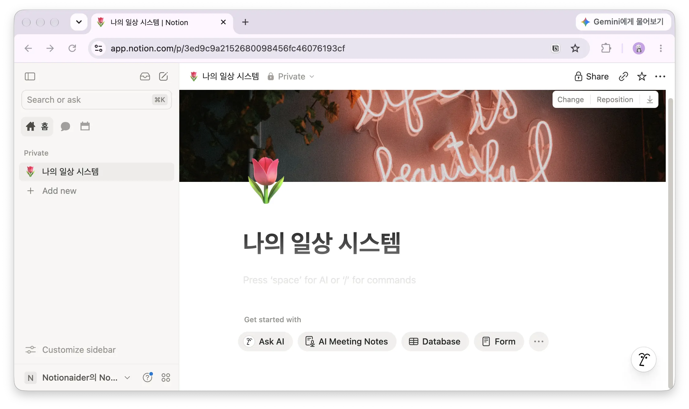
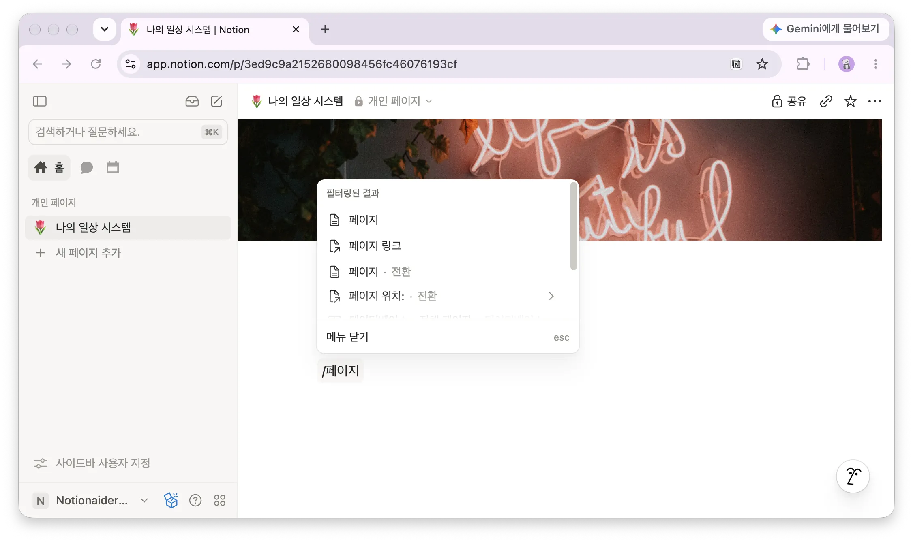
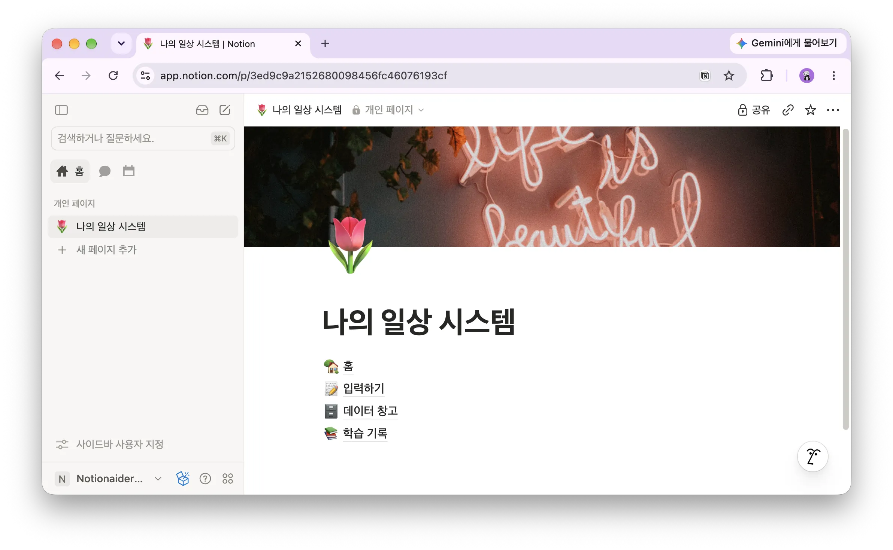
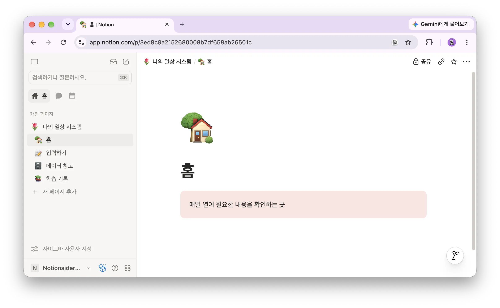
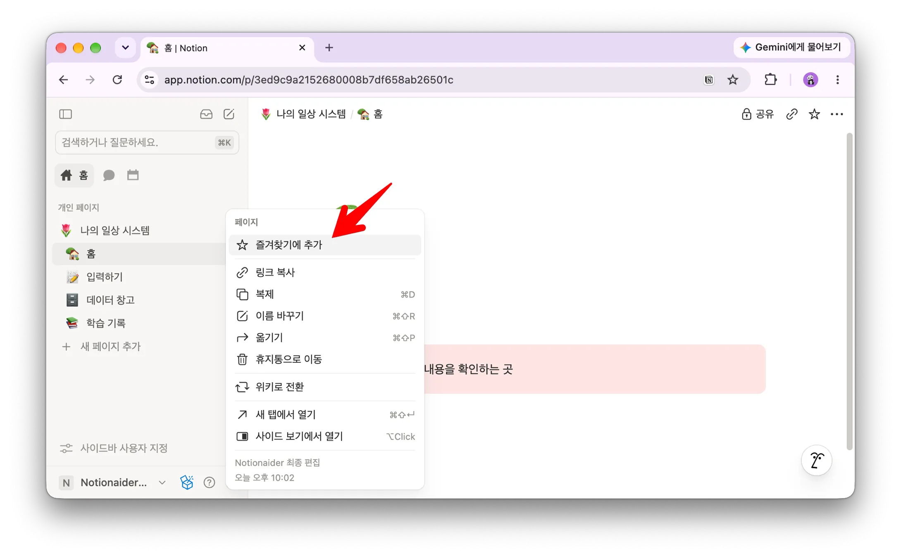
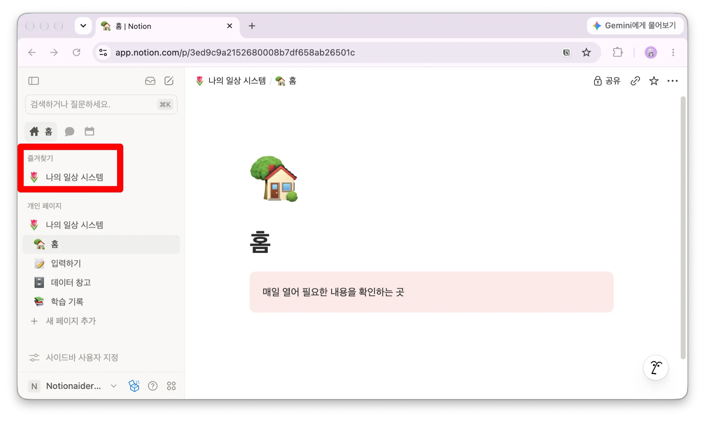

> 🧱 **이번 글에서 할 일**
데이터베이스는 아직 만들지 않습니다. 최상위 페이지 하나와 하위 페이지 네 개를 만들면서, 앞으로 확장할 ‘나의 일상 시스템’의 기본 틀을 세웁니다.

**예상 시간:** 약 20분 · **결과물:** 페이지 5개

[나의 일상 시스템 서문. 노션 초보자를 좌절시키는 문턱](https://app.notion.com/p/3e9091c284f680d2a6d4d594bd7ece9b)에서 살펴보았듯이, 노션을 처음 시작하는 분은 빈 화면보다 너무 많은 가능성 앞에서 더 쉽게 막막해집니다. 그래서 이 시리즈는 화려한 대시보드나 복잡한 데이터베이스에서 시작하지 않습니다.

첫 시간에 만들 것은 빈 페이지 몇 개뿐입니다. 시시해 보일 수도 있습니다. 하지만 이 작은 틀이 있어야 앞으로 만드는 데이터와 화면이 흩어지지 않습니다.

## 가장 먼저 ‘집’을 만드는 이유

노션을 처음 사용할 때는 필요한 페이지를 그때그때 만들기 쉽습니다. 처음에는 별문제가 없어 보이지만, 시간이 지나면 사이드바가 다음처럼 변합니다.

```
사이드바
├─ 무제
├─ 새 페이지
├─ 할 일
├─ 할 일 (1)
├─ 가계부 진짜최종
├─ 무제 (2)
├─ 독서
└─ ... 더 많은 페이지
```

이것은 노션만의 문제가 아닙니다. 컴퓨터 바탕화면에 파일을 계속 쌓아두면 나중에 찾기 어려워지는 것과 같습니다.

따라서 무언가를 기록하기 전에 먼저 모든 것이 돌아올 ‘집’을 만들겠습니다.

## 오늘 만들 구조

```
🏠 나의 일상 시스템
├─ 🏠 홈
├─ 📝 입력하기
├─ 🗄 데이터 창고
└─ 📚 학습 기록
```

각 공간의 역할은 간단합니다.

| 페이지 | 역할 |
| --- | --- |
| 🏠 홈 | 매일 열어 필요한 내용을 확인하는 곳 |
| 📝 입력하기 | 새로운 정보를 빠르게 기록하는 곳 |
| 🗄 데이터 창고 | 앞으로 만들 데이터베이스 원본을 보관하는 곳 |
| 📚 학습 기록 | 배우면서 생긴 질문과 개선점을 기록하는 곳 |

> 💡 **핵심은 사이드바에 ‘나의 일상 시스템’ 하나만 보이게 하는 것입니다.**
나머지 페이지는 그 안에 넣습니다. 이것만으로도 사이드바가 훨씬 단순해집니다.

## 1단계. 최상위 페이지 만들기

사이드바 아래쪽에서 **새 페이지**를 선택합니다. 새 페이지가 열리면 제목을 다음과 같이 입력합니다.



```
나의 일상 시스템
```

이 페이지가 앞으로 만드는 모든 페이지와 데이터베이스의 입구가 됩니다.

### 왜 ‘노션 연습’이라고 부르지 않을까요?

연습용으로 만든 공간은 연습이 끝나면 쉽게 버려집니다. 반면 자신의 생활을 가리키는 이름을 붙이면 처음부터 실제 공간처럼 사용하게 됩니다.

이름은 자유롭게 바꾸셔도 됩니다. 다만 다음 기준을 권합니다.

- 자신의 생활을 담는 공간임을 알 수 있어야 합니다.
- 사이드바에서 잘리지 않도록 2~4단어로 짧게 씁니다.
- ‘연습’, ‘테스트’, ‘임시’ 같은 표현은 피합니다.

예를 들어 ‘나의 일상’, ‘생활 관리’, ‘우리 집 시스템’처럼 지을 수 있습니다.

## 2단계. 아이콘과 커버 넣기

페이지 제목 위에 마우스를 올리면 **아이콘 추가**와 **커버 추가**가 나타납니다.



- 아이콘은 집을 떠올릴 수 있는 아이콘을 선택합니다.
- 커버는 기본 갤러리에서 마음에 드는 이미지를 하나 선택합니다.

아이콘과 커버는 단순한 장식만은 아닙니다. 페이지가 많아졌을 때 아이콘은 사이드바에서 페이지를 빠르게 찾게 해주는 표지판이 됩니다. 또한 자신이 좋아하는 모습으로 꾸민 공간은 다시 열어볼 가능성도 높아집니다.



다만 여기서 오래 고민할 필요는 없습니다. 지금은 마음에 드는 것을 하나 고르고 다음 단계로 넘어가세요. 언제든 다시 바꿀 수 있습니다.

## 3단계. 하위 페이지 네 개 만들기

이제 ‘나의 일상 시스템’ 페이지의 본문을 클릭합니다. 제목 아래 빈 공간에서 다음과 같이 입력합니다.



```
/페이지
```

메뉴가 나타나면 **페이지**를 선택하고 제목을 입력합니다. 같은 방법으로 아래 네 개의 페이지를 만듭니다.

| 순서 | 페이지 이름 | 추천 아이콘 |
| --- | --- | --- |
| 1 | 홈 | 🏠 |
| 2 | 입력하기 | 📝 |
| 3 | 데이터 창고 | 🗄 |
| 4 | 학습 기록 | 📚 |



노션에서 무언가를 넣고 싶을 때는 먼저 슬래시(`/`)를 입력해 보세요. 페이지뿐 아니라 제목, 표, 이미지 등 대부분의 블록을 이 메뉴에서 찾을 수 있습니다.

## 4단계. 각 페이지에 한 줄 설명 남기기

이름만 있는 빈 페이지는 시간이 지나면 역할을 잊기 쉽습니다. 네 페이지를 하나씩 열고, 미래의 자신을 위한 설명을 한 줄씩 적어두세요.

| 페이지 | 적어둘 문장 |
| --- | --- |
| 🏠 홈 | `매일 열어 필요한 내용을 확인하는 곳` |
| 📝 입력하기 | `새로운 정보를 빠르게 기록하는 곳` |
| 🗄 데이터 창고 | `데이터베이스 원본을 보관하는 곳` |
| 📚 학습 기록 | `배운 내용과 개선할 점을 기록하는 곳` |



이 설명은 지금보다 몇 달 뒤에 더 유용합니다. 오랜만에 페이지를 열었을 때도 “여기에 무엇을 넣기로 했지?”라고 고민하지 않게 해줍니다.

## 5단계. 즐겨찾기에 추가하기

마지막으로 최상위 페이지인 ‘나의 일상 시스템’을 즐겨찾기에 추가합니다.

```
페이지 오른쪽 위의 ⋯
→ 즐겨찾기에 추가
```

또는 사이드바에서 페이지 이름을 마우스 오른쪽 버튼으로 클릭해 즐겨찾기에 추가할 수 있습니다.



즐겨찾기에 추가하면 이 페이지가 사이드바 위쪽에 고정됩니다. 앞으로 페이지가 많아져도 ‘나의 일상 시스템’은 쉽게 찾을 수 있습니다.



## 오늘 알아둘 두 가지

### 노션에서는 페이지 안에 페이지를 넣습니다

컴퓨터에서는 폴더와 파일이 서로 다른 종류입니다. 노션에서는 페이지가 문서이면서 동시에 다른 페이지를 담는 공간이 됩니다.

```
컴퓨터: 폴더 안에 파일과 다른 폴더를 넣습니다
노션:   페이지 안에 다른 페이지를 넣습니다
```

처음에는 낯설 수 있지만, 오늘 만든 구조를 보면 어렵지 않습니다. ‘나의 일상 시스템’도 페이지이고, 그 안의 ‘홈’과 ‘데이터 창고’도 모두 페이지입니다.

### 페이지를 너무 깊게 넣지 않습니다

페이지 안에 페이지를 계속 넣다 보면 자료가 깊이 숨어버립니다. 초보자에게는 세 단계 정도가 찾기 쉽습니다.

```
✅ 나의 일상 시스템 > 데이터 창고 > 구독 서비스
❌ 나의 일상 시스템 > 생활 > 돈 > 구독 > 영상 > 넷플릭스
```

지금은 모든 분류를 미리 만들지 마세요. 필요한 페이지가 실제로 생길 때 한 단계씩 추가하면 됩니다.

## 잘되지 않을 때 확인하세요

### 하위 페이지가 최상위 페이지와 나란히 생겼습니다

사이드바에서 해당 페이지를 ‘나의 일상 시스템’ 아래로 드래그하세요. 들여쓰기 된 위치에 놓으면 하위 페이지가 됩니다.

### 페이지를 너무 많이 만들었습니다

오늘은 네 개면 충분합니다. 나중에 필요해졌을 때 추가하는 편이, 미리 열 개를 만들고 역할을 고민하는 것보다 쉽습니다.

### 페이지를 실수로 지웠습니다

휴지통에서 복구할 수 있으니 당황하지 않으셔도 됩니다. 실수해도 되돌릴 수 있다는 사실을 알면 노션을 더 편하게 배울 수 있습니다.

### ‘데이터 창고’가 아직 비어 있습니다

정상입니다. 오늘의 목적은 내용을 채우는 것이 아니라 자리를 마련하는 것입니다. 다음 글부터 실제 데이터를 넣기 시작합니다.

## 완성 확인

아래 항목을 모두 확인해 보세요.

- [ ] 사이드바에 ‘나의 일상 시스템’ 페이지가 있습니다.
- [ ] 그 안에 홈, 입력하기, 데이터 창고, 학습 기록이 있습니다.
- [ ] 최상위 페이지에 아이콘을 넣었습니다.
- [ ] 각 하위 페이지에 역할을 설명하는 한 문장을 적었습니다.
- [ ] 최상위 페이지를 즐겨찾기에 추가했습니다.

## 오늘 만든 것은 빈 페이지가 아닙니다

오늘은 데이터를 입력하지도, 멋진 대시보드를 만들지도 않았습니다. 그래서 아무것도 하지 않은 것처럼 느껴질 수 있습니다.

하지만 이제 노션에서 페이지를 만들고, 페이지 안에 다른 페이지를 넣고, 다시 찾을 수 있게 되었습니다. 앞으로 무엇을 만들더라도 돌아올 자리가 생긴 것입니다.

집을 지을 때 가구부터 들여놓지 않듯, 노션도 먼저 틀을 세우면 이후 과정이 훨씬 편해집니다. 오늘 만든 다섯 페이지는 앞으로 완성될 ‘나의 일상 시스템’의 뼈대입니다.

## 다음 글을 준비해 주세요

다음 글에서는 ‘데이터 창고’ 안에 첫 데이터베이스를 만듭니다. 예시 데이터가 아니라 현재 실제로 결제하고 있는 구독 서비스를 직접 기록할 예정입니다.

다음 글을 시작하기 전에 카드 또는 은행 명세서를 보면서 현재 이용 중인 구독 서비스를 간단히 적어두세요. 정확한 금액을 모두 찾지 못해도 괜찮습니다. 기억나는 것부터 준비하면 됩니다.

> 🧾 **다음 글: 첫 데이터베이스 만들기**
내가 매달 어떤 서비스에 얼마를 쓰는지 직접 확인해 봅니다. 기능을 배우기 위한 연습이 아니라, 생활에 바로 사용할 첫 데이터를 만듭니다.
