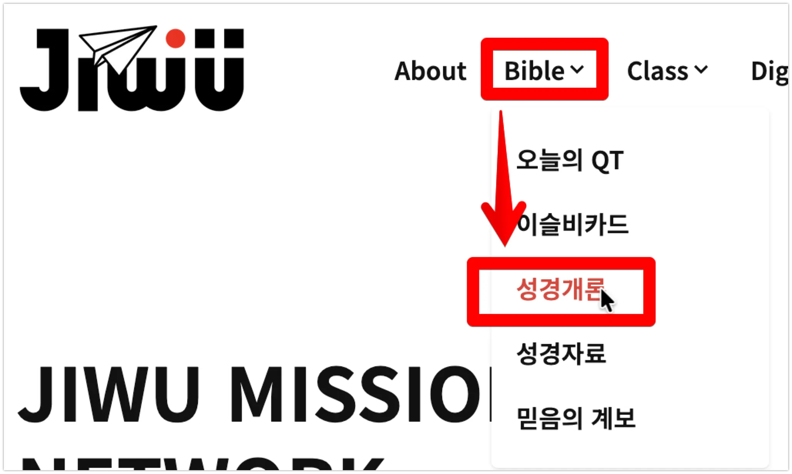
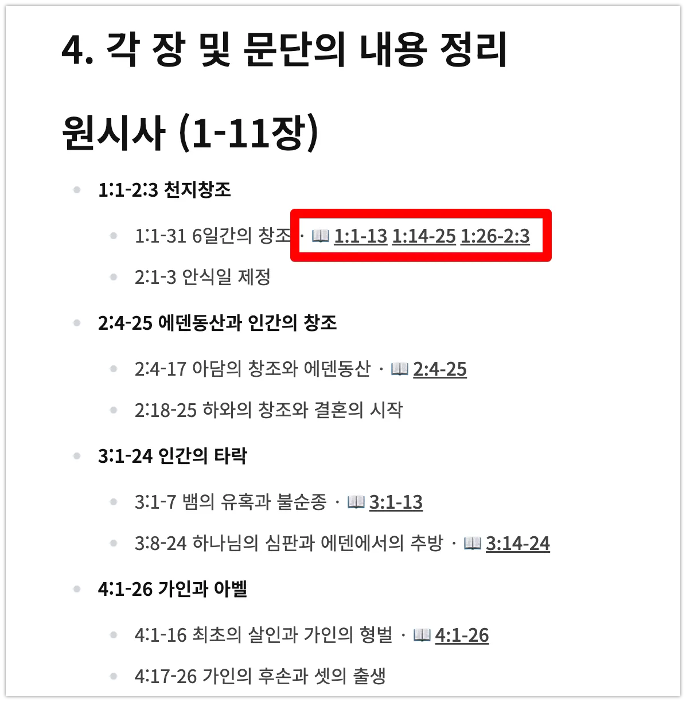

## [Jesusiswith.us](http://jesusiswith.us/) 기능 소개 - 매일의 QT

JIWU Mission Network의 홈페이지 [https://jesusiswith.us](https://jesusiswith.us/) 는 HUGO 정적 홈페이지(HugoPlate 테마)로 제작되었습니다.

홈페이지에 접속을 하면 맨 처음 맞이하는 것은 ‘매일의 QT’ 팝업 모달입니다. 성서유니온의 ‘[매일성경](https://sum.su.or.kr:8888/bible/today)’ 본문을 바탕으로 QT 자료를 보실 수 있습니다.

본 내용은 AI Agent에 의해 작성이 되었으며, 복음주의 신학을 바탕으로 면밀히 정리되었습니다. ‘내용 요약 - 역사적/문화적 배경 - 핵심 원어 해설 - 핵심 아이디어 - 성경 연결하기 - 생각해보기 - 근거 및 출처’의 순서로 구성되어 개인 묵상 뿐 아니라 QT 나눔용으로도 사용하실 수 있도록 구성하였습니다.

성서유니온의 ‘매일성경’은 6년 주기로 성경 전권을 묵상할 수 있도록 구성되어 있습니다. 본 홈페이지의 내용도 그 순서를 따라 6년간 성경 전권의 QT 자료를 제공할 예정입니다. 

2026년에 포함된 ‘창세기, 요한복음, 고린도전서, 시편 1-25편, 이사야, 고린도전서, 고린도후서’는 아래와 같이 ‘성경개론’에서도 정리된 리스트로 보실 수 있습니다. QT 자료 뿐 아니라 주석 및 설교준비용 자료로도 사용하실 수 있습니다.

## 한 가지 Tip을 공유합니다.

‘매일의 QT’ 모달 화면 하단에 보면 다음과 같이 공유하기 버튼이 있습니다. 이 버튼들을 통해 페이스북, X(트위터), 인스타그램, 쓰레드 등으로 공유할 수 있습니다.

공유의 마지막 버튼은 ‘**일반 공유**’버튼으로 카카오톡이나 기타 앱으로도 내용을 보낼 수 있습니다.

위 앱은 ElevenReader라는 텍스트를 자연스럽게 읽어주는 앱입니다. 모바일 앱 다운로드는 다음 링크에서 하실 수 있습니다.

**iOS App Store(아이폰)**: [https://apps.apple.com/us/app/elevenreader-read-books-aloud/id6479373050?l=ko](https://apps.apple.com/us/app/elevenreader-read-books-aloud/id6479373050?l=ko)

**Google Play Store(갤럭시 등)**: [https://play.google.com/store/apps/details?id=io.elevenlabs.readerapp](https://play.google.com/store/apps/details?id=io.elevenlabs.readerapp)

셀폰에서 위 앱을 다운로드하여 설치하신 후 ‘매일의 QT’에서 ‘**일반 공유**’ 버튼을 클릭하시고, ElevenReader 앱을 여시면 QT 텍스트 내용을 음성으로 들을 수 있습니다. 작은 글씨로 보기 불편하신 분들은 음성으로 들으시길 바랍니다.
