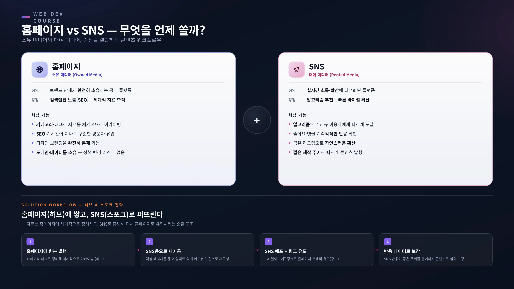
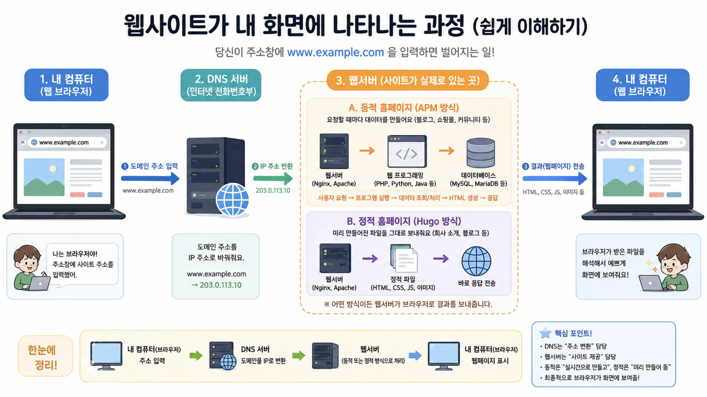
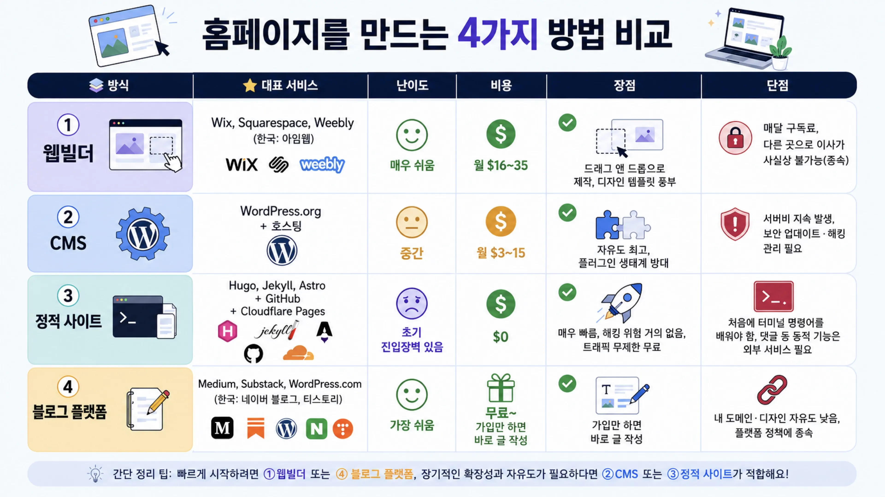
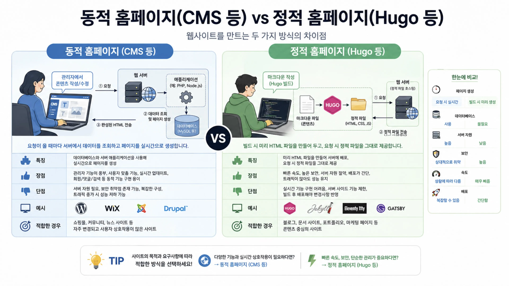
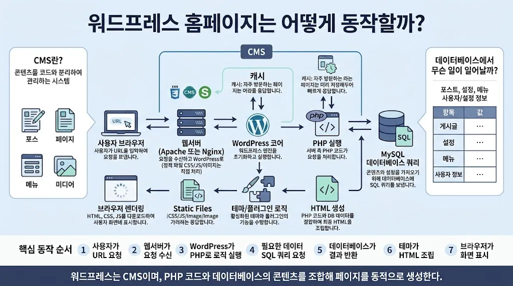
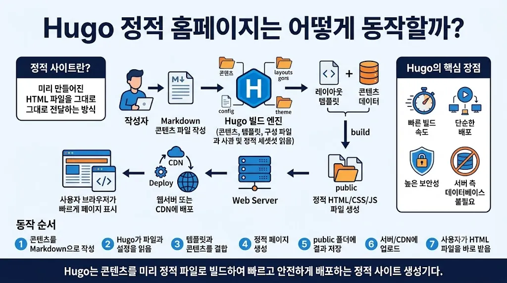
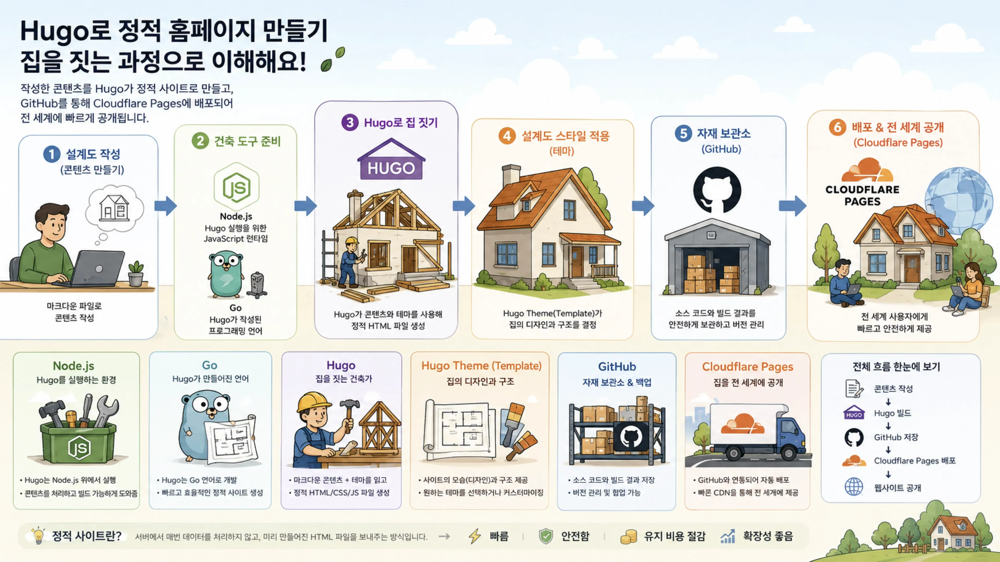
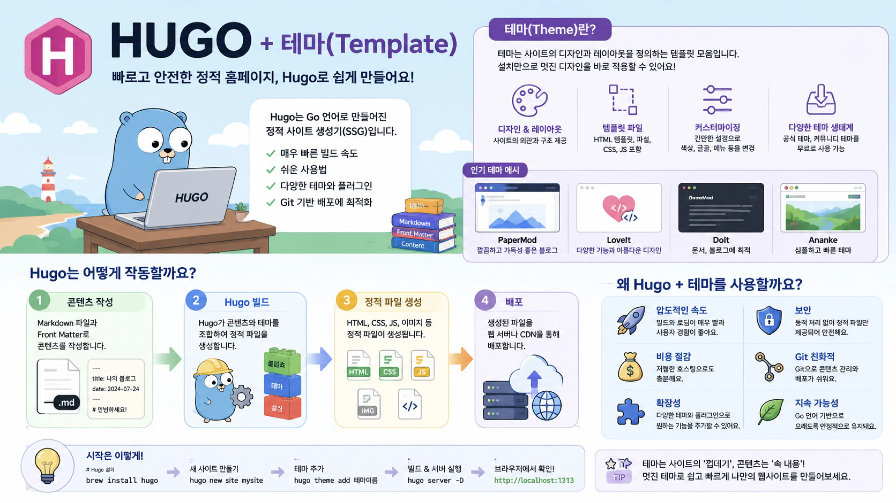
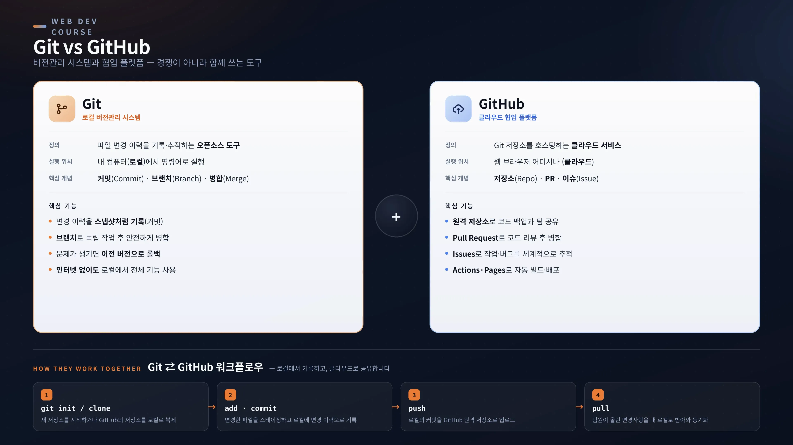
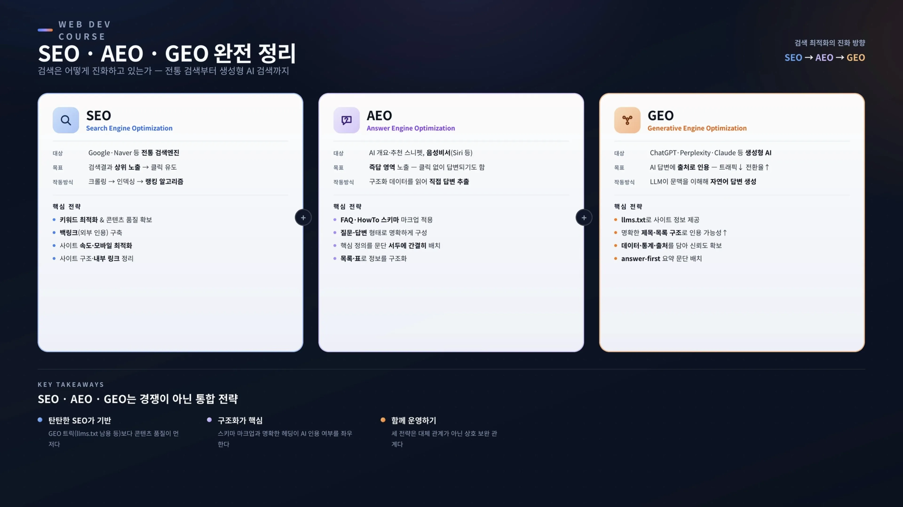

> 아래 토글 버튼(►)을 클릭하시면 펼쳐서 보실 수 있습니다.

## 준비물

- AI Agent 기능을 사용할 수 있는 도구
  - Antigravity IDE: 무료 티어 가능(Google 계정)
  - Claude Code, ChatGPT Codex 등
  - Cursor, Windsurf, VS Code 등
- gitHub 계정 및 사용할 리포지터리
  - [github.com/](http://github.com/) 에서 구글로 로그인을 하여 계정 생성
  - 원하는 이름으로 새 리포지터리를 만듭니다.(예, myhome 등)
- Cloudflare 계정
  - [https://cloudflare.com/](https://cloudflare.com/) 에서 구글로 로그인을 하여 계정 생성
  - 작업하면서 만들어도 됨
- 사용할 Hugo Theme 이름
  - [https://jesusiswith.us/tools/hugo-theme-guide/](https://jesusiswith.us/tools/hugo-theme-guide/)
  - 위 링크는 Hugo 홈페이지의 테마를 선택하기 쉽게 정리해놓은 사이트임. 
아래 원본 웹사이트에 추가된 내용과 차이가 날 수 있음.
  - 원본 웹사이트 주소: [https://themes.gohugo.io/](https://themes.gohugo.io/)

## 홈페이지 소스 준비를 위한 Gemini Gems 인터뷰 링크

- **개인 브랜드 홈페이지**
  [https://gemini.google.com/gem/1xxXvqvtICBjY8bS6clkyZEMWOXKcj4Di?usp=sharing](https://gemini.google.com/gem/1xxXvqvtICBjY8bS6clkyZEMWOXKcj4Di?usp=sharing)
- **소규모 사업체 홈페이지**
  [https://gemini.google.com/gem/1NsWsTM47Y4bMP56oqapujFe3kb8VH58d?usp=sharing](https://gemini.google.com/gem/1NsWsTM47Y4bMP56oqapujFe3kb8VH58d?usp=sharing)
- **교회 홈페이지**
  [https://gemini.google.com/gem/1GYdzFW8eJaR6O_5NwWlgX83WjRgJQRAM?usp=sharing](https://gemini.google.com/gem/1GYdzFW8eJaR6O_5NwWlgX83WjRgJQRAM?usp=sharing)
- **기타(범용) 홈페이지**
  [https://gemini.google.com/gem/18_kyRiZbPgJZmDoABvckDXXcjYvn5aBR?usp=sharing](https://gemini.google.com/gem/18_kyRiZbPgJZmDoABvckDXXcjYvn5aBR?usp=sharing)

## 알고 있으면 도움이 되는 내용



<details>
<summary>그림 설명</summary>

이 그림은 홈페이지와 SNS를 서로 경쟁하는 선택지가 아니라, 역할이 다른 두 채널로 함께 활용해야 한다는 내용을 설명합니다. 홈페이지는 브랜드나 단체가 완전히 소유하는 공식 플랫폼으로, 검색엔진 노출과 체계적인 자료 축적에 강점이 있습니다. 카테고리와 태그로 콘텐츠를 정리하고, SEO를 통해 시간이 지나도 방문자를 꾸준히 유입하며, 디자인·브랜딩을 안정적으로 유지할 수 있습니다. 반면 SNS는 대여 미디어로서 실시간 소통과 빠른 확산에 적합합니다. 알고리즘을 통해 새 사용자에게 빠르게 도달하고, 좋아요·댓글 등 즉각적인 반응을 확인하며, 짧은 주기로 콘텐츠를 발행하기 좋습니다.

핵심 전략은 **홈페이지에는 원본 콘텐츠를 쌓고, SNS에는 이를 재가공해 퍼뜨리는 것**입니다. 먼저 홈페이지에 원본 글을 발행해 자료를 체계적으로 아카이빙한 뒤, 그 내용을 SNS용 카드뉴스나 짧은 글로 재구성합니다. 이후 SNS 게시물에서 “더 알아보기” 링크로 홈페이지 트래픽을 유도하고, 반응 데이터를 다시 홈페이지 콘텐츠 개선에 활용합니다. 이렇게 하면 홈페이지는 신뢰도와 자료 축적의 허브가 되고, SNS는 확산과 소통을 담당하는 스포크 역할을 하게 됩니다.

</details>



<details>
<summary>그림 설명</summary>

이 그림은 사용자가 웹 브라우저에 `www.example.com` 같은 도메인 주소를 입력했을 때, 실제 웹사이트가 화면에 표시되기까지의 과정을 단계별로 설명합니다. 먼저 사용자의 컴퓨터, 즉 웹 브라우저가 도메인 주소를 입력받습니다. 그다음 DNS 서버가 사람이 읽기 쉬운 도메인 주소를 서버가 찾을 수 있는 IP 주소로 변환합니다. 예시에서는 `www.example.com`이 `203.0.113.10`이라는 IP 주소로 바뀌는 흐름을 보여줍니다.

이후 브라우저는 변환된 IP 주소를 따라 웹서버에 접속합니다. 웹서버는 웹사이트가 실제로 저장되고 처리되는 공간입니다. 그림은 웹서버가 웹페이지를 제공하는 방식을 두 가지로 나누어 설명합니다. 첫째, 동적 홈페이지 방식은 요청이 들어올 때마다 프로그램과 데이터베이스를 사용해 HTML을 새로 만들어 응답합니다. WordPress처럼 글, 쇼핑몰, 커뮤니티 기능이 필요한 사이트가 여기에 해당합니다. 둘째, 정적 홈페이지 방식은 미리 만들어 둔 HTML, CSS, 이미지 파일을 바로 전송합니다. Hugo 같은 정적 사이트 생성기는 이 방식에 속하며, 회사 소개나 블로그처럼 미리 준비된 페이지를 빠르게 보여주는 데 적합합니다.

마지막으로 웹서버가 HTML, CSS, JavaScript, 이미지 같은 결과 파일을 사용자의 브라우저로 보내면, 브라우저가 이 파일들을 해석해서 우리가 보는 웹페이지 화면으로 표시합니다. 핵심은 **DNS는 주소를 IP로 바꾸는 역할**, **웹서버는 사이트 파일을 제공하는 역할**, **브라우저는 받은 파일을 화면에 보여주는 역할**을 한다는 점입니다.

</details>



<details>
<summary>그림 설명</summary>

이 그림은 홈페이지를 만드는 네 가지 대표적인 방법을 **웹빌더, CMS, 정적 사이트, 블로그 플랫폼**으로 나누어 비교합니다. 각 방식은 대표 서비스, 난이도, 비용, 장점, 단점 기준으로 정리되어 있습니다.

첫째, **웹빌더**는 Wix, Squarespace, Weebly, 한국의 아임웹 같은 서비스를 말합니다. 드래그 앤 드롭 방식으로 제작할 수 있어 매우 쉽고 디자인 템플릿도 풍부하지만, 매달 구독료가 들고 다른 곳으로 이전하기 어려워 서비스에 종속될 수 있습니다.

둘째, **CMS**는 WordPress.org와 호스팅을 조합하는 방식입니다. 난이도는 중간 정도이며, 플러그인 생태계가 넓어 기능 확장이 자유롭습니다. 다만 서버비가 계속 발생하고, 보안 업데이트와 해킹 관리가 필요합니다.

셋째, **정적 사이트**는 Hugo, Jekyll, Astro 같은 정적 사이트 생성기를 GitHub와 Cloudflare Pages에 연결해 운영하는 방식입니다. 비용은 거의 0원이고 속도가 빠르며 해킹 위험이 낮고 트래픽도 무료에 가깝습니다. 대신 처음에는 터미널 명령어와 Git 사용법을 배워야 하고, 댓글이나 동적 기능은 외부 서비스를 연결해야 합니다.

넷째, **블로그 플랫폼**은 Medium, Substack, WordPress.com, 한국의 네이버 블로그나 티스토리처럼 가입 후 바로 글을 쓰는 방식입니다. 가장 쉽게 시작할 수 있고 무료 또는 소액으로 운영할 수 있지만, 내 도메인과 디자인 자유도가 낮고 플랫폼 정책에 영향을 받습니다.

정리하면 빠르게 시작하려면 웹빌더나 블로그 플랫폼이 적합하고, 장기적으로 확장성과 자유도가 필요하다면 CMS나 정적 사이트가 더 적합합니다. 특히 정적 사이트는 초기에 조금 배워야 하지만, 비용과 속도, 안정성 면에서 장점이 큰 방식입니다.

</details>



<details>
<summary>그림 설명</summary>

이 그림은 **동적 홈페이지(CMS 등)**와 **정적 홈페이지(Hugo 등)**의 차이를 비교합니다. 왼쪽의 동적 홈페이지는 사용자가 페이지를 요청할 때마다 웹 서버가 애플리케이션 언어(PHP, Node.js 등)와 데이터베이스(MySQL 등)를 사용해 데이터를 조회하고, 그 결과로 HTML 페이지를 실시간 생성해 브라우저에 전송하는 방식입니다. WordPress, Wix, Joomla, Drupal 같은 서비스가 대표적인 예입니다.

동적 홈페이지의 장점은 관리자 화면에서 콘텐츠를 쉽게 작성·수정할 수 있고, 회원 기능, 게시판, 검색, 예약처럼 사용자와 상호작용하는 기능을 구현하기 쉽다는 점입니다. 반면 서버 자원이 더 많이 필요하고, 보안 취약점 관리와 업데이트가 중요하며, 트래픽이 갑자기 늘면 성능이 저하될 수 있습니다. 그래서 쇼핑몰, 커뮤니티, 뉴스 사이트처럼 자료가 자주 바뀌고 사용자 참여가 많은 사이트에 적합합니다.

오른쪽의 정적 홈페이지는 글을 마크다운으로 작성한 뒤 Hugo 같은 정적 사이트 생성기가 미리 HTML, CSS, JS 파일을 만들어 두고, 사용자가 요청하면 웹 서버가 이 완성된 파일을 그대로 제공하는 방식입니다. Hugo, Jekyll, Eleventy, Gatsby 등이 대표적인 예입니다.

정적 홈페이지의 장점은 데이터베이스가 필요 없고 서버 부담이 낮으며, 페이지 표시 속도가 빠르고 보안 관리가 비교적 단순하다는 점입니다. 다만 실시간 게시판, 회원 로그인, 예약 시스템처럼 서버가 즉시 처리해야 하는 기능은 제한적이며, 내용을 바꾸려면 다시 빌드하고 배포해야 합니다. 그래서 블로그, 문서 사이트, 포트폴리오, 마케팅 페이지처럼 콘텐츠 중심의 사이트에 적합합니다.

오른쪽의 비교 표는 핵심 차이를 요약합니다. 동적 홈페이지는 요청 시 실시간으로 페이지를 생성하고 데이터베이스를 사용하며 서버 자원 요구가 높고 보안 관리가 상대적으로 어렵습니다. 정적 홈페이지는 빌드 시 미리 페이지를 생성하고 데이터베이스가 필요 없으며 서버 자원 요구가 낮고 보안성이 높으며 속도가 매우 빠릅니다. 결론적으로 다양한 기능과 실시간 상호작용이 필요하면 동적 홈페이지가, 빠른 속도와 낮은 비용, 단순한 관리가 중요하면 정적 홈페이지가 더 적합합니다.

</details>

<details>
<summary>WordPress vs. Hugo 참고자료</summary>





</details>



<details>
<summary>그림 설명</summary>

이 그림은 **Hugo로 정적 홈페이지를 만드는 전체 과정을 “집을 짓는 과정”에 비유해 설명**합니다. 사용자는 먼저 마크다운 파일로 콘텐츠를 작성합니다. 이것은 집을 짓기 전 설계도를 준비하는 단계와 같습니다. 그다음 Node.js는 Hugo를 실행하기 위한 작업 환경을 제공하고, Go는 Hugo가 만들어진 프로그래밍 언어로서 빠르게 정적 사이트를 생성하는 기반이 됩니다.

Hugo는 작성된 콘텐츠와 테마를 조합해 HTML, CSS, JavaScript 같은 완성된 웹사이트 파일을 만들어 냅니다. 그림에서는 이 과정을 집의 골격을 세우는 건축 작업으로 표현합니다. 이어서 Hugo Theme은 사이트의 디자인과 구조를 담당하며, 같은 콘텐츠라도 어떤 테마를 적용하느냐에 따라 전혀 다른 모습의 홈페이지가 됩니다. 이는 설계도에 맞춰 집의 외관과 스타일을 입히는 단계에 해당합니다.

완성된 사이트 소스와 결과물은 GitHub에 저장됩니다. GitHub는 자재 보관소처럼 코드와 파일을 안전하게 보관하고, 변경 이력을 관리하며, 문제가 생겼을 때 이전 상태로 되돌릴 수 있게 해줍니다. 마지막으로 Cloudflare Pages는 GitHub에 저장된 사이트를 빌드하고 전 세계 사용자에게 공개합니다. 사용자가 사이트 주소에 접속하면 Cloudflare의 전 세계 네트워크를 통해 빠르고 안정적으로 홈페이지가 전달됩니다.

아래쪽 요약은 전체 흐름을 한눈에 정리합니다. **콘텐츠 작성 → Hugo 빌드 → GitHub 저장 → Cloudflare Pages 배포 → 웹사이트 공개**의 순서로 진행됩니다. 정적 사이트는 서버에서 매번 데이터를 처리하지 않고, 미리 만들어진 HTML 파일을 제공하기 때문에 빠르고 안전하며 유지 비용이 적고 확장성도 좋다는 장점이 있습니다.

</details>



<details>
<summary>그림 설명</summary>

이 그림은 **Hugo와 테마(Template)를 함께 사용해 정적 홈페이지를 만드는 개념과 흐름**을 한 장으로 설명합니다. Hugo는 Go 언어로 만들어진 정적 사이트 생성기(SSG)로, 빌드 속도가 빠르고 사용법이 비교적 쉬우며 다양한 테마와 플러그인을 활용할 수 있고 Git 기반 배포에 적합하다는 장점이 있습니다.

오른쪽에서는 테마가 무엇인지 설명합니다. 테마는 사이트의 디자인과 레이아웃을 미리 정의해 둔 템플릿 모음으로, HTML 템플릿, CSS, JavaScript, 이미지 같은 파일로 구성됩니다. 사용자는 테마를 적용해 사이트의 외형을 빠르게 만들고, 색상·글꼴·메뉴·설정 등을 바꾸어 원하는 모습으로 커스터마이징할 수 있습니다. 예시 테마로 PaperMod, LoveIt, Doit, Ananke가 소개되어 있습니다.

아래쪽의 작업 흐름은 네 단계로 정리됩니다. 먼저 Markdown 파일과 Front Matter로 콘텐츠를 작성합니다. 그다음 Hugo가 콘텐츠와 테마를 조합해 정적 파일을 빌드합니다. 이후 HTML, CSS, JavaScript, 이미지 같은 완성된 파일이 생성되고, 마지막으로 이 파일들을 웹 서버나 CDN에 배포해 방문자가 홈페이지를 볼 수 있게 합니다.

그림의 핵심 메시지는 **Hugo는 콘텐츠를 빠르게 정적 파일로 만들어 주는 도구이고, 테마는 사이트의 겉모양을 쉽게 입혀 주는 디자인 틀**이라는 점입니다. 두 가지를 함께 사용하면 안정적이고 빠르며 보안성이 높고 비용을 절감할 수 있는 홈페이지를 비교적 쉽게 만들 수 있습니다.

</details>



<details>
<summary>그림 설명</summary>

이 그림은 **Git과 GitHub의 차이와 함께 사용하는 흐름**을 설명합니다. 왼쪽의 Git은 로컬 버전관리 시스템으로, 내 컴퓨터에서 파일 변경 이력을 기록하고 추적하는 오픈소스 도구입니다. 핵심 개념은 커밋(Commit), 브랜치(Branch), 병합(Merge)이며, 변경 이력을 스냅샷처럼 기록하고 브랜치로 독립적인 작업을 진행한 뒤 안전하게 병합할 수 있습니다. 또한 문제가 생기면 이전 버전으로 되돌릴 수 있고, 인터넷이 없는 상태에서도 로컬에서 버전 관리를 할 수 있습니다.

오른쪽의 GitHub는 Git 저장소를 클라우드에 올려 보관하고 협업할 수 있게 해주는 클라우드 협업 플랫폼입니다. 웹 브라우저 어디서나 접근할 수 있으며, 저장소(Repo), Pull Request, 이슈(Issue) 같은 기능을 제공합니다. 원격 저장소를 통해 코드를 백업하고 팀과 공유하며, Pull Request로 코드 리뷰와 병합을 진행하고, Issues로 작업과 버그를 체계적으로 추적할 수 있습니다. 또한 Actions와 Pages를 통해 자동 빌드와 배포도 할 수 있습니다.

아래쪽 워크플로우는 Git과 GitHub가 함께 작동하는 기본 순서를 보여줍니다. 먼저 `git init` 또는 `clone`으로 새 저장소를 시작하거나 GitHub 저장소를 로컬로 복제합니다. 그다음 `add`와 `commit`으로 변경한 파일을 스테이징하고 로컬에 변경 이력을 기록합니다. 이후 `push`로 로컬 커밋을 GitHub 원격 저장소에 업로드하고, 마지막으로 `pull`을 통해 팀원이 올린 변경사항을 내 로컬로 받아 동기화합니다.

핵심은 **Git은 내 컴퓨터에서 변경 이력을 관리하는 도구이고, GitHub는 그 Git 저장소를 온라인에 올려 백업·공유·협업·배포까지 가능하게 하는 서비스**라는 점입니다. 둘은 경쟁 관계가 아니라 함께 쓰는 도구이며, 정적 홈페이지 작업에서는 Git으로 작업 이력을 관리하고 GitHub를 통해 Cloudflare Pages 같은 배포 서비스와 연결하는 기반이 됩니다.

</details>


<details>
<summary>그림 설명</summary>

이 그림은 **Hugo + GitHub + Cloudflare Pages로 정적 홈페이지를 만드는 전체 흐름**을 세 단계로 정리해 보여줍니다. 먼저 Hugo는 마크다운 콘텐츠, 템플릿, 테마를 바탕으로 정적 사이트를 생성하는 도구입니다. 사용자가 글을 작성하면 Hugo가 HTML, CSS, JavaScript, 이미지 같은 정적 파일을 빠르게 만들어 내며, 이를 통해 데이터베이스 없이도 빠르고 안정적인 웹사이트를 구성할 수 있습니다.

두 번째 단계는 GitHub입니다. GitHub는 홈페이지 프로젝트의 코드 저장소이자 버전 관리 공간입니다. content, layouts, static, themes, config.toml 같은 파일을 저장하고, 변경 이력을 추적하며, 필요할 때 이전 상태로 되돌릴 수 있게 해줍니다. 또한 Cloudflare Pages 배포의 원본 저장소 역할을 하므로, GitHub에 push된 내용이 실제 배포 과정의 기준이 됩니다.

세 번째 단계는 Cloudflare Pages입니다. Cloudflare Pages는 GitHub 저장소와 연결되어 코드 변경을 감지하고, Hugo 빌드 명령을 실행한 뒤, 생성된 정적 파일을 전 세계 CDN을 통해 빠르게 배포합니다. 그림에서는 GitHub 연동, 빌드 과정, 정적 파일 생성, 배포 완료의 흐름을 통해 사용자가 `pages.dev` 주소로 완성된 홈페이지에 접속하는 과정을 보여줍니다.

아래쪽의 전체 흐름은 **콘텐츠 작성 → Hugo 빌드 → GitHub에 push → Cloudflare Pages가 자동 빌드·배포 → 웹사이트 공개**의 순서입니다. 핵심은 Hugo가 사이트 파일을 만들고, GitHub가 원본을 보관하며, Cloudflare Pages가 호스팅과 글로벌 전송을 담당한다는 점입니다. 이 조합의 장점은 빠른 속도, 높은 보안성, 낮은 비용, 개발자 친화적인 작업 흐름입니다.

</details>



<details>
<summary>그림 설명</summary>

이 그림은 **SEO, AEO, GEO의 개념과 차이**를 비교해 설명합니다. 제목은 “SEO · AEO · GEO 완전 정리”이며, 검색 최적화가 전통적인 검색엔진 중심의 SEO에서 AI 답변 최적화인 AEO, 생성형 AI 검색 최적화인 GEO로 확장되고 있음을 보여줍니다. 오른쪽 위에는 검색 최적화의 진화 방향을 **SEO → AEO → GEO**로 표시해, 세 전략이 서로 대체 관계가 아니라 이어지는 흐름임을 강조합니다.

왼쪽의 **SEO(Search Engine Optimization)**는 Google, Naver 같은 전통 검색엔진을 대상으로 합니다. 목표는 검색 결과 상위 노출과 클릭 유도입니다. 적용 방식은 크롤링, 인덱싱, 랭킹 알고리즘에 맞춰 콘텐츠를 최적화하는 것입니다. 핵심 전략으로는 키워드 최적화, 백링크 구축, 사이트 속도와 모바일 최적화, 사이트 구조와 내부 링크 정리가 제시되어 있습니다.

가운데의 **AEO(Answer Engine Optimization)**는 AI 개요, 추천 스니펫, 음성비서처럼 질문에 대한 답을 바로 보여주는 환경을 대상으로 합니다. 목표는 사용자의 질문에 대한 명확한 답변으로 선택되는 것입니다. 핵심 전략은 FAQ·How-to 스키마 마크업 적용, 질문-답변 형태의 명확한 구성, 핵심 정보를 문단 서두에 배치, 목록과 표를 활용한 구조화입니다. 즉, AEO는 검색 결과 안에서 바로 답으로 채택되기 위한 최적화입니다.

오른쪽의 **GEO(Generative Engine Optimization)**는 ChatGPT, Perplexity, Claude 같은 생성형 AI 검색과 답변 시스템을 대상으로 합니다. 목표는 AI 답변의 출처로 인용되거나 참고될 가능성을 높이는 것입니다. 핵심 전략으로는 LLMs.txt를 통한 사이트 정보 제공, 명확한 제목과 구조로 인용 가능성 향상, 데이터 중심 출처를 통한 신뢰도 확보, answer-first 요약 문단 배치가 제시되어 있습니다. GEO는 생성형 AI가 콘텐츠를 잘 이해하고 답변에 반영할 수 있도록 돕는 전략입니다.

아래쪽 핵심 요약은 **SEO, AEO, GEO는 경쟁이 아니라 통합 전략**이라는 점을 정리합니다. 탄탄한 SEO 기반 위에서 AEO와 GEO가 작동하고, 스키마 마크업과 명확한 헤딩 같은 구조화가 AI 인용 여부를 좌우합니다. 결론적으로 이 그림은 앞으로의 콘텐츠 최적화가 “검색엔진에 잘 보이는 것”을 넘어, “AI가 이해하고 답변에 활용하기 좋은 구조로 만드는 것”까지 포함해야 한다는 메시지를 전달합니다.

</details>

## AI Agent를 이용하여 정적 홈페이지 만들기(초안 작성)


```
Gemini Gems 홈페이지 제작용 인터뷰 자료를 바탕으로 현재 폴더에 plan.md 파일을 만들어줘.
```

```
plan.md 파일의 내용을 바탕으로 Hugo 정적홈페이지생성기와 [테마이름] 템플릿을 사용하여 현재 폴더에 홈페이지를 구성해줘.
```

```
로컬 서버를 실행해서 홈페이지를 띄워줘.
```

```
[내 gitHub 리포지터리 주소] 리포지터리에 업로드할 수 있도록 환경을 구성해줘.
```

```
현 프로젝트에 대한 제작 매뉴얼과 문제보고서를 파일로 doc 폴더에 작성해줘. 작업이 진행될 때마다 자동으로 업데이트도 해줘. 이 파일을 Root 폴더의 README.md 파일과 링크를 연결해줘.
```

```
내 리포지터리에 push 해줘.
```

## 디자인의 도움을 받을 수 있는 툴 소개


<details>
<summary>그림 설명</summary>

이 그림은 **Hugo로 만든 정적 홈페이지를 더 보기 좋고 사용자 친화적으로 개선하는 데 도움이 되는 디자인 리소스 3가지**를 소개합니다. 상단에는 Hugo로 정적 홈페이지를 만든 뒤, 디자인 리소스를 활용해 개선하고, 최종적으로 더 멋지고 사용성 좋은 홈페이지로 완성하는 흐름이 표현되어 있습니다.

첫 번째 리소스는 **GetDesign.md**입니다. 웹 디자인 영감을 찾고 UI/UX 트렌드를 파악할 수 있는 디자인 갤러리이자 영상 사이트로 소개됩니다. 다양한 웹사이트 디자인 사례를 수집하고, 카테고리별로 디자인을 정리하며, 색상·레이아웃·타이포그래피 같은 디자인 요소를 참고하는 데 유용합니다. 특히 테마 커스터마이징을 시작하기 전에 레이아웃, 색상, 구성 아이디어를 얻고 싶을 때 활용할 수 있습니다.

두 번째 리소스는 **Nutlope/hallmark**입니다. Hugo 기반의 미니멀하고 세련된 블로그 테마로 소개됩니다. 미니멀하고 깔끔한 디자인, 반응형 및 다크모드 지원, SEO 친화성, 쉬운 커스터마이징이 주요 특징입니다. 깔끔한 블로그나 문서형 사이트를 빠르게 구성하고 싶을 때 좋은 예시로 활용할 수 있습니다.

세 번째 리소스는 **Leonxlinx/taste-skill**입니다. 개인 블로그에 최적화된 감성적이고 세련된 Hugo 테마로 소개됩니다. 감성적인 디자인, 다양한 레이아웃 지원, 다크모드와 코드 하이라이트, 블로그 기능 최적화가 주요 특징입니다. 개인 블로그를 더 개성 있고 감각적으로 꾸미고 싶을 때 추천할 만한 리소스입니다.

전체적으로 이 그림은 “정적 홈페이지를 만드는 것”에서 한 걸음 더 나아가, 디자인 참고 사이트와 Hugo 테마를 활용해 홈페이지의 시각적 완성도와 사용자 경험을 높이는 방법을 안내합니다. 핵심 메시지는 **이 리소스들을 활용하면 Hugo 홈페이지를 더 멋지고 사용자 친화적으로 만들 수 있다**는 것입니다.

</details>
