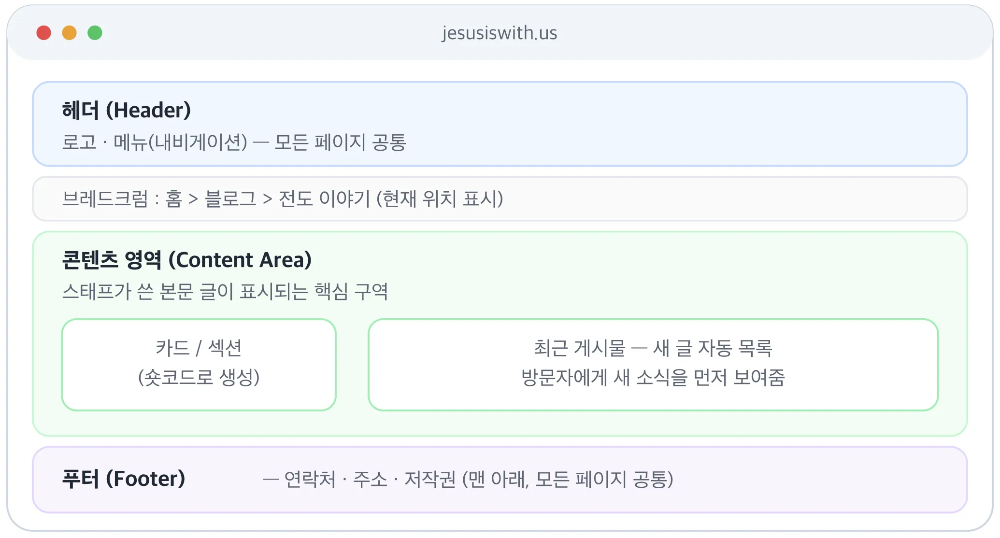
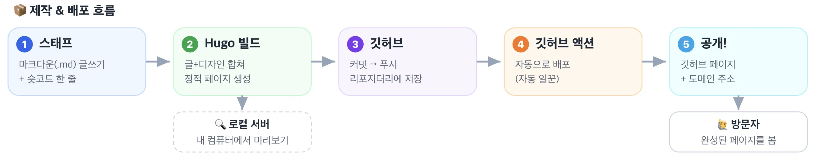

<iframe src="https://www.notion.so/embed/38e091c284f680b9bb1adab00e445eaa" frameborder="0" allowfullscreen="" style="width: 100%; height: 500px;"></iframe>

## 1. 가장 먼저 알아야 할 큰 개념

**정적 홈페이지 (Static Website)**
미리 다 만들어 놓은 완성된 페이지를 그대로 보여주는 방식의 홈페이지. 식당으로 치면 "이미 만들어 놓은 도시락"을 그대로 내주는 것과 같습니다. 방문자가 누구든 똑같은 페이지를 빠르게 받아 봅니다. 

**동적 홈페이지 (Dynamic Website)**
방문자가 접속할 때마다 그 자리에서 페이지를 새로 만들어 보여주는 방식. "주문 받고 즉석에서 요리하는 식당"에 비유됩니다. 로그인, 댓글, 실시간 검색 같은 기능에 쓰이지만, 그만큼 데이터베이스와 서버가 계속 일을 해야 합니다.

<iframe src="https://www.notion.so/embed/38e091c284f680b9bb1adab00e445eaa" frameborder="0" allowfullscreen="" style="width: 100%; height: 500px;"></iframe>

**데이터베이스 (DB, Database)**
회원 정보·게시물 내용 등을 저장해 두는 "디지털 창고". 동적 사이트는 이게 꼭 필요하지만, 우리는 DB 없이 운영합니다. 그래서 프로젝트 이름이 "DB 없는 홈페이지"입니다. DB가 없으면 해킹 위험·관리 부담·비용이 크게 줄어듭니다.

**정적 사이트 생성기 (SSG, Static Site Generator)**
글(원고)과 디자인을 합쳐서 완성된 정적 페이지들을 자동으로 찍어내 주는 프로그램. 우리가 쓰는 **Hugo(휴고)** 가 바로 이 도구입니다.

> 최신 2026년 자료 기준으로 보면, Hugo 외에도 많이 쓰이는 정적 사이트 생성기·하이브리드 SSG는 아래처럼 정리할 수 있습니다. 현재 페이지의 설명처럼 SSG는 “글과 디자인을 합쳐 완성된 정적 페이지를 미리 만들어 주는 도구”입니다.[[1]](https://app.notion.com/p/38e091c284f680b9bb1adab00e445eaa)
>
> | 도구 | 기반 | 한 줄 특징 | 적합한 용도 |
> | --- | --- | --- | --- |
> | --- | ---: | --- | --- |
> | **Astro** | JavaScript/TypeScript | 기본적으로 JavaScript를 적게 보내는 “콘텐츠 중심” 프레임워크 | 블로그, 마케팅 사이트, 교회/단체 소개 사이트 |
> | **Next.js** | React | 정적 생성뿐 아니라 SSR, ISR까지 가능한 하이브리드 프레임워크 | 규모 있는 서비스형 웹사이트, 회원 기능이 섞인 사이트 |
> | **Eleventy / 11ty** | JavaScript | 구조가 단순하고 Markdown 친화적인 SSG | 개발자 블로그, 가벼운 문서·콘텐츠 사이트 |
> | **Jekyll** | Ruby | GitHub Pages와 오래전부터 잘 맞는 전통적 SSG | 개인 블로그, GitHub 기반 간단한 사이트 |
> | **Docusaurus** | React | 문서 사이트에 특화 | 매뉴얼, 개발 문서, 교육 자료 사이트 |
> | **MkDocs** | Python | Python 생태계에서 인기 있는 문서 사이트 생성기 | 기술 문서, 지식베이스, 매뉴얼 |
> | **Nuxt** | Vue | Vue 기반의 하이브리드 웹 프레임워크 | Vue를 쓰는 팀의 웹사이트·앱 |
> | **SvelteKit** | Svelte | 가볍고 빠른 인터랙티브 사이트 제작에 강점 | 성능 좋은 웹앱, 콘텐츠+동작이 섞인 사이트 |
> | **VitePress** | Vue/Vite | 빠르고 단순한 문서 사이트 도구 | 프로젝트 문서, 강의 노트, 가이드 |
> | **Zola** | Rust | 설치·빌드가 빠르고 단일 실행 파일 중심 | 빠른 블로그, 기술 문서, 심플한 정적 사이트 |
> | **Hexo** | Node.js | 블로그 중심의 오래된 SSG | 개인 블로그, 기술 블로그 |
> | **Quartz** | TypeScript | Obsidian 노트를 웹사이트로 공개하는 데 특화 | 디지털 가든, 개인 지식 저장소 |
> 
> 간단히 선택 기준을 잡으면 이렇습니다.
> 
> - **초보자용 콘텐츠 사이트**: **Astro**, **Eleventy**, **Jekyll**
> - **문서·매뉴얼 사이트**: **Docusaurus**, **MkDocs**, **VitePress**
> - **React 기반 확장성**: **Next.js**
> - **Vue 기반**: **Nuxt**, **VitePress**
> - **빠른 빌드와 단순성**: **Zola**, **Eleventy**
> - **Obsidian 노트 공개**: **Quartz**
> 
> 현재 진행 중인 “DB 없는 홈페이지” 관점에서는 **Hugo, Astro, Eleventy, Jekyll, Zola**가 가장 직접적인 대안입니다. 반면 **Next.js, Nuxt, SvelteKit**은 정적 생성도 가능하지만, 실제로는 웹앱 개발까지 고려한 “하이브리드 프레임워크”에 가깝습니다.

**Hugo (휴고)**
마크다운으로 쓴 글을 빠르고 안정적인 웹페이지로 변환해 줍니다. 빌드 속도가 매우 빠르고, 데이터베이스 없이 운영할 수 있어 보안·비용·관리 측면에서 부담이 적습니다. 특히 GitHub Pages 같은 무료 호스팅과 잘 어울려 교회·단체·교육용 홈페이지 제작에 적합합니다.

**Hugo의 주요 장점**

Hugo의 장점은 한마디로 “빠르고, 단순하고, 운영 부담이 적은 정적 홈페이지 제작 도구”라는 점입니다.

Hugo는 Go 언어로 만들어져서 사이트를 만드는 속도가 빠른 편입니다.

글이 수십 개, 수백 개로 늘어나도 전체 사이트를 빠르게 다시 만들어 줍니다.

비유하면, Hugo는 **원고 뭉치를 순식간에 인쇄물로 찍어내는 고속 인쇄기**와 같습니다.

Hugo는 마크다운 파일을 HTML 페이지로 미리 만들어 둡니다.

그래서 WordPress처럼 데이터베이스 서버가 계속 작동할 필요가 없습니다.

이 장점은 큽니다.

- 해킹 위험이 줄어듭니다.
- 서버 관리 부담이 줄어듭니다.
- 백업이 단순해집니다.
- 무료 호스팅과 잘 맞습니다.

즉, **교회·단체·교육용 홈페이지처럼 자주 복잡한 기능이 필요하지 않은 사이트**에 잘 맞습니다.

Hugo에서는 글을 보통 `.md` 파일로 작성합니다.

HTML을 몰라도 제목, 목록, 링크, 이미지 정도는 마크다운 문법으로 쉽게 작성할 수 있습니다.

예를 들면:

```markdown
# 예배 안내

- 주일예배: 오전 11시
- 수요예배: 오후 7시 30분
```

이런 글을 Hugo가 웹페이지로 바꿔 줍니다.

Hugo로 만든 결과물은 정적 파일입니다.

그래서 GitHub Pages, Cloudflare Pages, Netlify, Vercel 같은 서비스에 쉽게 올릴 수 있습니다.

특히 현재 진행 중인 방식처럼 **GitHub + GitHub Actions + Hugo** 조합을 쓰면:

1. 글 수정
2. GitHub에 업로드
3. 자동 빌드
4. 홈페이지 자동 반영

이라는 흐름을 만들 수 있습니다.

Hugo에는 다양한 테마가 있습니다.

Hugoplate처럼 이미 디자인 구조가 잡힌 테마를 사용하면 처음부터 디자인을 다 만들 필요가 없습니다.

비유하면, Hugo 테마는 **빈 땅에 건물을 짓는 것이 아니라, 이미 지어진 건물을 우리 용도에 맞게 리모델링하는 것**에 가깝습니다.

Hugo에서는 보통 역할을 이렇게 나눌 수 있습니다.

- 글 작성자: 마크다운 파일 작성
- 디자이너/개발자: 테마, 레이아웃, 숏코드 관리
- 운영자: GitHub에 올리고 배포 확인

그래서 비개발자 스태프는 디자인 코드를 직접 만지지 않고, **글 작성에 집중**할 수 있습니다.

정적 사이트는 서버에서 매번 페이지를 새로 계산하지 않습니다.

이미 만들어진 파일을 보여 주기만 하면 됩니다.

그래서 일반적으로:

- 서버 비용이 낮고
- 장애 가능성이 낮고
- 속도가 빠르고
- 장기 운영이 쉽습니다.

소규모 교회, 선교단체, 교육 프로젝트에는 큰 장점입니다.

## 초보자용 한 문장 정리

**Hugo는 마크다운으로 쓴 글을 빠르게 정적 홈페이지로 바꿔 주는 도구이며, 데이터베이스 없이 안전하고 저렴하게 사이트를 운영할 수 있게 해 줍니다.**

현재 페이지의 문장에 조금 덧붙인다면 이렇게 정리할 수 있습니다.

> **Hugo (휴고)**

> 우리 사이트를 만드는 정적 사이트 생성기입니다. 마크다운으로 쓴 글을 빠르고 안정적인 웹페이지로 변환해 줍니다. 빌드 속도가 매우 빠르고, 데이터베이스 없이 운영할 수 있어 보안·비용·관리 측면에서 부담이 적습니다. 특히 GitHub Pages 같은 무료 호스팅과 잘 어울려 교회·단체·교육용 홈페이지 제작에 적합합니다.

**테마 (Theme) / Hugoplate (휴고플레이트)**
홈페이지의 전체적인 디자인·구조 "뼈대 세트". 우리는 **Hugoplate**라는 테마를 기반으로 합니다. 옷으로 치면 기성복 한 벌을 받아 우리 몸에 맞게 수선해 입는 것과 같습니다.

**마크다운 (Markdown, .md 파일)**
복잡한 코딩 없이 간단한 기호(`#`, `*` 등)만으로 글을 작성하는 방식. 비개발자 스태프가 글을 쓸 때 다루는 파일이 바로 이 마크다운 파일입니다.

**HTML / CSS / JavaScript**
웹페이지를 이루는 3대 언어. HTML은 "뼈대(내용 구조)", CSS는 "디자인(색·글꼴·배치)", JavaScript는 "움직임(동작)"을 담당합니다.

**Tailwind (테일윈드)**
CSS 디자인을 빠르게 입히는 도구. Hugoplate가 이걸로 디자인되어 있습니다. 스태프가 직접 만질 일은 거의 없습니다.

---

## 2. 화면의 구조 (레이아웃)

**레이아웃 (Layout)**
페이지의 전체 배치 틀. 보통 위(헤더) → 가운데(콘텐츠) → 아래(푸터) 순서로 구성됩니다.



**헤더 (Header)**
페이지 맨 위 영역. 보통 로고와 메뉴가 들어가며, 모든 페이지에 공통으로 나타납니다. 건물의 "간판과 안내데스크"에 해당합니다.

**로고 (Logo)**
헤더에 들어가는 사이트 상징 이미지/글자. 보통 클릭하면 첫 페이지(홈)로 돌아갑니다.

**내비게이션 / 메뉴 (Navigation, Nav)**
사이트의 각 코너로 이동하는 길잡이 버튼 모음(예: 블로그, 클래스, 데이터뱅크). 헤더 안에 들어 있는 "이정표"입니다.

**히어로 (Hero) / 배너 (Banner)**
첫 화면 상단에 크게 보이는 대표 이미지·문구 영역. 방문자가 가장 먼저 마주치는 "표지" 역할을 합니다.

**콘텐츠 영역 (Content Area)**
실제 글·이미지 등 본문 내용이 들어가는 가운데 핵심 영역. 스태프가 작성한 마크다운 글이 표시되는 곳입니다.

**사이드바 (Sidebar)**
본문 옆에 붙는 보조 영역. 카테고리 목록, 최근 게시물 등을 넣습니다.

**푸터 (Footer)**
페이지 맨 아래 영역. 저작권 문구, 연락처, 주소, SNS 링크 등을 넣으며 모든 페이지 공통입니다. 건물의 "1층 안내문·연락처판"에 해당합니다.

**브레드크럼 (Breadcrumb, 빵부스러기/브레드콤)**
지금 보고 있는 페이지가 사이트 어디쯤에 있는지 보여주는 경로 표시. 예: `홈 > 블로그 > 전도 이야기`. 동화 헨젤과 그레텔이 빵부스러기로 길을 표시한 데서 온 이름으로, 방문자가 "길을 잃지 않게" 도와주고 뒤로 가기도 쉽게 해 줍니다.

**섹션 (Section)**
한 페이지 안에서 주제별로 나뉜 가로 띠 단위의 구역. 우리 사이트에는 `section` 숏코드가 있습니다.

**카드 (Card)**
이미지·제목·짧은 설명을 하나로 묶은 네모난 정보 상자. 게시물 목록이나 소개를 정돈해 보여줄 때 씁니다(우리 `cards`/`card` 숏코드).

---

## 3. 콘텐츠(글)를 이루는 요소

**페이지 (Page)**
하나의 웹 화면. 소개·연락처처럼 고정된 단일 페이지를 가리키기도 합니다.

**게시물 / 포스트 (Post)**
블로그처럼 계속 새로 쌓이는 글 한 편. 날짜순으로 목록이 만들어집니다.

**최근 게시물 (Recent Posts)**
가장 최근에 올린 글 몇 개를 자동으로 뽑아 보여주는 목록. 보통 첫 화면이나 사이드바에 넣어 방문자가 새 소식을 바로 보게 합니다.

**카테고리 (Category) / 태그 (Tag)**
글을 주제별로 묶는 분류표. 카테고리는 큰 서랍, 태그는 더 잘게 붙이는 라벨 스티커라고 보면 됩니다.

**슬러그 (Slug)**
주소(URL)에 들어가는 글의 짧은 이름. 예: `AI & Tech` 카테고리는 주소에서 `ai-tech`로 바뀝니다(소문자+하이픈 규칙).

**프론트매터 (Front Matter)**
마크다운 글의 맨 위에 적는 "정보표"(제목·날짜·카테고리·대표이미지 등). 글 본문은 아니지만 Hugo가 이 정보를 읽어 페이지를 만듭니다.

**숏코드 (Shortcode)**
마크다운 안에 넣는 "간단한 명령 한 줄"로, 복잡한 디자인 요소를 불러오는 단축키입니다. 예를 들어 스태프는 `card` 한 줄만 쓰면 디자인이 입혀진 카드가 나타납니다. HTML을 몰라도 됩니다. 우리 사이트엔 `section, cards, card, contact, checklist, check, profile, cta, subheading` 등 아홉 개가 있습니다.

**콘텐츠/디자인 분리 (Content–Design Separation)**
"글 쓰는 일"과 "디자인하는 일"을 따로 떼어 놓는 원칙. 디자인(HTML/Tailwind)은 숏코드 파일에 숨겨 두고, 스태프는 마크다운 글만 쓰면 됩니다. 우리 프로젝트의 가장 중요한 운영 원칙입니다.

---

## 4. 만들고 올리는 도구 (개발·배포)



**깃 (Git)**
파일 변경 내역을 단계별로 저장·관리하는 도구. "무한 되돌리기가 되는 작업 기록장"이라고 보면 됩니다.

**깃허브 (GitHub)**
Git으로 관리하는 파일을 인터넷에 보관·공유하는 웹 서비스. 우리 사이트의 원본 파일이 모두 여기에 저장됩니다. "구글 드라이브 + 작업 기록장"의 개발자 버전입니다.

**리포지터리 (Repository, 저장소, 레포)**
깃허브 안에서 한 프로젝트의 모든 파일을 담는 "폴더 묶음". 우리 홈페이지 파일 전체가 하나의 리포지터리에 들어 있습니다.

**커밋 (Commit) / 푸시 (Push) / 풀 (Pull)**
작업을 저장하고 주고받는 3단계 동작입니다: 커밋은 "변경 내용에 이름표 붙여 저장", 푸시는 "내 컴퓨터에서 깃허브로 올리기", 풀은 "깃허브에서 내 컴퓨터로 내려받기".

**GitHub Pages (깃허브 페이지)**
깃허브가 무료로 제공하는 홈페이지 호스팅(게시) 기능. 우리 사이트가 실제로 인터넷에 공개되는 곳입니다.

**GitHub Actions (깃허브 액션)**
파일을 푸시하면 자동으로 Hugo를 실행해 사이트를 새로 만들어 배포해 주는 "자동 일꾼". 스태프가 글만 올리면 나머지는 자동으로 처리됩니다.

**빌드 (Build)**
원고와 디자인을 합쳐 실제 웹페이지 파일들을 만들어 내는 과정. Hugo가 하는 핵심 작업입니다.

**배포 (Deploy / Publish)**
완성된 페이지를 인터넷에 실제로 올려 누구나 볼 수 있게 하는 것.

**로컬 서버 (Local Server)**
내 컴퓨터 안에서만 작동하는 "임시 미리보기 서버". 인터넷에 올리기 전에 `hugo server` 명령으로 내 컴퓨터에서 결과를 먼저 확인할 때 씁니다. 주소는 보통 `localhost:1313`입니다. "남에게 공개하기 전 내 방에서 하는 리허설"입니다.

**로컬 (Local) vs 라이브/프로덕션 (Live/Production)**
로컬은 내 컴퓨터 안, 라이브는 실제 인터넷에 공개된 상태를 뜻합니다.

**IDE / Antigravity (앤티그래비티)**
글과 코드를 편집하는 작업 프로그램(편집기). 우리는 VS Code 기반의 Antigravity IDE를 씁니다.

**터미널 / CLI (Command Line)**
글자로 명령을 입력해 컴퓨터를 다루는 검은 창. `hugo server`, `git push` 같은 명령을 여기에 입력합니다.

**Node.js / Go**
Hugo와 테마가 동작하는 데 필요한 "엔진"들. 설치만 해 두면 평소엔 신경 쓸 일이 거의 없습니다.

---

## 5. 주소(도메인) 관련

**도메인 (Domain)**
사람이 외우는 인터넷 주소. 우리의 경우 `jesusiswith.us`, `jiwumission.org`입니다.

**URL**
특정 페이지의 정확한 인터넷 위치 전체 주소(예: `jesusiswith.us/blog/...`).

**baseURL**
Hugo 설정에 적는 "이 사이트의 기준 주소". 실제 도메인과 정확히 같아야 디자인과 링크가 깨지지 않습니다.

**CNAME 파일**
깃허브 페이지에 "우리 도메인을 쓰겠다"고 알려 주는 작은 파일. `static/` 폴더에 둬야 빌드할 때마다 사라지지 않습니다.

**DNS**
도메인 이름을 실제 서버 위치로 연결해 주는 "인터넷 전화번호부".

**Cloudflare (클라우드플레어)**
도메인 연결·속도·보안·주소 전환(리다이렉트)을 도와주는 서비스.

**301 리다이렉트 (Redirect)**
한 주소로 들어온 방문자를 다른 대표 주소로 자동 이동시키는 것. 두 도메인을 하나로 모을 때 씁니다.

---

## 6. 검색 노출 관련 (참고용 심화 용어)

**SEO (검색엔진 최적화)**
구글 같은 검색엔진에서 우리 사이트가 잘 노출되도록 다듬는 작업. 모든 것의 기본 토대입니다.

**AEO (답변엔진 최적화)**
구글 답변상자·음성검색에서 바로 답으로 뽑히도록 최적화하는 것.

**GEO (생성형엔진 최적화)**
ChatGPT·Gemini·Claude 같은 AI가 우리 내용을 인용하도록 만드는 최적화.

**메타데이터 (Metadata) / JSON-LD 스키마**
검색엔진과 AI가 페이지 내용을 잘 이해하도록 붙이는 "설명 꼬리표". FAQ 구조 표시 등에 씁니다.

**Google Search Console**
구글 검색에서 우리 사이트가 어떻게 노출되는지 점검하는 무료 도구.

---
