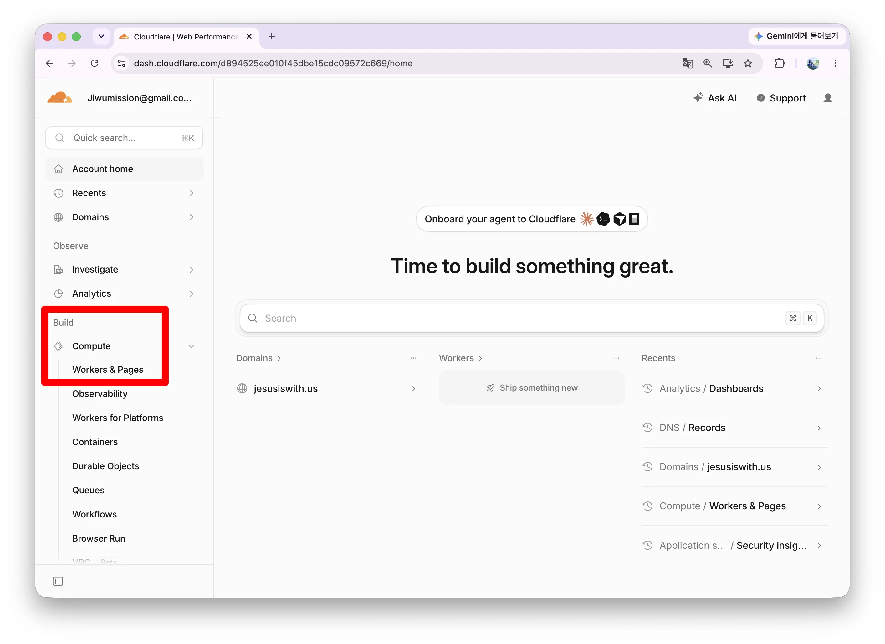
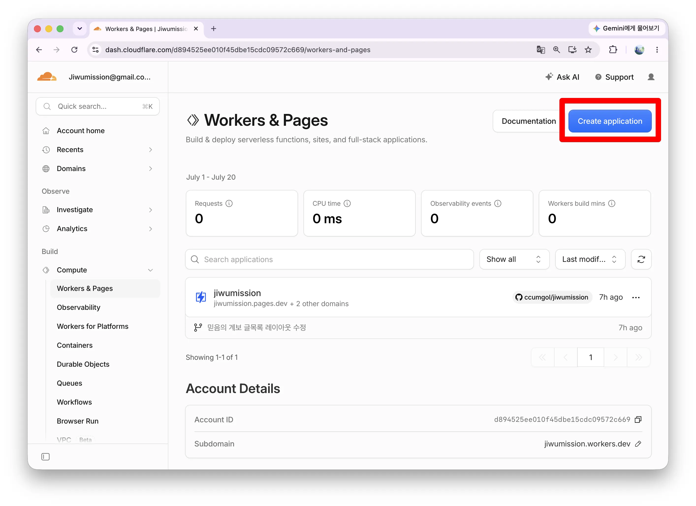
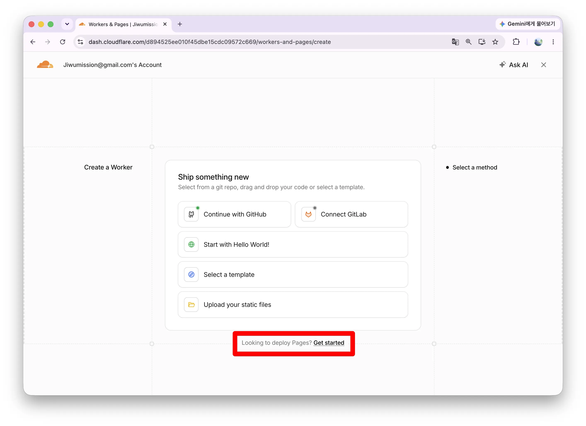
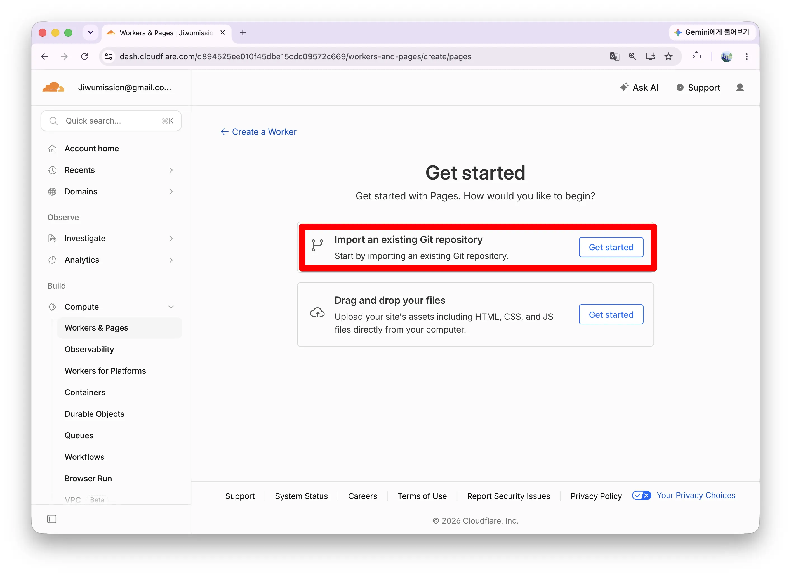
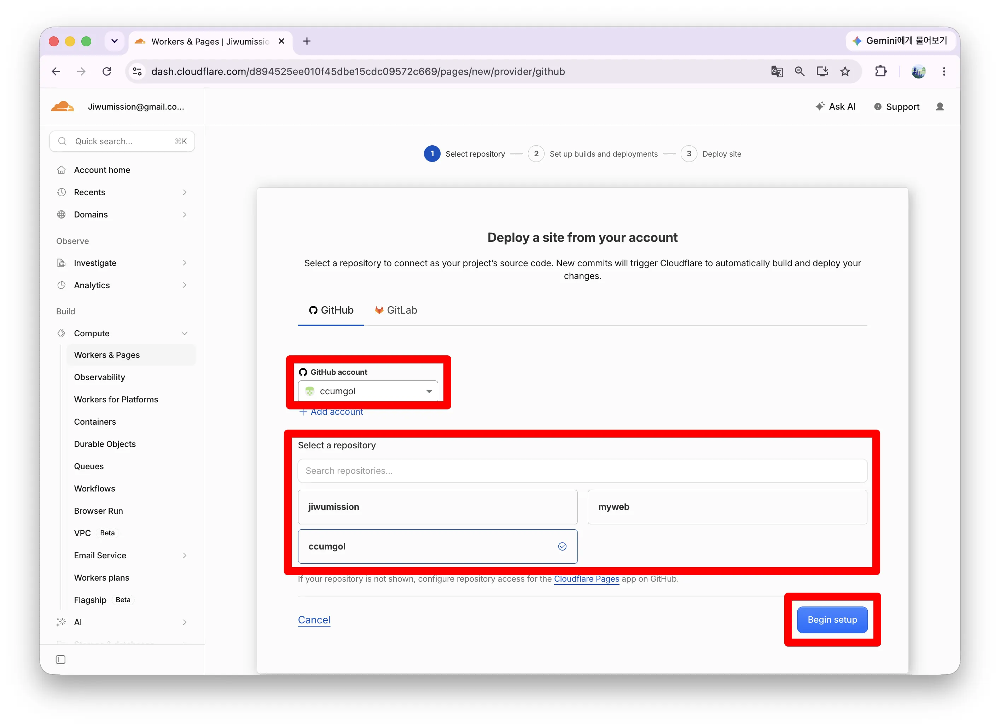
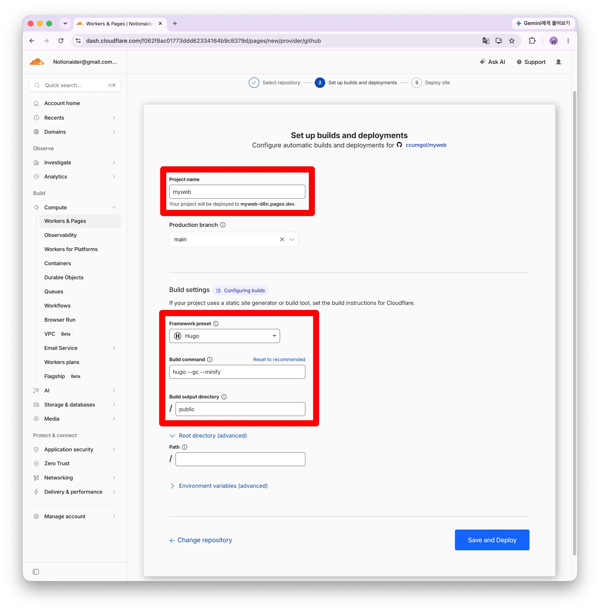
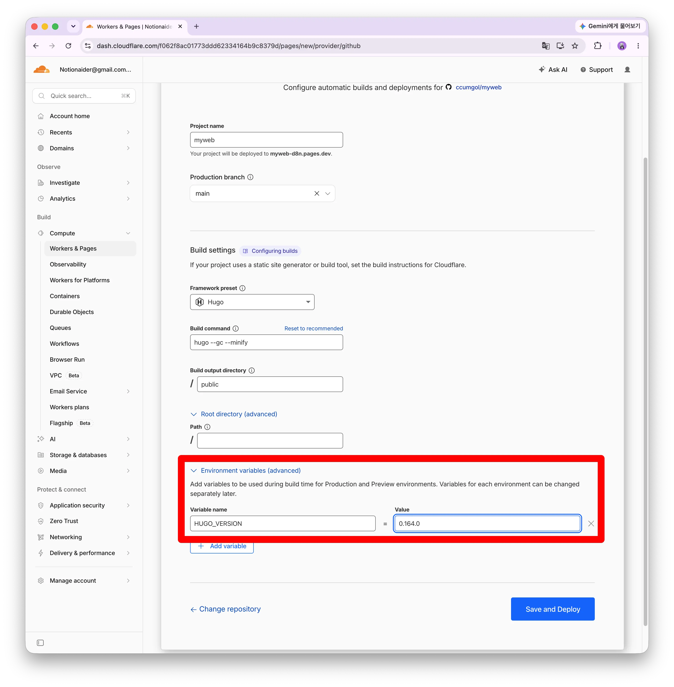

# Cloudflare Pages로 홈페이지 배포하기

## 왜 이 과정이 필요한가요?

Hugo로 만든 정적 사이트는 **그대로는 인터넷에 공개되지 않습니다.** 반드시 “빌드된 결과물(public 폴더)”을 누군가의 서버가 대신 호스팅해줘야 합니다.

Cloudflare Pages는 이 과정을 초보자에게 가장 단순하게 만들어 줍니다.

- **GitHub와 연결**하면 `git push`만으로 자동 빌드·배포(업데이트)됩니다.
- **무료 플랜**만으로도 전 세계 CDN을 통해 빠르게 제공됩니다.
- **HUGO_VERSION 환경 변수**를 지정하면, 내 로컬과 같은 Hugo 버전으로 빌드되어 “내 컴퓨터에서는 되는데 배포만 실패” 같은 오류를 크게 줄일 수 있습니다.

즉, 이 문서의 목적은 “한 번만 설정해두면 이후에는 글 쓰고 push하는 것만으로 홈페이지가 자동으로 갱신되는 상태”를 만드는 것입니다.

화면에 보이는 그대로, 순서대로 따라 하시면 됩니다. 시작하기 전에 아래 두 가지가 준비되어 있어야 합니다.

- GitHub에 내 사이트 소스(content, themes, hugo.toml 등)가 push 되어 있는 상태

> 내 컴퓨터 터미널에서 `hugo version`을 입력했을 때 나오는 버전 숫자를 메모해 두기 (예: `hugo v0.164.0-...` 이면 **0.164.0**만 메모)

---

## 1단계. Cloudflare 무료 계정 만들기

1. 브라우저에서 **https://dash.cloudflare.com/sign-up** 접속
2. 이메일 주소와 비밀번호를 입력하고 **Sign Up(가입)** 클릭
  - 신용카드 정보는 묻지 않습니다. 무료입니다.
3. 가입한 이메일로 확인 메일이 오면, 메일 안의 **Verify email(이메일 확인)** 버튼을 클릭
  - 이 확인을 안 하면 일부 기능이 막히니 꼭 해주세요.
4. 로그인하면 Cloudflare **대시보드**(관리 화면)가 열립니다. 처음엔 영어 화면일 수 있는데, 아래 설명에 영어 메뉴명을 함께 적어두었으니 그대로 찾으시면 됩니다.

---

## 2단계. Pages 프로젝트 만들고 GitHub 연결하기

1. 대시보드 **왼쪽 메뉴**에서 **Compute** → **Workers & Pages** 클릭

2. 화면에 나오는 파란색 **Create(생성)** 버튼 클릭

3. 하단에 Pages: ‘**Get started**’ 버튼을 클릭합니다.
  - 👉 반드시 **Pages** 탭을 클릭하세요. (Workers는 다른 서비스입니다)


4. **Import an existing Git repository(Git에 연결)** 버튼 클릭

5. **GitHub account**를 확인하고, 하단에 리포지터리가 보이면 클릭, 보이지 않으면 검색하여 선택합니다. → Bigin setup 버튼 클릭

6. GitHub가 "Cloudflare Pages에 어떤 저장소 접근을 허용할까요?" 하고 묻는 화면이 나옵니다. 여기서 선택 옵션이 두 가지입니다:
  - **All repositories(모든 저장소)**: 내 GitHub의 모든 저장소를 열어줌
  - **Only select repositories(선택한 저장소만)**: 지정한 저장소만 열어줌 👈 **이걸 권장**
7. **Only select repositories**를 선택하고, 아래 드롭다운에서 내 홈페이지 저장소(예: `myWeb`)를 선택
8. 초록색 **Install & Authorize(설치 및 승인)** 버튼 클릭
9. Cloudflare 화면으로 돌아오면 저장소 목록에 `내아이디/myWeb`가 보입니다. 클릭해서 선택
10. **Begin setup(설정 시작)** 버튼 클릭

---

## 3단계. 빌드 설정 입력하기 ★가장 중요한 화면★

이제 "Set up builds and deployments"라는 설정 화면이 나옵니다. 항목이 여러 개인데, 하나씩 설명합니다.



**① Project name(프로젝트 이름)**

- 저장소 이름이 자동으로 들어가 있습니다 (예: myWeb)
- 이 이름이 그대로 사이트 주소가 됩니다: `myWeb.pages.dev`
- 다른 주소를 원하면 여기서 바꾸세요. 영문 소문자와 하이픈(-)만 사용 가능합니다.

**② Production branch(운영 브랜치)**

- `main`이 자동 선택되어 있을 겁니다. 그대로 두세요.
- 의미: "main 브랜치에 push가 올라오면 실제 사이트를 갱신한다"는 뜻입니다.

**③ Framework preset(프레임워크 프리셋)**

- 드롭다운을 클릭하면 여러 도구 이름이 나옵니다 (Next.js, React, Hugo...)
- 👉 목록에서 **Hugo**를 찾아 선택하세요.
- Hugo를 선택하는 순간 아래 두 칸이 자동으로 채워집니다.

**④ Build command(빌드 명령)**

- 자동으로 ‘hugo’가 입력됩니다. `hugo --gc --minify` 이렇게 추가합니다.
- 의미: Cloudflare 서버에서 실행할 명령입니다.

**⑤ Build output directory(빌드 결과물 폴더)**

- 자동으로 `public`이 입력됩니다. 그대로 두세요.
- 의미: `hugo` 명령이 완성된 사이트를 public 폴더에 만들어 놓으면, Cloudflare가 그 폴더 내용을 배포합니다.

**⑥ Root directory(루트 디렉터리)** — 있어도 비워두세요

- hugo.toml이 저장소 최상위에 바로 있다면 건드릴 필요 없습니다. (정상적으로 따라오셨다면 그렇습니다)

**⑦ Environment variables(환경 변수) 추가 — 절대 건너뛰지 마세요!**

같은 화면을 아래로 스크롤하면 "Environment variables" 섹션이 있습니다.

1. **Add variable(변수 추가)** 버튼 클릭
2. 두 칸이 나타납니다:
  - **Variable name(변수 이름)** 칸에: `HUGO_VERSION` (대문자, 언더바 포함, 정확히 이대로)
  - **Value(값)** 칸에: 아까 메모해 둔 내 Hugo 버전 숫자 (예: `0.164.0`)
    - v나 extended 같은 글자는 빼고 **숫자와 점만** 입력합니다.

왜 필요한가요? 이걸 설정하지 않으면 Cloudflare가 아주 오래된 Hugo로 빌드를 시도합니다. 그러면 "내 컴퓨터에서는 잘 되는데 배포만 실패"하는, 초보자가 가장 많이 겪는 문제가 생깁니다.



**⑧ 마지막으로 파란색 Save and Deploy(저장 후 배포)** 버튼 클릭!

---

## 4단계. 첫 배포 결과 확인하기

1. 클릭하면 빌드 화면으로 넘어가고, 검은 화면에 글자가 주르륵 올라갑니다. 이게 **빌드 로그**입니다. 그냥 지켜보면 됩니다 (보통 1~2분).
2. **성공한 경우**: 로그 끝에 "Success" 표시가 나오고, 화면 상단에 `https://myWeb.pages.dev` 형태의 주소가 파란 링크로 보입니다.
3. 그 링크를 클릭하세요. 새 탭에서 **내 홈페이지가 인터넷에 공개된 모습**이 열립니다. 🎉
4. **실패한 경우**: 로그에 빨간색 에러가 보입니다. 당황하지 말고 아래 "문제 해결"을 보세요.

> 💡 이 주소는 이제 전 세계 누구나 접속할 수 있습니다. 스마트폰으로도 열어보세요!

---

## 5단계. baseURL 수정하고 다시 push (마무리 작업)

사이트가 열렸지만, 디자인(CSS)이 깨져 보이거나 링크가 이상할 수 있습니다. hugo.toml의 baseURL이 아직 가짜 주소(example.com)이기 때문입니다. 실제 주소로 바꿔줍니다.

1. VS Code(또는 메모장)에서 내 사이트 폴더의 `hugo.toml` 열기
2. 맨 위의 baseURL 줄을 방금 발급받은 실제 주소로 수정:

```toml
baseURL = "https://myWeb.pages.dev/"
```

주의할 점 세 가지: ① `https://`로 시작 ② 내가 받은 실제 주소 ③ **끝에 슬래시(/)** 포함

1. 파일 저장 후, 터미널에서 사이트 폴더로 이동해 아래 세 줄을 순서대로 입력:

```
git add .
git commit -m "baseURL을 실제 주소로 변경"
git push
```

1. push 하는 순간 Cloudflare가 자동으로 감지해서 다시 빌드하고 배포합니다. Cloudflare 대시보드 → 내 프로젝트 → **Deployments** 탭에서 진행 상황(노란 점 → 초록 Success)을 볼 수 있습니다.
2. 1~2분 후 사이트를 새로고침하면 디자인까지 완벽하게 나옵니다.

---

## 완성! 앞으로의 사용법

이제 설정은 끝났습니다. 다시는 Cloudflare 화면에 들어갈 필요가 없습니다. 앞으로 글을 발행하는 과정은 이게 전부입니다:

```
① 글 쓰기 (draft = false 확인)
② git add .
③ git commit -m "새 글 추가"
④ git push
⑤ 1~2분 기다리면 사이트에 자동 반영 ✅
```

---

## 자주 겪는 문제 해결

**빌드 실패: 로그에 "found no layout" 또는 테마 관련 에러**
→ 테마가 함께 안 올라간 경우입니다. 테마를 git submodule로 설치했는지, GitHub 저장소에 `.gitmodules` 파일이 보이는지 확인하세요. ZIP으로 설치했다면 테마 폴더 안의 숨김 폴더 `.git`을 삭제하고 다시 push 하세요.

**빌드 실패: "Unable to locate config file"**
→ hugo.toml이 저장소 최상위에 없는 경우입니다. GitHub 저장소 페이지 첫 화면에 hugo.toml과 content 폴더가 바로 보여야 정상입니다.

**로컬에서는 되는데 Cloudflare에서만 실패**
→ 90%는 HUGO_VERSION 문제입니다. 프로젝트 → **Settings → Variables and Secrets**에서 값이 내 로컬 버전과 같은지 확인하고, Deployments 탭에서 **Retry deployment(재시도)**를 누르세요.

**사이트는 열리는데 디자인이 깨짐**
→ baseURL 문제입니다. 5단계를 다시 확인하세요 (https://, 실제 주소, 끝 슬래시).

**push 했는데 사이트가 안 바뀜**
→ ① Deployments 탭에 새 배포가 Success인지 확인 ② 브라우저에서 Ctrl+Shift+R (강력 새로고침) ③ 글의 draft가 false인지 확인.

여기까지 하시다가 특정 화면에서 막히거나 에러 메시지가 나오면, 그 메시지를 그대로 복사해서 알려주세요. 해당 부분만 콕 집어 해결 방법을 드릴게요.
