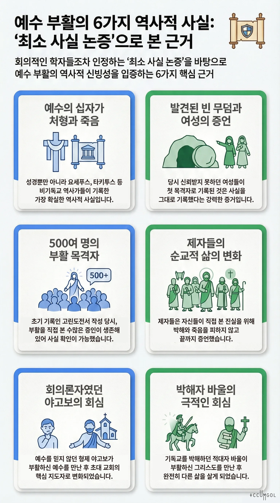

# 예수 그리스도의 부활에 대한 역사적·변증적 근거

복음주의 변증학의 핵심 방법론인 **"최소 사실 논증(Minimal Facts Argument)"**을 중심으로 정리합니다. 이 방법론은 Gary Habermas(Liberty University)와 Michael Licona가 개발한 것으로, 회의적인 학자들을 포함한 비기독교 학자들까지 인정하는 역사적 사실들만을 근거로 삼는다는 점에서 강력한 변증적 도구입니다.

---

## 방법론: 왜 "최소 사실"인가?

역사적 사건의 신뢰성을 평가하는 기준으로 학자들은 다음을 사용합니다: 복수의 독립적 자료에 의해 지지될 것, 적대적 증인들도 인정할 것, 기록자에게 불리한 내용도 포함할 것. 최소 사실 논증은 이 기준을 모두 통과하는 사실들만 사용합니다.

---

## 핵심 역사적 사실 6가지

### 1. 예수의 십자가 처형과 죽음

예수의 십자가 죽음은 동시대 역사에서 가장 많이 언급된 단일 사실입니다. 신약성경 전체(사복음서, 사도행전, 바울서신, 히브리서, 베드로전서, 요한계시록)와 요세푸스, 타키투스 같은 비기독교 역사가들에게서도 기록됩니다.

회의주의 학자인 바트 어만조차도 예수가 1세기에 살았고 수년간 사역했으며 로마에 의해 십자가에 못 박혔다는 기본적 사실들을 기독교 자료와 비기독교 자료 모두를 근거로 강력히 주장합니다.

### 2. 빈 무덤

유대 당국이 기독교 운동을 잠재우려 했다면, 단지 예수의 무덤을 열어 시신이 여전히 그 안에 있음을 세상에 증명하기만 하면 됐을 것입니다. 그것이 불가능했다는 사실은 압도적 다수의 신약학자들이 빈 무덤 전승의 역사적 신빙성을 인정하는 근거가 됩니다.

**"당혹감의 기준(Criterion of Embarrassment)"** — 사복음서는 모두 여성들이 빈 무덤을 가장 먼저 발견한 증인이었다고 기록합니다. 이는 매우 중요한 사실인데, 1세기 유대-로마 문화에서 여성의 증언은 법정에서 신뢰받지 못했기 때문입니다. 만일 초대 기독교인들이 이야기를 꾸며냈다면, 왜 더 신뢰받을 증인으로 기록하지 않았겠습니까? 이는 그들이 실제로 일어난 일을 있는 그대로 기록했다는 강력한 증거입니다.

### 3. 부활하신 예수의 목격 경험

고린도전서 15:3-8에 따르면 예수께서는 베드로, 야고보, 바울, 그리고 나머지 제자들 외에도 500명이 넘는 사람들에게 나타나셨습니다. 바울이 이 사건을 기록한 기원후 55년경에는 많은 목격자들이 여전히 생존해 있어 직접 확인이 가능했습니다.

바울이 고린도전서 15:3-4에서 전하는 부활 신앙은 "받은 전통"으로서, 신약성경의 어떤 복음서보다도 이른 시기의 자료에 해당합니다. 이는 부활 신앙이 후대에 만들어진 신화가 아니라 매우 초기부터 존재했음을 보여주며, 그 짧은 시간 안에 허구가 자리잡을 가능성을 극도로 낮춥니다.

### 4. 제자들의 삶의 변화 — 순교까지

초대 기독교인들이 거짓말을 했다면 그들에게 얻을 것이 아무것도 없었습니다. 권력도, 부도 없었고 오히려 박해와 죽음을 직면했습니다. 예를 들어 바울은 기독교인이 되기 전에 유대교 내에서 영향력 있고 안락한 삶을 누렸지만, 기독교인이 된 후에는 반복적으로 채찍질을 당하고, 투옥되고, 수많은 고난을 당하다 결국 처형되었습니다.

제자들은 자신들이 직접 이야기를 꾸며냈는지 아닌지를 알 수 있는 위치에 있었습니다. 현대 순교자들처럼 다른 사람의 말을 믿고 죽는 것이 아니라, 부활하신 예수를 실제로 봤는지 여부를 직접 알면서도 그것을 끝까지 증언하다 목숨을 잃었습니다.

### 5. 회의주의자였던 야고보의 회심

야고보는 예수의 공생애 사역 동안 불신자였고 회의적이었지만(마가복음 3:21, 요한복음 7:5), 사도행전에 이르러서는 초대 교회의 핵심 인물이 됩니다. 고린도전서 15:7이 기록하는 "부활하신 예수의 야고보에게의 나타나심"이 이 변화의 원인으로 보입니다. 가족 중 한 명이 형제가 메시아라고 믿게 되는 것, 그것도 그 형제가 수치스러운 방식으로 처형된 이후에 그렇게 된다는 것은 매우 설명하기 어려운 일입니다.

### 6. 핍박자 바울의 회심

기독교 운동을 박해하던 사울(바울)이 부활하신 그리스도를 만났다고 주장하며 완전히 변화되었습니다. 내부 신자도, 동조자도 아닌 외부의 적대자가 회심했다는 사실은 어떤 집단 심리학적 설명으로도 다루기 어렵습니다.

---

## 대안적 설명들에 대한 반박

부활에 대해 제시될 수 있는 논리적 가능성은 다섯 가지입니다: 실제 부활, 환각, 신화 창작, 공모(거짓말), 기절(소생).

**거짓말 이론** — 초대 기독교인들이 거짓으로 부활을 주장했다는 설명은 그들이 박해와 죽음을 통해서도 그것을 철회하지 않았다는 사실로 무너집니다. 거짓말쟁이는 자기 목숨을 희생하면서까지 거짓을 유지하지 않습니다.

**환각 이론** — 환각은 마음의 투영이므로 새로운 내용을 담을 수 없습니다. 당시 유대인의 부활 개념에 따르면, 설령 제자들이 예수에 대한 환각을 경험했다 하더라도 그것은 예수가 아브라함의 품에서 쉬고 있다는 확신을 낳았을 것이지, 부활이라는 새로운 신앙으로 이어지지는 않았을 것입니다.

**시신 소재 불명** — 예루살렘에서 부활 선포가 시작됐을 때, 로마 당국이나 유대 지도자들이 단지 예수의 시신을 공개적으로 전시했다면 기독교는 시작될 수 없었을 것입니다. 그런 반박이 기록 어디에도 없다는 사실 자체가 의미심장합니다.

---

## 비기독교 역사 자료들

타키투스는 "그리스도는 티베리우스 황제 치하에서 우리 행정관 중 한 명인 본디오 빌라도에 의해 극형을 당했다"고 기록했습니다. 적대적 자료에서도 예수의 처형이 확인된다는 사실은 역사적 신뢰성을 크게 높입니다.

폴리카르포스는 그리스도의 부활을 언급하고, 이그나티우스도 부활을 언급합니다. 쿼드라투스는 예수에 의해 치유된 사람들이 아직 생존해 있다고 보고합니다.

---

## 복음주의적 결론

역사적 증거는 예수의 부활에 대한 합리적 근거를 제공하지만, 그것만으로 충분하지는 않습니다. 복음서 자체가 회의론자들을 논파하기 위해 쓰인 것이 아니라, "예수께서 하나님의 아들 그리스도이심을 믿게 하려 함이요, 또 너희로 믿고 그 이름을 힘입어 생명을 얻게 하려 함이니라"(요한복음 20:31)고 밝히고 있습니다.

역사적 증거는 신앙의 **합리적 토대**를 제공하며, 그 위에서 성령의 내적 증거와 함께 온전한 믿음이 형성됩니다. 복음주의 변증학의 핵심은 부활이 "종교적 신화"가 아닌 **역사 속에서 일어난 실제 사건**임을 공개적으로 주장할 수 있다는 데 있습니다.

---

**주요 참고 학자 및 저술**

- Gary Habermas & Michael Licona, *The Case for the Resurrection of Jesus* (Kregel, 2004)
- William Lane Craig, *Reasonable Faith* (Crossway, 2008)
- N.T. Wright, *The Resurrection of the Son of God* (Fortress Press, 2003)
- Lee Strobel, *The Case for Christ* (Zondervan, 2016)
