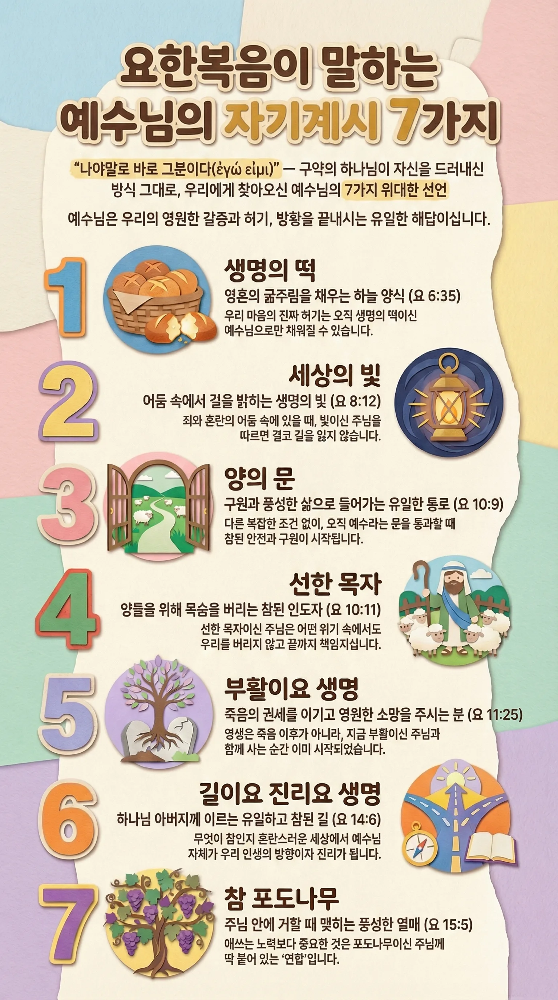

# 요한복음의 예수님 자기 계시 일곱 가지

요한복음을 읽다 보면 예수님께서 반복해서 “나는 …이다”라고 말씀하시는 장면을 만나게 됩니다. 이 표현은 단순히 비유를 드는 말이 아니라, 예수님께서 스스로 누구이신지, 그리고 우리에게 어떤 분으로 다가오시는지를 직접 밝혀 주시는 선언입니다. 요한복음은 그 선언을 특별히 일곱 가지로 묶어 보여 주는데, 각각은 우리의 삶에서 가장 실제적인 필요(먹을 것, 빛, 안전, 인도, 생명, 관계)를 예수님께서 어떻게 채우시는지를 이해하도록 돕습니다.

초신자에게는 “예수님이 하나님의 아들이시다”라는 말이 아직 멀게 느껴질 수 있습니다. 그런데 예수님은 어려운 신학 용어 대신, 누구나 경험해 본 일상의 언어로 자신을 설명하십니다. “생명의 떡”, “세상의 빛”, “양의 문”, “선한 목자”, “부활이요 생명”, “길이요 진리요 생명”, “참 포도나무”라는 말씀은, 믿음이 단지 머리로 아는 지식이 아니라 삶을 살리는 관계임을 보여 줍니다. 이제 이 일곱 가지 선언을 하나씩 살펴보며, 예수님이 어떤 분이신지 더 또렷하게 알아가 보시기 바랍니다.

> **ἐγώ εἰμι** — "나는 ~~이다"
>
> 출애굽기 3:14의 하나님의 자기 계시(אֶהְיֶה אֲשֶׁר אֶהְיֶה)를 배경으로, 요한복음은 예수님의 신성과 사역을 일곱 가지 술어적 선언으로 펼쳐냅니다.

---

## 선언의 신학적 구조

각 선언은 정관사(ὁ/ἡ)를 동반한 술어적 ἐγώ εἰμι 구조입니다.

단순한 "나는 ~와 같다"가 아니라 **"나야말로 바로 그 ~~~이다"** 라는 배타적 동일시를 표현합니다.

절대적 ἐγώ εἰμι의 절정은 **요한복음 8:58**입니다.

> *"아브라함이 나기 전부터 내가 있느니라"*
>
> πρὶν Ἀβραὰμ γενέσθαι ἐγώ εἰμι

이 선언이 이하 일곱 계시 전체의 신학적 토대를 이룹니다.

---

## 일곱 가지 자기 계시

### ① 나는 생명의 떡이다

**ὁ ἄρτος τῆς ζωῆς** | 요 6:35, 48

오천 명을 먹이신 표적 직후, 유월절 문맥에서 선언됩니다. 광야의 만나는 먹어도 다시 배고프지만, 예수님은 영원히 주리지 않게 하는 양식임을 선포합니다. 이 선언은 유대인들의 "표적을 보여 달라"는 요구에 대한 역설적 응답으로, 믿음 자체가 생명의 떡을 먹는 행위임을 강조합니다.

- **배경**: 출 16장 만나 사건, 시 78:24
- **핵심**: 육신의 양식을 넘어선 영원한 영적 양육
- **신학적 함의**: 성찬 신학의 근거 본문으로 널리 해석됨

---

### ② 나는 세상의 빛이다

**τὸ φῶς τοῦ κόσμου** | 요 8:12; 9:5

초막절(수전절) 문맥에서 성전의 등불 앞에서 선언됩니다(8:12). 이어 나면서부터 맹인을 고치신 사건(9장)에서 재확인되며, "내가 세상에 있는 동안에는 세상의 빛이로라"(9:5)고 선언하십니다.

- **배경**: 창 1:3, 사 9:2, 요 1:4-9 프롤로그의 빛 신학
- **핵심**: 어둠(죄, 무지, 사망)을 이기는 생명의 빛
- **신학적 함의**: 제자들도 "세상의 빛"으로 부름 받음(마 5:14)과 연결

---

### ③ 나는 양의 문이다

**ἡ θύρα τῶν προβάτων** | 요 10:7, 9

선한 목자 담화(요 10장) 앞부분에서 나옵니다. 삯꾼과 도둑을 대비시키며, 예수님 외에 다른 구원의 통로가 없음을 선포합니다. "나로 말미암아 들어가면 구원을 받고"(10:9).

- **배경**: 팔레스타인 양 우리 문화 — 목자가 밤에 문 앞에 누워 문이 됨
- **핵심**: 구원의 유일성과 접근의 자유("들어가며 나오며")
- **신학적 함의**: 행 4:12("다른 이름으로는 구원을 받을 수 없고")와 병행

---

### ④ 나는 선한 목자다

**ὁ ποιμὴν ὁ καλός** | 요 10:11, 14

같은 선한 목자 담화 후반부입니다. καλός는 단순히 "good"이 아니라 **아름답고, 진정한, 이상적인** 목자를 뜻합니다. 핵심은 "목숨을 버린다"는 자발적 희생입니다(10:11, 15, 17-18).

- **배경**: 겔 34장 — 거짓 목자들을 심판하고 하나님이 친히 목자가 되심
- **핵심**: 삯꾼(μισθωτός)과의 대조 — 양을 위해 죽는 헌신
- **신학적 함의**: "다른 양들도 있어"(10:16) — 이방인 선교의 예고

---

### ⑤ 나는 부활이요 생명이다

**ἡ ἀνάστασις καὶ ἡ ζωή** | 요 11:25

나사로의 죽음 앞에서, 마르다의 종말론적 부활 신앙("마지막 날에 다시 살아날 줄을")에 대한 응답으로 선언됩니다. 미래의 사건이 아니라 **지금 여기 계신 예수님 자신이** 부활이요 생명이심을 선포합니다.

- **배경**: 겔 37장 마른 뼈 환상, 단 12:2 종말론적 부활
- **핵심**: 종말론의 현재화(realized eschatology) — "나를 믿는 자는 죽어도 살겠고"
- **신학적 함의**: 요한 신학의 "이미와 아직" 긴장의 절정

---

### ⑥ 나는 길이요 진리요 생명이다

**ἡ ὁδός καὶ ἡ ἀλήθεια καὶ ἡ ζωή** | 요 14:6

최후의 만찬 고별 담화에서, "우리가 어디로 가는지 그 길을 알지 못하나이다"라는 도마의 질문에 대한 응답입니다. 세 명사는 각각 독립적이면서도 상호 해석적입니다.

| 속성 | 의미 |
| --- | --- |
| **길** (ὁδός) | 아버지께 이르는 유일한 통로 |
| **진리** (ἀλήθεια) | 하나님의 실재의 완전한 계시 |
| **생명** (ζωή) | 하나님과의 관계 자체 |

- **배경**: 구약의 "야훼의 길"(시 25:4, 잠 3:6), 지혜문학의 진리
- **핵심**: 셋은 분리되지 않음 — 예수님은 길 자신이며, 진리 자신이며, 생명 자신
- **신학적 함의**: "나를 통하지 않고는 아버지께로 올 자가 없느니라" — 기독론적 배타성

---

### ⑦ 나는 참 포도나무다

**ἡ ἄμπελος ἡ ἀληθινή** | 요 15:1, 5

마지막 자기 계시 선언으로, 고별 담화를 마무리합니다. ἀληθινή("참된")는 이스라엘이 실패한 포도나무(사 5:1-7, 겔 15장)와 대비됩니다. 예수님이 참된 이스라엘의 성취입니다.

- **배경**: 사 5:1-7, 렘 2:21, 겔 15장, 시 80:8-11 — 이스라엘 = 포도나무 은유
- **핵심**: μένω(거하다) — 11절에 걸쳐 반복되는 연합의 명령
- **신학적 함의**: 열매 맺음은 능력이 아니라 연합(union)의 결과

---

## 주제별 분류

### 공급과 양육

- **① 생명의 떡** — 영적 양식의 공급
- **⑦ 참 포도나무** — 생명 에너지의 지속적 공급

### 인도와 보호

- **② 세상의 빛** — 방향 제시, 어둠 극복
- **③ 양의 문** — 안전한 출입, 구원의 유일성
- **④ 선한 목자** — 돌봄과 희생적 헌신
- **⑥ 길** — 목적지로의 안내

### 생명과 종말론

- **⑤ 부활이요 생명** — 죽음 권세의 극복
- **⑥ 진리와 생명** — 하나님의 실재에 대한 완전한 계시

---

## 요한 신학적 의의

**1. 숫자 7의 의미**

요한복음은 표적도 7개, ἐγώ εἰμι 선언도 7개로 구성됩니다. 유대 문학에서 7은 완전수로, 예수님의 자기 계시가 완전하고 충분함을 상징합니다.

**2. 공관복음과의 차이**

마태·마가·누가에는 이 형식의 선언이 없습니다. 이는 요한 공동체의 고도로 발전된 기독론을 반영하며, 요한이 사건들의 신학적 의미를 심층적으로 해석한 결과입니다.

**3. 구약 성취 신학**

각 선언은 구약의 은유와 약속들(만나, 빛, 목자, 포도나무)이 예수님 안에서 최종적으로 성취됨을 보여줍니다. 요한의 기독론은 철저히 구약 위에 세워져 있습니다.

**4. 현재화된 종말론**

특히 ⑤번 선언에서 두드러지듯, 요한은 미래의 구원을 현재 예수님과의 관계 안으로 당겨옵니다. 영생은 죽음 이후의 사건이 아니라 **지금 예수님을 아는 것** 자체입니다(요 17:3).
