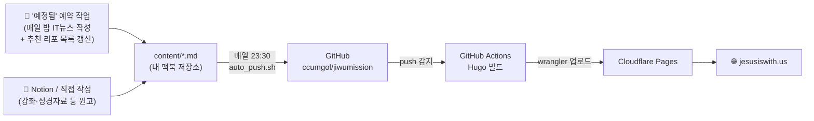

# JIWU Mission 홈페이지 — 적용된 기능 총정리

> jesusiswith.us에 지금 실제로 동작하고 있는 기능들을 "무엇이 / 어디서 / 어떻게" 관점으로 정리한 문서입니다.
> 작성: 2026-07-31 (코드·설정·실행 로그를 직접 확인해 작성)
> 관련 문서: [manual.md](./manual.md)(사용 매뉴얼), [issue_report.md](./issue_report.md)(문제 해결 이력), [github-actions-deploy.md](./github-actions-deploy.md)(배포 방식 비교)

---

## 0. 한눈에 보기 — 전체 구조



핵심은 **"내 맥북에서 원고가 만들어지고 → 자동으로 GitHub에 올라가고 → GitHub이 빌드해서 → Cloudflare가 서비스한다"** 는 4단 흐름입니다.

> **원고를 만드는 주체**는 두 갈래입니다.
> - **매일의 IT뉴스**(+추천 GitHub 리포 목록) → **'예정됨'에 등록된 예약 작업**(AI)이 매일 밤 자동 작성
> - **QT·강좌·성경자료 등** → 미리 만들어 둔 파일에 원고를 채우거나 직접 작성

---

## 1. 매일 돌아가는 자동화 시계 (타임라인)

| 시각 | 무엇이 실행되나 | 어디서 실행 | 설정 |
|------|----------------|------------|------|
| **밤 (23시경)** | IT뉴스 원고 작성 + 추천 리포 목록 갱신 | **'예정됨' 예약 작업 (AI)** | Claude의 예약 작업 목록 |
| **23:30** (매일) | 원고 커밋 & GitHub 푸시 | 내 맥북 (launchd) | `com.jiwumission.autopush.plist` → `~/.scripts/auto_push.sh` |
| **푸시 직후** | Hugo 빌드 → Cloudflare 배포 | GitHub 서버 | `.github/workflows/deploy-cloudflare.yml` |
| ~~06:00 KST~~ | ~~Cloudflare 재빌드 훅~~ | — | **2026-07-31 중단** (아래 설명) |

### 23:30 — 로컬 자동 푸시 (`auto_push.sh`)
순서대로 이런 일을 합니다:
1. `git pull --rebase --autostash origin main` — 원격과 동기화 (작업 중 파일이 남아 있어도 실패하지 않음)
2. 변경/신규 파일이 있으면 `git add -A` → `chore: 일일 자동 생성 컨텐츠 추가 [날짜]` 커밋
3. `git push origin main` → 이 푸시가 GitHub Actions 빌드·배포를 자동 트리거
4. 모든 과정을 `~/.scripts/auto_push.log`에 기록 (저장소 밖에 기록해 git을 더럽히지 않음)

> **파일 관리**: 저장소의 `scripts/auto_push.sh`가 **유일한 원본**이고,
> launchd가 실행하는 `~/.scripts/auto_push.sh`는 **그 파일을 가리키는 심볼릭 링크**입니다.
> → 고칠 때 저장소 파일만 고치면 됩니다. (2026-07-31 정리)

### 06:00 KST 재빌드 — 왜 중단했나
예전에는 "예약된 미래 날짜 글을 매일 아침 발행"하려고 Deploy Hook을 호출했지만, **지금 구조에서는 불필요**함이 확인되어 중단했습니다(수동 실행은 그대로 가능).
1. `buildFuture = true` 라서 미래 날짜 글도 **이미 빌드·배포**됩니다 (2026-12-31 QT 페이지가 이미 라이브 확인)
2. 오늘의 QT 팝업·버튼은 **브라우저가 날짜를 계산**하므로 날짜가 바뀌어도 재빌드가 필요 없습니다
3. 레이아웃에 **빌드 시점의 '오늘'을 쓰는 곳이 없습니다** (날짜만으로 바뀌는 화면 없음)
4. 새 원고는 **23:30 푸시가 이미 배포를 트리거**합니다

---

## 2. 오늘의 QT — 매일 성경 말씀이 뜨는 원리

가장 정교하게 만들어진 기능입니다. 5개 요소가 맞물려 동작합니다.

### (1) 콘텐츠: 1년치를 미리 만들어 둠
- 위치: `content/bible/daily-bible/2026/2026-07-31.md` (연도별 폴더)
- **2026년치 365개 파일이 이미 존재**합니다.
- frontmatter 예:
  ```yaml
  title: "7월 31일 (금) | 이사야 12:1-6"
  date: 2026-07-31
  draft: false
  weekday: 금
  passage: 이사야 12:1-6
  book: 이사야
  qt_status: done      # done = 원고 완성 / draft = 뼈대만 (작성 예정)
  ```
- **`qt_status`가 완성 여부를 나타내는 핵심 표시**입니다. 미래 날짜 파일은 `qt_status: draft` 상태로 본문이 "_(작성 예정)_"이며, 원고를 채우면 `done`으로 바꿉니다.

### (2) `buildFuture = true` (hugo.toml)
Hugo는 기본적으로 **미래 날짜 글을 만들지 않습니다.** 이 옵션이 켜져 있어 예약된 날짜의 QT도 미리 페이지로 만들어집니다.

### (3) 홈페이지 팝업 모달 (`layouts/home.html`)
홈에 접속하면 오늘의 QT가 팝업으로 뜹니다. 동작 순서:
1. 브라우저에서 **오늘 날짜를 계산** (`new Date()`)
2. `/bible/daily-bible/2026/2026-07-31/index.txt` 주소로 **QT 데이터를 가져옴(fetch)**
3. 제목·본문을 팝업에 채워 표시
4. **`◀ 어제` / `내일 ▶`** 버튼으로 날짜 이동 가능
5. **"오늘 하루 보지 않기"** 체크 → `localStorage`에 저장해 그날은 다시 안 뜸

즉 **서버가 아니라 브라우저가 날짜를 판단**하기 때문에, 재빌드 없이도 날짜가 바뀌면 자동으로 그날 QT를 보여줍니다.

### (4) QT 데이터 전용 출력 포맷 — `DailyBibleJSON`
- 설정: `hugo.toml`의 `[outputFormats.DailyBibleJSON]`
- 템플릿: `layouts/bible/daily-bible/single.dailybiblejson.txt`
- 각 QT 페이지마다 `index.txt`(JSON)를 함께 만들어, 팝업이 HTML 전체를 받지 않고 **필요한 데이터만 가볍게** 가져가도록 했습니다.
  ```json
  { "title": …, "date": …, "passage": …, "status": …, "url": …, "content": … }
  ```

### (5) 목록 페이지 & 히어로 버튼
- 목록: `layouts/bible/daily-bible/list.html` — **월별로 접이식(`<details>`)** 그룹핑, 각 항목에 날짜·요일·본문 범위 표시
- "오늘의 묵상 보기" 버튼: 오늘 QT가 있는지 확인(HEAD 요청) 후 표시
- 홈 히어로의 **"오늘의 말씀"** 버튼도 접속 시점 날짜로 링크가 자동 설정됩니다.

### (6) 성경개론 ↔ QT 상호 링크
`scripts/link_qt_to_overview.py`가 성경개론의 "내용구분" 항목에 해당 QT 링크(`📖 1:1-13`)를 자동으로 붙입니다.
현재 창세기(52개)·사사기(22)·시편(19)·이사야(17)·요한복음(42) 등에 적용돼 있습니다.

---

## 3. 매일 IT 뉴스 — 자동으로 올라가는 원리

### 콘텐츠
- 위치: `content/digest/daily-it-news/2026/2026-07-31.md` (연도별 폴더, 현재 25개)
- frontmatter 예:
  ```yaml
  title: "2026년 7월 31일 IT뉴스"
  date: 2026-07-30T23:00:00-04:00
  summary / description: 그날 핵심 뉴스 요약
  tags: ["IT뉴스", "AI", …]
  categories: ["매일의 IT뉴스", "blog"]
  ```

### 올라가는 경로 (2단계)
1. **원고 작성** — **'예정됨'에 등록된 예약 작업(AI)** 이 매일 밤 그날의 IT뉴스를 조사·정리해
   `content/digest/daily-it-news/2026/2026-07-31.md` 로 저장합니다.
2. **발행** — 23:30 `auto_push`가 커밋·푸시 → GitHub Actions 빌드 → Cloudflare 배포

실제 로그(2026-07-30 23:30)에서도 `create mode 100644 content/digest/daily-it-news/2026/2026-07-31.md` 로 그날 뉴스가 자동 커밋된 것이 확인됩니다.

### 함께 갱신되는 것 — 추천 GitHub 리포지터리 모음
- 결과물: `content/extra/pds/github-repos.md` (Extra ▸ 자료실)
- **뉴스를 작성하는 예약 작업이 같은 실행에서 이 목록도 갱신**합니다.
  그날 뉴스에 소개된 리포지터리를 **카테고리별 알파벳 순 위치에 설명과 함께 추가**하는 방식(기존 항목 보존).
  - 근거: 7/30에 추가된 `TurboFieldfare`·`BibleOS`·`RomM` 3개가 모두 그날 뉴스(`2026-07-31.md`)에 등장합니다.
- ⚠️ 옛 스크립트 `scripts/updateRepos.js`는 **사용 중지**되었습니다.
  이 스크립트는 문서를 통째로 덮어쓰고(설명문도 내부 하드코딩 목록에서만 가져옴) 그동안 축적된 큐레이션이 사라지므로 **실행하면 안 됩니다.**
  → [10장](#10-점검-항목--조치-완료-2026-07-31) 참조

---

## 4. 배포 시스템 (GitHub Actions 2개)

| 워크플로우 | 언제 | 하는 일 |
|-----------|------|--------|
| **Deploy to Cloudflare Pages**<br/>`deploy-cloudflare.yml` | main에 push될 때마다 (+수동) | Go·Node·pnpm·Hugo Extended 0.158.0 설치 → `pnpm run build` → `wrangler pages deploy public` |
| **Scheduled Daily Publish**<br/>`scheduled-publish.yml` | 매일 06:00 KST (+수동) | Cloudflare Deploy Hook 호출 (재빌드만) |

- **동시 배포 방지**: `concurrency` 설정으로 최신 커밋만 배포(이전 실행 자동 취소)
- **필요한 GitHub Secrets**: `CLOUDFLARE_API_TOKEN`, `CLOUDFLARE_ACCOUNT_ID`, `CLOUDFLARE_PAGES_DEPLOY_HOOK`
- 이 방식을 택한 이유(Cloudflare Git 연동을 쓰지 않는 이유)는 [github-actions-deploy.md](./github-actions-deploy.md)에 정리돼 있습니다.

---

## 5. 어드민 패널 (브라우저에서 사이트 관리)

- 위치: `static/admin/index.html` (약 1,175줄의 단일 파일 앱)
- 접속: `/admin/` — 관리자 인증 후 사용
- **동작 방식**: 서버 없이 **브라우저에서 GitHub API를 직접 호출**해 저장소 파일을 읽고 씁니다. (토큰은 `localStorage`에 보관)
- 주요 기능:
  - **글 편집 및 발행** — `content/` 아래 문서 목록 조회·수정·커밋
  - **메인 메뉴 / 푸터 메뉴 편집** — `config/_default/menus.toml` 수정
  - **글 목록 표시 항목 · 글씨 크기 · 섹션별 정렬 · 카테고리/태그별 정렬** — `config/_default/params.toml` 수정
  - **방문자 통계** — GA4 + Google Looker Studio 대시보드 임베드
  - **배포 상태 확인** — GitHub Actions 최근 실행 조회

---

## 6. 콘텐츠 표현 기능 (직접 만든 숏코드 & 스타일)

### 커스텀 숏코드 (`layouts/shortcodes/`)
| 숏코드 | 용도 |
|--------|------|
| `section` | 섹션 제목/부제 래퍼 (`eyebrow`, `title`, `intro`, `bg`) |
| `cards` | 카드 그리드 (`cols`, `mobcols`, **`maxw`**=2단 폭 제한) |
| `info_card` | 아이콘+제목+설명+링크 카드 |
| `image_card` | 이미지(포스터)를 담는 카드 — **회색조 → 마우스오버 시 컬러** |
| `profile` | 대표간사 소개 (`note`=링크 아래 작은 회색 글씨, 사진은 300×300 Fill로 원형 채움) |
| `newsletter` | 소식지 신청 카드 (모바일 중앙정렬 / 데스크탑 좌측정렬) |
| `card`·`cta`·`contact`·`check`·`checklist`·`subheading` | 소개 카드·행동 유도·연락처·체크 항목·소제목 |

### 본문 표현
- **접이식 토글**: 노션 토글을 `<details>/<summary>`로 대체. 들여쓰기·소제목 계층 스타일 + **닫힘 `►` / 열림 `▼`** 마커 (`assets/css/custom.css`)
- **원시 HTML 허용**: `hugo.toml`의 `unsafe = true` — 그래서 `<details>` 같은 태그가 실제로 동작
- **이미지 자동 최적화**: `layouts/_default/_markup/render-image.html` 훅이 본문 이미지를 800px·webp로 변환 (SVG는 예외 처리 필요)
- **홈 사역 소개 구분선**: 3개 소개 사이에 500px 짧은 가로선 (`layouts/home.html`)
- **변경 이력 정렬 토글**: 사이트 제작기 페이지의 **[최신순 ↓] / [오래된순 ↑]** 버튼 (`content/extra/site-story.md` 내 인라인 스크립트)

---

## 7. 사이트 공통 기능

| 기능 | 구현 위치 / 방식 |
|------|-----------------|
| **사이트 내 검색** | `SearchIndex` 출력 포맷 → `searchindex.json` + 검색 모달 (테마 search 모듈) |
| **PWA (앱처럼 설치)** | `WebAppManifest` 출력 + 서비스워커(테마 pwa 모듈, **이미지만 캐시**) |
| **SEO / 소셜 썸네일** | `layouts/partials/basic-seo.html` + `assets/images/og-image.png`(1200×630 브랜드 카드), `params.toml`의 `[metadata]` |
| **소셜 공유 버튼** | `layouts/partials/social-share.html` (Facebook·X·Email 등) |
| **다크 모드** | 테마 스위처(`theme_default = "system"`) + `custom.css`의 다크 대응 규칙 |
| **한글/영어 토글** | Hugo 다국어가 아니라 **`data-lang` 속성 + CSS 표시 제어** 방식 (`.lang-ko` / `.lang-en`, `custom.css`) |
| **방문자 분석** | GA4 (`G-KGN4QELTEK`) + Looker Studio 임베드 |
| **AI 크롤러 대응** | `llms`·`llmsfull`·`md` 출력 포맷 (llms.txt 표준) |
| **RSS 피드** | 홈·페이지·섹션·분류 전체 RSS 출력 |
| **이미지 캐시** | `[caches.images]` 30일(720h) 유지 → 재빌드 속도 향상 |

---

## 8. 유지관리 스크립트 (`scripts/`)

| 스크립트 | 용도 | 실행 방법 |
|---------|------|----------|
| `auto_push.sh` | 일일 커밋·푸시 (**유일 원본**, `~/.scripts/`는 심볼릭 링크) | launchd 매일 23:30 |
| `gen_changelog.sh` | 커밋 기록 → 사이트 제작기 변경 이력 생성 | `bash scripts/gen_changelog.sh` (수동) |
| `link_qt_to_overview.py` | 성경개론 내용구분에 QT 링크 삽입 (원고 완성분만, 여러 번 실행해도 안전) | `python3 scripts/link_qt_to_overview.py` (수동) |
| `themeGenerator.js`·`projectSetup.js` 등 | 테마 빌드·초기 설정 (Hugoplate 기본 제공) | `pnpm run build`에 포함 |
| ~~`updateRepos.js`~~ | ~~IT뉴스에서 GitHub 리포 추출·분류~~ | **사용 중지** — 예약 작업이 대체. 실행 시 큐레이션 소실 위험 |

---

## 9. 리다이렉트 · 보안 헤더

- **`static/_redirects`** — 폴더 구조 개편 시 옛 주소를 새 주소로 301 전달
  (`/databank/*` → `/bible/*`, `/blog/*` → `/digest/*`, gemini 강좌 통합 등)
  ※ 반드시 `static/`에 둬야 배포본(`public/`)에 포함됩니다.
- **`static/_headers`** — 보안 헤더: `X-Frame-Options: DENY`, `X-Content-Type-Options: nosniff`, `Referrer-Policy`, `Permissions-Policy`, HSTS
- **`static/CNAME`** — 커스텀 도메인
- 캐시 정책(Cloudflare): HTML은 `max-age=0, must-revalidate`(항상 최신 확인), 해시가 붙은 CSS/JS는 4시간 캐시

---

## 10. 점검 항목 — 조치 완료 (2026-07-31)

실행 로그와 코드를 확인해 발견한 5가지 + 재빌드 필요성 검토 1가지를 모두 처리했습니다.
**현재 정상 작동 중인 흐름(예약 작업의 IT뉴스 작성 → 23:30 푸시 → 자동 배포)은 건드리지 않았습니다.**

### ✅ 1) `updateRepos.js` — 사용 중지 (경로를 "고치지 않은" 이유)
- **증상**: 매일 밤 `에러: IT 뉴스 폴더가 존재하지 않습니다: …/content/blog/daily-it-news` 로 실패.
- **조사 결과**: 이 스크립트는 이미 **역할이 대체된 상태**였습니다.
  추천 리포 목록은 **'예정됨' 예약 작업이 뉴스와 함께 갱신**하고 있었습니다.
- **⚠️ 만약 경로만 고쳤다면 오히려 망가졌습니다**:
  이 스크립트는 결과 문서를 `writeFileSync`로 **통째로 덮어쓰고**, 설명문은 파일 안에 **하드코딩된 목록에서만** 가져옵니다.
  → 그동안 예약 작업이 쌓아 온 **100여 개 큐레이션 항목이 전부 사라집니다.**
- **조치**: `auto_push.sh`에서 **호출 제거**(야간 오류 사라짐) + 스크립트 상단에 **사용 중지 경고** 명시(참고용 보관).

### ✅ 2) `link_qt_to_overview.py` — 경로/URL/필터 수정
- `QT_DIR` → `content/bible/daily-bible` (연도 폴더까지 **재귀 탐색**), `OV_DIR` → `content/bible/bible-overview`
- 링크 형식 → `/bible/daily-bible/2026/2026-01-01/` (연도 포함)
- **`qt_status: done` 필터 추가** — 1년치 파일이 미리 있어 이 필터가 없으면 **아직 쓰지 않은 QT까지 링크**가 붙습니다.
- **검증**: 실행 결과 **8권 / 300링크가 기존과 완전히 동일하게 재현**(git diff 0줄) → 경로·필터·형식이 정확함을 확인.

### ✅ 3) `auto_push.sh` — pull 실패 해결
`git pull --rebase` → **`git pull --rebase --autostash`** 로 변경.
작업 중인 수정 파일이 남아 있어도 임시 보관 후 동기화하고 되돌려 놓습니다. (동기화 실패 시 경고만 남기고 커밋·푸시는 계속)

### ✅ 4) 빈 파일이 페이지로 만들어지던 문제
`content/digest/daily-it-news/CLAUDE.md`(0바이트) **삭제**.
※ git 이력 확인 결과 **처음 생성될 때부터 0바이트**였으므로 내용 손실이 아닙니다.

### ✅ 5) `auto_push.sh` 이중 관리 해소
- 저장소의 `scripts/auto_push.sh`를 **유일한 원본**으로 삼고,
  `~/.scripts/auto_push.sh`는 이를 가리키는 **심볼릭 링크**로 교체 (원본은 `auto_push.sh.bak-20260731`로 백업).
- 로그는 계속 `~/.scripts/auto_push.log`(저장소 밖)에 기록.
- 저장소에 커밋되던 로그 파일 3개(`auto_push.log`, `launchd_stdout.log`, `launchd_stderr.log`)를 **추적 해제 + `.gitignore` 등록**.

### ✅ 6) 06:00 KST 재빌드 — 불필요 확인 후 중단
검증 근거(4가지)는 [1장](#1-매일-돌아가는-자동화-시계-타임라인)에 정리했습니다.
`.github/workflows/scheduled-publish.yml`의 `schedule` 트리거를 **주석 처리**했고, 필요할 때 **수동 실행(workflow_dispatch)** 은 그대로 가능합니다.

---

### 참고 — 유지관리 시 주의사항
- **`updateRepos.js`는 실행하지 마세요.** (`pnpm run update-repos` 포함)
- `auto_push.sh`를 고칠 때는 **저장소 파일만** 고치면 됩니다(심볼릭 링크로 연결됨).
- QT 원고를 더 채운 뒤에는 `python3 scripts/link_qt_to_overview.py`를 다시 실행하면 링크가 갱신됩니다.
